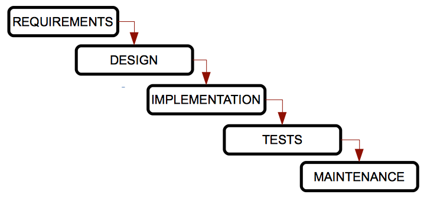
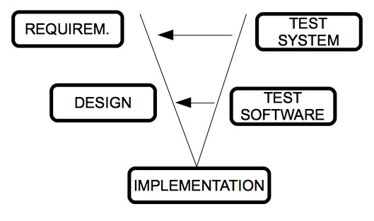
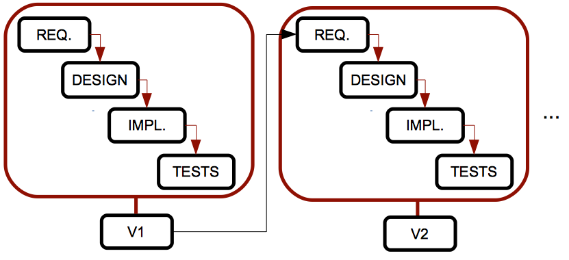
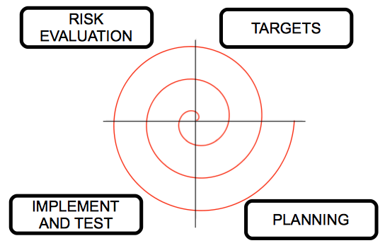

**1. Enginyeria de programari**

Per tal de desenvolupar programari de manera adequada, hem de seguir alguns passos o un enfocament determinat per a aquest desenvolupament. L'enginyeria de programari és la branca de la informàtica que ens ajuda a seguir aquests enfocaments i passos correctament.

**1.1. Etapes en el desenvolupament de programari**

En (gairebé) tots els processos d'enginyeria de programari, podem seguir aquests passos:

- **Anàlisi de requisits:** Aquesta etapa inclou la comunicació amb el client per aclarir les seves necessitats, i una fase d'anàlisi per esbossar el comportament principal de l'aplicació. Es pot dividir en dues fases:
  - **Especificació de requisits:** La comunicació amb el client, en la qual organitzarem algunes entrevistes o altres maneres d’obtenir informació. Hem d'aclarir les necessitats que cal complir, i un cop s'han recopilat els requisits, escrivim un document anomenat especificació de requisits, que ha de ser tan complet com sigui possible.
  - **Anàlisi:** A partir de l'especificació de requisits creada en l'etapa anterior, ara hem de crear un nou document on utilitzarem alguns diagrames útils per representar les funcionalitats principals de l'aplicació i les seves connexions o dependències.
  
- **Disseny:** A partir dels documents d'anàlisi establerts abans, ara podem determinar com funcionarà el programari. Aquí utilitzarem altres diagrames que ens ajudaran a implementar el programari.

- **Implementació:** Aquesta etapa ha de començar des de l'etapa de disseny anterior, utilitzant un llenguatge de programació específic (o més d'un).

- **Proves:** Un cop el producte ha estat implementat, hem de provar-lo per comprovar si compleix tots els requisits i no hi ha cap error. Aquestes proves han de ser revisades per algú que no estigui implicat en el procés d'implementació.

- **Manteniment:** Aquesta última etapa consisteix a millorar el rendiment del producte de programari, afegint-hi noves extensions o corregint alguns errors.

Per resumir aquestes etapes, podríem dir que l'enginyeria de programari proporciona un enfocament que ens ajuda a entendre el problema a resoldre (anàlisi de requisits), dissenyar una possible solució, implementar-la, provar-la i després obtenir una millor qualitat o rendiment (manteniment).

Tanmateix, aquests passos a vegades poden ser un obstacle, ja que molts desenvolupadors pensen que l'enginyeria de programari és massa estructurada i no els permet desenvolupar programari ràpidament. Però hem de veure l'enginyeria de programari com una cosa adaptativa, que proporciona diferents models i metodologies que es poden adaptar al nostre procés de desenvolupament, com veurem més endavant.

**2. Cicles de vida del programari**

Un cicle de vida és una llista d’etapes per les quals ha de passar un sistema (en aquest cas, un projecte de programari) des del seu naixement fins que deixa d'utilitzar-se. En cada cicle de vida establim tant les etapes com els requisits per passar d'una etapa a la següent, incloent-hi les entrades i eixides esperades per a cada etapa.

Els productes generats després de cada etapa es denominen lliurables, i formen part de l'entrada de l'etapa següent o són una avaluació del projecte en un moment determinat.

Alguns cicles de vida són repetitius, és a dir, podem passar per la mateixa etapa més d'una vegada, depenent de l'estat del producte. Aquest procés també es coneix com a retroalimentació.

Anem a veure alguns dels cicles de vida més típics en el desenvolupament de programari, així com els seus avantatges i desavantatges. En tots ells trobarem les etapes vistes anteriorment (anàlisi de requisits, disseny, implementació...), o qualsevol variació d'aquestes.

**2.1. Model en cascada o de cascada**

Aquest és el model més antic i el més difós. Va ser creat per W. Royce en els anys 70, i ordena les etapes del desenvolupament de programari de manera rigorosa, de forma que el començament d’una etapa ha d'esperar al final de l’etapa anterior.

Es denomina model en cascada perquè les etapes estan disposades una davall de l’altra, i el procés flueix des de les etapes superiors cap a les inferiors, com si foren una cascada.

**Avantatges:**

- Adequat per a projectes xicotets i ben coneguts, on tots els requisits estan perfectament establits des del principi.
- Ben estructurat, les etapes no es barregen.
- Fàcil d'utilitzar, gràcies a la seua rigidesa.

**Inconvenients:**

- No podem aplicar-lo a la majoria de projectes reals, ja que els requisits poques vegades són coneguts des del principi.
- No podem veure cap resultat fins al final del procés, per la qual cosa els clients poden sentir-se preocupats pel resultat final.
- No és habitual que una etapa estiga perfectament acabada abans de començar la següent.
- Els errors no es detecten fins a l'etapa de proves, al final del procés.

**Variacions:**

Hi ha algunes variacions d’aquest model, com el model Sashimi, en què les etapes es solapen, com fa el peix japonés. En aquest model, hi ha un solapament temporal entre dues etapes seqüencials; d’aquesta manera, comencem l’etapa de disseny mentre acabem d’establir els requisits (i podem canviar-los a mesura que avancem amb el disseny), i comencem a implementar el sistema mentre acabem amb el disseny (així podem millorar el disseny per alguns problemes detectats durant la implementació).

**2.2. Model V**

Un dels principals problemes del model tradicional en cascada és que els errors no es detecten fins que arribem a les etapes finals del procés. Amb el model V, les proves comencen tan prompte com siga possible i són realitzades en paral·lel per un altre equip de treball. D’aquesta manera, les proves s'integren en cada etapa del cicle de vida.

La branca esquerra de la V representa l’anàlisi de requisits, el disseny i la implementació, i la branca dreta integra les proves de cada etapa. Ens desplacem per la branca esquerra fins arribar al fons, i després validem les proves de la branca dreta, des de les més específiques (proves unitàries per a comprovar alguns mòduls concrets del producte) fins a les més generals (proves d’integració i proves del sistema). Cada vegada que detectem un problema, tornem a l’etapa associada de la branca esquerra.

**Avantatges:**

- Fàcil d'utilitzar
- Hi ha lliurables per a cada etapa
- Major probabilitat d'èxit gràcies als plans de proves associats a cada etapa del procés
- Útil per a projectes xicotets amb requisits fàcils d'entendre

**Inconvenients:**

- També és rígid
- L'usuari no veu cap resultat fins a etapes posteriors, perquè no es desenvolupa cap prototip intermedi
- De vegades és complicat passar de la branca dreta a l'esquerra per solucionar els problemes

**2.3. Model iteratiu**

Els models vistos fins ara només són adequats per a projectes amb requisits senzills i ben especificats, però això no és molt habitual en els projectes de programari reals. Per tal de millorar-ho, el model iteratiu repeteix el model en cascada i genera una versió intermèdia o prototip després de cada iteració. Aquest prototip pot ser revisat pel client, els problemes es poden detectar abans, i així podem millorar el sistema.

**Avantatges:**

- No cal especificar tots els requisits al principi.
- Els riscos es gestionen millor, perquè lliurem prototips intermedis després de cada iteració.

**Inconvenients:**

- Si no necessitem tindre tots els requisits al principi, poden aparéixer més tard inesperadament i afectar significativament el disseny o l’arquitectura del sistema.

**Variacions:**

Hi ha algunes variacions interessants d’aquest model, amb altres noms i característiques particulars:

- **Model incremental:** cada prototip té només unes poques millores respecte a l’anterior. Açò fa que els prototips siguen més fàcils de provar (només cal provar aquests xicotets canvis). No obstant això, necessitem molta experiència per tal de construir aquests prototips de manera proporcional.
  
- **Model basat en prototips:** es basa en el desenvolupament de prototips de l'aplicació. Al principi, només recollim alguns requisits ràpidament, fem un disseny simple i obtenim un prototip bàsic, de manera que el client pot comprovar ràpidament l'aplicació i donar-nos la seua opinió. El principal avantatge d’aquest model és que el client està implicat en el procés des del començament. Però pot ser molt costós, ja que podem desenvolupar molts prototips inútils. A més, el client pot sentir-se decebut si comprova algunes versions del producte que no funcionen com esperava, i el desenvolupador pot sentir-se temptat a accelerar el procés per incloure tot el que el client vol, eludint tots els patrons de qualitat i manteniment.

**2.4. Model espiral**

Aquest model va ser creat per Boehm en 1988, i intenta combinar els models en cascada i iteratiu. Les etapes estan disposades en una espiral dividida en quatre seccions, de manera que cada secció fa una tasca, i cada gir de l'espiral passa per totes les seccions i tasques, generant un prototip després de cada gir complet.

Aquest model gestiona els riscos del desenvolupament de programari. Comencem des del centre de l’espiral, i en cada bucle analitzem totes les alternatives de desenvolupament, identifiquem els riscos més assumibles i després realitzem un cicle d'espiral. Si el client aporta nous requisits o millores, tornem a avaluar els riscos i realitzem un altre cicle, fins que el producte siga finalment acceptat.

- En l’etapa d'objectius establim el producte final a aconseguir (requisits, anàlisi, etc.).
- En l’etapa d'avaluació de riscos identifiquem els possibles riscos del projecte i triem les opcions per reduir-los tant com siga possible.
- En l’etapa d'implementació i proves dissenyem, implementem i provem el producte, segons les opcions triades en l’etapa anterior.
- En l’etapa de planificació comprovem el producte amb el client, i després decidim si necessitem un altre cicle d’espiral per solucionar alguns problemes o afegir millores.

**Avantatges:**

- Adequat per a projectes grans i complicats.
- Els riscos es minimitzen.
- La implementació i el manteniment estan integrats.
- Desenvolupem prototips des de les etapes inicials, perquè el client puga aportar la seua opinió durant el procés.

**Inconvenients:**

- Necessitem molta experiència per a avaluar els riscos correctament.
- Aquest model genera molts productes addicionals (informes, prototips…).
- Pot ser molt costós.
- No és adequat per a projectes xicotets.

