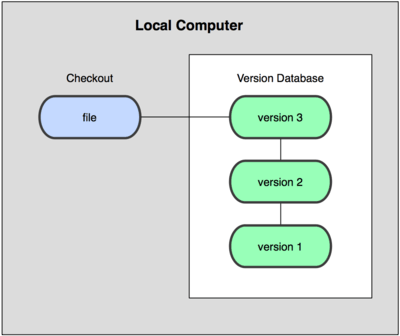
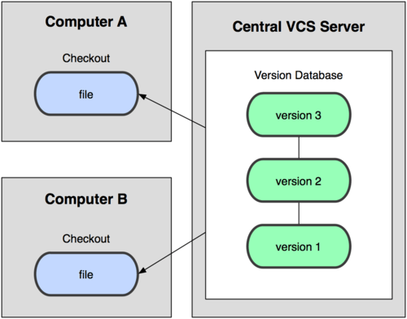
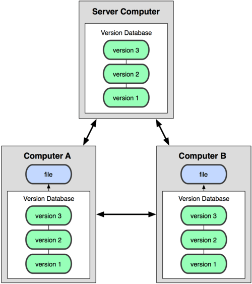
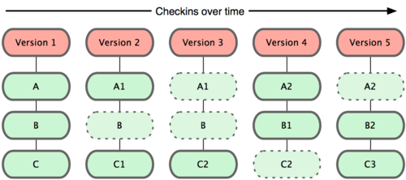
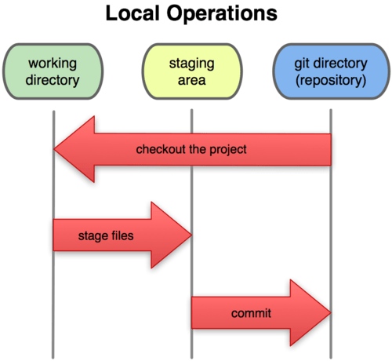

# **Sistemes de control de versions** 
 
Els sistemes de control de versions (VCS) són eines que poden registrar qualsevol canvi en qualsevol fitxer o conjunt de fitxers al llarg del temps, de manera que puguem recuperar fàcilment qualsevol versió anterior. Poden ser utilitzats no només amb fitxers fonts, sinó també amb qualsevol altre tipus de fitxer.

Un VCS ens permet revertir l'estat de qualsevol fitxer o fins i tot d'un projecte sencer, i comparar fitxers al llarg del temps, determinar qui va canviar el fitxer en un moment determinat i molt més. A més, si algun fitxer es danya o es perd, podem tornar a una versió anterior en la història i recuperar-lo de nou.
## 1. Tipus de VCS

### **1.1 VCS Local**  
Els VCS poden ser utilitzats tant en línia com en mode local. Aquest últim mode és particularment útil perquè podem crear fàcilment una còpia de seguretat d'un projecte i emmagatzemar-la localment, de manera que la podem restaurar més tard si la necessitem (en cas d'un error, per exemple) i tornar a una versió estable.

L'avantatge principal d'això és la seva simplicitat, i el principal inconvenient és que hem de gestionar el control de versions manualment, de manera que podem cometre alguns errors en aquest procés. Per exemple, hem d'oblidar-nos que estem en la carpeta equivocada i després modificar el fitxer de còpia de seguretat en lloc del fitxer actual.

Per fer front a aquests problemes, hi ha algunes eines interessants que ens ajuden a gestionar els fitxers i canvis. Una de les més populars és un sistema anomenat rcs, que encara es pot trobar en molts ordinadors. Aquesta eina bàsicament emmagatzema un conjunt de pegats o diferències entre fitxers d'una versió a l'altra. Aquests canvis s'emmagatzemen en un tipus de fitxer especial, i després el sistema pot recuperar qualsevol estat anterior de qualsevol fitxer, afegint o restant els pegats corresponents.


 
### **1.2 VCS Centralitzat**  
Els VCS locals no són adequats quan necessitem col·laborar amb altres membres de l'equip. Per resoldre aquest problema, també hi ha VCS centralitzats (CVCS). Aquests sistemes s'instal·len en un sol servidor que conté tots els fitxers i les seves diferents versions. Aleshores, molts clients poden connectar-se a aquest servidor i descarregar/pujar canvis a aquests fitxers. Aquesta segona manera de controlar les versions va ser un estàndard durant molts anys, ja que tenia grans avantatges sobre els sistemes CVS locals, però el seu principal inconvenient és que, si el servidor falla, podríem perdre tot el projecte.


 
### **1.3 VCS Distribuït**  
Els VCS distribuïts (DVCS) van sorgir per resoldre el principal inconvenient del CVCS. En un DVCS (com Git, Mercurial, Bazaar o Darcs), els clients no només es connecten al servidor, sinó que també descarreguen tot el repositori. Així, si un servidor falla, qualsevol dels repositoris locals dels clients pot ser copiat al servidor de nou, i el projecte pot ser restaurat. Cada vegada que descarreguem qualsevol cosa del repositori, estem fent una còpia de seguretat completa de les dades.


 
## 2. **Git**  
Git va ser desenvolupat per l'equip de Linux un cop van trencar la relació amb BitKeeper, l'eina que utilitzaven per al control de versions abans. A partir de les mancances vistes en aquesta eina, van decidir alguns dels principals objectius del nou sistema a desenvolupar:

- Velocitat  
- Disseny fàcil  
- Fort suport al desenvolupament no lineal (milers de branques paral·leles)  
- Totalment distribuït  
- Adequat per a grans projectes (com el nucli de Linux)  
- Eficàcia (en termes de velocitat i mida de dades)  

Des de la seva creació el 2005, Git ha evolucionat i s'ha tornat cada cop més fàcil d'utilitzar. És realment ràpid i eficient amb grans projectes, i té un sistema de branques excepcional.

### 2.1 **Fonaments de Git**

#### 2.1.1 **Modelatge de dades**

Git emmagatzema una mena de conjunt d'instantànies (snapshots) del seu sistema de fitxers, en lloc d'emmagatzemar una llista de canvis. Cada vegada que pugem un nou canvi, bàsicament pren una "fotografia" de cada fitxer en aquell moment i emmagatzema una referència a aquesta instantània. Si el fitxer no ha estat modificat, Git no guarda una còpia nova, sinó un enllaç a la versió anterior, que és idèntica.


 
Aquesta és una diferència important entre Git i gairebé tots els altres VCS, i fa que Git replantege alguns aspectes de les generacions anteriors de VCS. Per tant, s'assembla més a un petit sistema de fitxers amb eines útils, més que a un VCS tradicional.

#### 2.1.2 **Treball local**

La major part de les funcions de Git només necessiten fitxers i recursos locals per funcionar. Com que la història del projecte s'emmagatzema localment, moltes operacions són immediates, i ens permet treballar en un projecte fins i tot si no estem connectats a Internet. Els canvis es guarden localment, i tan prompte com tinguem una connexió, es pot actualitzar el repositori extern.

1. **Integritat**

Git utilitza l'algoritme de hash SHA-1 per emmagatzemar la informació, de manera que les dades estan sempre verificades, i si es modifica alguna cosa, Git se n'adonaria.

2. **Només afegeix informació**

Cada operació de Git consisteix a afegir informació, de manera que tot es pot desfer fàcilment (la informació no s’esborra). Després de confirmar una instantània, la informació es guarda de manera segura.

3. **Estats del projecte**

Git té tres estats principals en què pot estar qualsevol fitxer d'un projecte:

- **Modificat**: les dades han estat canviades localment, però encara no s'han confirmat (committed).
- **En estat d'espera (staged)**: les dades s'han etiquetat per ser enviades en el pròxim commit.
- **Confirmat (committed)**: les dades s'han emmagatzemat de manera segura en un magatzem local.

Per tant, hi ha tres seccions en Git:

- **Directori de Git (repository)**: on Git emmagatzema les metadades i la base de dades dels elements del projecte. Aquesta part és la que copiem quan clonem el repositori des d'un altre ordinador.
- **Directori de treball (working directory)**: és una còpia d'una versió del projecte. Aquests fitxers s'extrauen de la base de dades de Git i es col·loquen en una carpeta, llestos per a ser utilitzats.
- **Àrea d'espera (staging area)**: és un fitxer simple emmagatzemat en el directori de Git que conté informació sobre els fitxers que seran enviats en el següent commit. També es coneix com a índex.




### 2.2 **Cicle bàsic de treball amb Git**

Ara que ja coneixem alguns dels conceptes bàsics de Git, vegem el cicle de treball típic amb Git.

1. **Modificar fitxers**: Treballem en els fitxers del projecte en el directori de treball.
2. **Afegir canvis a l'àrea d'espera**: Una vegada hem fet canvis que volem registrar, els afegim a l'àrea d'espera utilitzant l'ordre `git add`.
3. **Confirmar canvis (commit)**: Finalment, fem un commit dels canvis afegits a l'àrea d'espera amb l'ordre `git commit`. Això emmagatzema de manera segura una instantània dels canvis en el repositori de Git.

A més, podem pujar els canvis a un repositori remot amb `git push` o baixar canvis amb `git pull`.

#### 2.2.1 Comandes bàsiques

- **git init**: Inicialitza un nou repositori Git.
- **git clone**: Clona un repositori existent a l'ordinador local.
- **git status**: Mostra l'estat actual del projecte, indicant quins fitxers han estat modificats i quins estan en l'àrea d'espera.
- **git add**: Afegix fitxers a l'àrea d'espera (per exemple, `git add <fitxer>`).
- **git commit**: Confirma els canvis en l'historial del projecte.
- **git push**: Puja els canvis al repositori remot.
- **git pull**: Descarrega els canvis des del repositori remot i els fusiona amb el projecte local.

#### 2.2.2 **Branques a Git**

Una de les característiques més potents de Git és el seu sistema de branques. Una branca en Git és una línia de desenvolupament independent dins d'un projecte. Podem crear branques noves, treballar-hi i després fusionar-les amb la branca principal (normalment anomenada `main` o `master`).

- **Crear una branca nova**: Amb `git branch <nom-branca>`, creem una nova branca.
- **Canviar de branca**: Amb `git checkout <nom-branca>`, ens movem a una altra branca.
- **Fusionar branques**: Amb `git merge <nom-branca>`, fusionem els canvis d'una branca en una altra.

Les branques són ideals per a treballar en noves funcionalitats sense afectar la branca principal del projecte. Quan la funcionalitat està acabada, podem fusionar-la amb la branca principal.

#### 2.2.3 **Fusionar conflictes**

Quan es treballa amb altres persones en el mateix projecte, de vegades poden ocórrer conflictes quan dos desenvolupadors fan canvis al mateix fitxer i intenten fusionar-los. Això és el que es coneix com a **conflicte de fusió**.

Quan ocorre un conflicte, Git ens avisa i ens demana que el resolguem manualment. Hem de revisar el fitxer conflictiu, triar quins canvis conservar i després confirmar la fusió resolta.

#### 2.2.4 **Clonar un repositori**

Quan comencem a treballar en un projecte que ja està en un repositori remot, el primer que fem és clonar-lo al nostre ordinador local amb l'ordre:

```bash
git clone <url-del-repositori>
```

Això descarrega una còpia completa del repositori i la seva història.

#### 2.2.5 **Estats dels fitxers en Git**

Com hem vist, Git utilitza tres estats principals per als fitxers:

1. **Modificat (Modified)**: El fitxer ha estat canviat, però no s'ha afegit a l'àrea d'espera.
2. **En espera (Staged)**: El fitxer ha estat afegit a l'àrea d'espera i està llest per al següent commit.
3. **Confirmat (Committed)**: El fitxer està emmagatzemat de manera segura en el repositori local.

Aquests estats permeten gestionar de manera eficient els canvis en el projecte i assegurar-nos que cada modificació està correctament registrada.

***[font](https://nachoiborraies.github.io/entornos/md/en/05a)***