
- [Programación Orienada a Objetos (CAS)](#programación-orienada-a-objetos-cas)
  - [Aspectos básicos del paradigma orientado a objetos](#aspectos-básicos-del-paradigma-orientado-a-objetos)
    - [Actividad 1: Creación de diagramas a partir de una definición](#actividad-1-creación-de-diagramas-a-partir-de-una-definición)
    - [Actividad 2: Explicación de diagramas](#actividad-2-explicación-de-diagramas)
- [Programació Orientada a Objectes (VAL)](#programació-orientada-a-objectes-val)
  - [Aspectes bàsics del paradigma orientat a objectes](#aspectes-bàsics-del-paradigma-orientat-a-objectes)
    - [Activitat 1: Creació de diagrames a partir d’una definició](#activitat-1-creació-de-diagrames-a-partir-duna-definició)
    - [Activitat 2: Explicació de diagrames](#activitat-2-explicació-de-diagrames)

# Programación Orienada a Objetos (CAS)

## Aspectos básicos del paradigma orientado a objetos

Un paradigma de programación consiste en un enfoque y una serie de reglas que nos ayudan a resolver problemas. En el caso del paradigma orientado a objetos, definimos la realidad a través de objetos. Los objetos tienen una serie de propiedades, que llamamos atributos, y pueden realizar una serie de acciones, que llamamos métodos. Asimismo, los objetos se comunican entre ellos a través del paso de mensajes.

La programación orientada a objetos puede basarse en prototipos, como ocurre en Javascript, en la cual unos objetos sirven como base de otros; o bien basarse en clases. Una clase es un patrón que define una serie de atributos y métodos propios que tendrán los objetos que pertenezcan a la misma. A estos objetos, se los conoce como *instancias* de la clase.

Para representar una clase emplearemos diagramas de clases del estándar UML. Cada clase se representa con una caja que tiene tres apartados:

- **Superior**: Se coloca el nombre de la clase y su tipo. Puede ser una clase normal (C), una clase abstracta (A) o una interfaz (I). En Java, se emplea CamelCase para los nombres. Es decir, la primera letra de cada palabra en mayúscula y sin espacios. Se evitan caracteres especiales que no pertenezcan al ANSII (como tildes, ñ o ç).
- **Medio**: En este espacio se colocan los atributos de la clase, en CamelCase pero con la primera letra en minúscula. El tipo se puede colocar antes, como en Java o C#, o después, como en TypeScript.
- **Inferior**: En este espacio se colocan los métodos. Se nombran como los atributos, pero al final tienen paréntesis. Dentro del paréntesis puede haber parámetros (con su tipo correspondiente) y, si el método devuelve algo, se coloca al lado el tipo de datos del retorno.

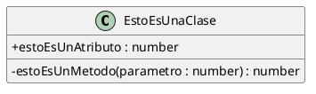

Podemos pensar en los atributos y métodos de una clase de la siguiente forma:

- **Atributos:** Conforman las propiedades del objeto.
- **Métodos:** Conforman el comportamiento del objeto.

Cuando definimos una clase, los diferentes componentes tienen una visibilidad determinada:

- Si un componente es **público**, es accesible por cualquier otro objeto. Lo representamos con un +:

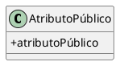

- Si un componente es **privado**, es accesible solo por el mismo objeto. Lo representamos con un -:

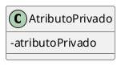

- Si un componente es **protegido**, funciona como privado excepto cuando el objeto que quiere acceder a él es de una clase derivada, que entonces funciona como público. Lo representamos con un #:

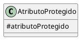

- Si un componente tiene visibilidad de **paquete**, funciona como público para todos los miembros del paquete y privado para todos los demás. Es una visibilidad característica del lenguaje de programación Java (es la visibilidad por defecto, de hecho). En UML se representa con el signo ~:

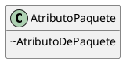

Para estos diagramas se está usando [PlantUML](https://plantuml.com/es/class-diagram). Para que aparezcan los signos indicados se debe especificar antes de empezar a escribir el diagrama la línea `skinparam classAttributeIconSize 0`. Si no se hace, aparecen formas geométricas de diferentes colores según la visibilidad, y están rellenas o no según si son atributo o método:

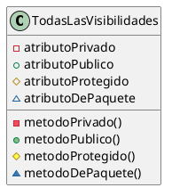

### Actividad 1: Creación de diagramas a partir de una definición

Crea un diagrama de clase que se corresponda con cada una de estas definiciones:

- Para representar un libro, necesitamos saber su autor, su editorial, su año de publicación, su ISBN y su número de páginas. Un libro se puede leer.
- Para representar a un perro, necesitamos saber su nombre, su raza y su edad. Un perro puede ladrar y pasear.

### Actividad 2: Explicación de diagramas

Explica los siguientes diagramas:

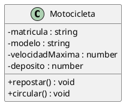

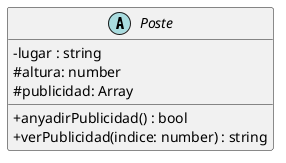

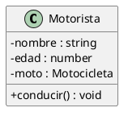

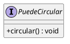

---

# Programació Orientada a Objectes (VAL)

## Aspectes bàsics del paradigma orientat a objectes

Un paradigma de programació consisteix en un enfocament i una sèrie de regles que ens ajuden a resoldre problemes. En el cas del paradigma orientat a objectes, definim la realitat a través d’objectes. Els objectes tenen una sèrie de propietats, que anomenem atributs, i poden realitzar una sèrie d’accions, que anomenem mètodes. Així mateix, els objectes es comuniquen entre ells a través del pas de missatges.

La programació orientada a objectes pot basar-se en prototips, com ocorre en Javascript, en la qual uns objectes serveixen com a base d'altres; o bé basar-se en classes. Una classe és un patró que defineix una sèrie d’atributs i mètodes propis que tindran els objectes que pertanguen a la mateixa. A aquests objectes se’ls coneix com a *instàncies* de la classe.

Per a representar una classe emprarém diagrames de classes de l’estàndard UML. Cada classe es representa amb una caixa que té tres apartats:

- **Superior**: Es col·loca el nom de la classe i el seu tipus. Pot ser una classe normal (C), una classe abstracta (A) o una interfície (I). En Java, s’empra CamelCase per als noms. És a dir, la primera lletra de cada paraula en majúscula i sense espais. S’eviten caràcters especials que no pertanguen a l’ANSI (com accents, ñ o ç).
- **Mitjà**: En aquest espai es col·loquen els atributs de la classe, en CamelCase però amb la primera lletra en minúscula. El tipus es pot col·locar abans, com en Java o C#, o després, com en TypeScript.
- **Inferior**: En aquest espai es col·loquen els mètodes. Es nomenen com els atributs, però al final tenen parèntesis. Dins del parèntesi pot haver-hi paràmetres (amb el seu tipus corresponent) i, si el mètode retorna alguna cosa, es col·loca al costat el tipus de dades del retorn.

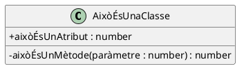

Podem pensar en els atributs i mètodes d’una classe de la següent manera:

- **Atributs:** Formen les propietats de l’objecte.
- **Mètodes:** Formen el comportament de l’objecte.

Quan definim una classe, els diferents components tenen una visibilitat determinada:

- Si un component és **públic**, és accessible per qualsevol altre objecte. Ho representem amb un +:

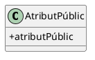

- Si un component és **privat**, és accessible només pel mateix objecte. Ho representem amb un -:

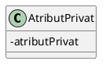

- Si un component és **protegit**, funciona com a privat, excepte quan l’objecte que vol accedir-hi és d’una classe derivada, que aleshores funciona com a públic. Ho representem amb un #:

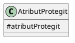

- Si un component té visibilitat de **paquet**, funciona com a públic per a tots els membres del paquet i com a privat per a tots els altres. És una visibilitat característica del llenguatge de programació Java (és la visibilitat per defecte, de fet). En UML es representa amb el signe ~:

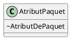

Per a aquests diagrames s’està utilitzant [PlantUML](https://plantuml.com/es/class-diagram). Perquè apareguen els signes indicats s’ha d’especificar abans de començar a escriure el diagrama la línia `skinparam classAttributeIconSize 0`. Si no es fa, apareixen formes geomètriques de diferents colors segons la visibilitat, i estan plenes o no segons si són atribut o mètode:

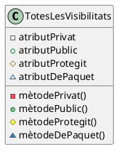

### Activitat 1: Creació de diagrames a partir d’una definició

Crea un diagrama de classe que es corresponga amb cadascuna d’aquestes definicions:

- Per a representar un llibre, necessitem saber el seu autor, la seua editorial, el seu any de publicació, el seu ISBN i el seu nombre de pàgines. Un llibre es pot llegir.
- Per a representar un gos, necessitem saber el seu nom, la seua raça i la seua edat. Un gos pot bordar i passejar.

### Activitat 2: Explicació de diagrames

Explica els diagrames següents:

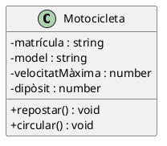

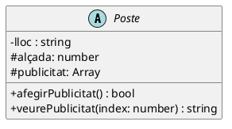

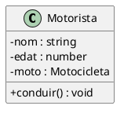

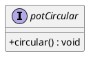
