<style>

body{
    font-family: Arial, Helvetica, sans-serif;
    font-size: 1rem;
} 
p{
    text-indent: 1rem;
    text-align: justify;
}
h1{
    font-size: 2rem;
    font-weight: bold;
}
h2{
    font-size: 1.5rem;
    font-weight: bold;
}
h3{
    font-size: 1.25rem;
    font-style: italic;
    font-weight: bold;
}
img{
    display: block;
    margin: 0 auto;
}
</style>

- [Programación Orienada a Objetos](#programación-orienada-a-objetos)
  - [Relaciones entre clases](#relaciones-entre-clases)
    - [Otras relaciones](#otras-relaciones)
    - [Actividad 3: Explica el siguiente diagrama](#actividad-3-explica-el-siguiente-diagrama)
    - [Actividad 4: Crea un diagrama de la siguiente explicación](#actividad-4-crea-un-diagrama-de-la-siguiente-explicación)
- [Programació Orientada a Objectes (VAL)](#programació-orientada-a-objectes-val)
  - [Relacions entre classes](#relacions-entre-classes)
    - [Altres relacions](#altres-relacions)
    - [Activitat 3: Explica el següent diagrama](#activitat-3-explica-el-següent-diagrama)
    - [Activitat 4: Crea un diagrama de la següent explicació](#activitat-4-crea-un-diagrama-de-la-següent-explicació)

<div style="page-break-after: always;"></div>

# Programación Orienada a Objetos

## Relaciones entre clases

A través de los diagramas UML podemos expresar las relaciones entre las clases de múltiples maneras, mediante líneas que las unen. A su vez, también podemos especificar cardinalidades, como en los diagramas Entidad-Relación empleados en base de datos, para cuantificar los detalles de las relaciones, e incluso nombrar a dichas relaciones (generalmente con un verbo). Representamos las cardinalidades con 0, 1, muchos (representado a veces con `*` o una letra) o números fijos. Las clases se pueden relacionar entre ellas de las siguientes maneras:

- **Herencia:** "es un" (relación jerárquica). Una clase deriva de otra. La clase base se denomina a veces clase padre y la clase derivda clase hija. En algunos casos, la clase padre es una clase abstracta. Esto significa que la clase abstracta no puede ser instanciada, pero las derivadas (mientras no sean abstractas a su vez) sí. Las clases abstractas, a la hora de ser programadas, pueden tener métodos abstractos, que son métodos sin definir (se definen en las clases derivadas).

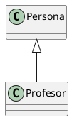

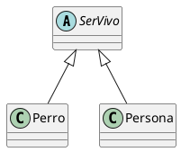

- **Componente:** "tiene un". Una clase contiene como atributo un objeto (o varios) de otra.
- **Composición:** De tipo *componente*. En este caso, el atributo es dependiente de la clase principal.

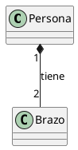

*Una persona tiene dos brazos. Los brazos no pueden existir sin la persona.*

- **Agregación:** De tipo *componente*. En este caso, el atributo no es dependiente de la clase principal y puede existir por separado.

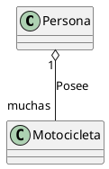

*Una persona posee muchas motocicletas. Cada motocicleta puede existir sin la persona.*

- **Asociación:** "colabora con". Dos clases pueden trabajar en colaboración. La colaboración puede ser simétrica o asimétrica (señalamos la dirección con una flecha). Aunque no es exactamente el mismo concepto, la asociación se puede usar de forma alternativa a la agregación y la composición. De hecho, muchas veces, el resultado al programarla será el mismo.

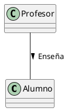

### Otras relaciones

Además de esas relaciones básicas, existen otras un poco más avanzadas.

- **Dependencia:** "usa". En este tipo de relación, se dice que una clase usa a otra. Este uso puede ser mediante clases que contengan otras clases o mediante la implementación de interfaces dentro de una clase. Se representa como la herencia, pero con línea discontinua. A efectos de programación, una interfaz y una clase abstracta son muy similares. En ambos casos, no permiten instancias de ellas, sino de clases derivadas o que las usen. En Java, las interfaces vienen a compensar las limitaciones que tiene el hecho de que no exista la herencia múltiple.

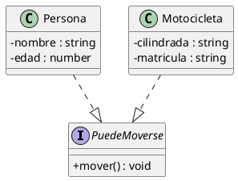

Un uso muy habitual de las interfaces es el de agrupar instancias que semánticamente son cosas distintas, pero que todas pueden realizar la misma acción. De esta forma, les podemos pedir a todas ellas con un mensaje que realicen dicha acción, aunque sean cosas tan dispares como una puerta o un plazo de entrega (en ambos casos, se podrían cerrar).

- **Pertenencia al mismo paquete:** En caso de que queramos especificar también los paquetes, podemos encapsular las clases en formas geométricas para verlo claro, de la siguiente manera:

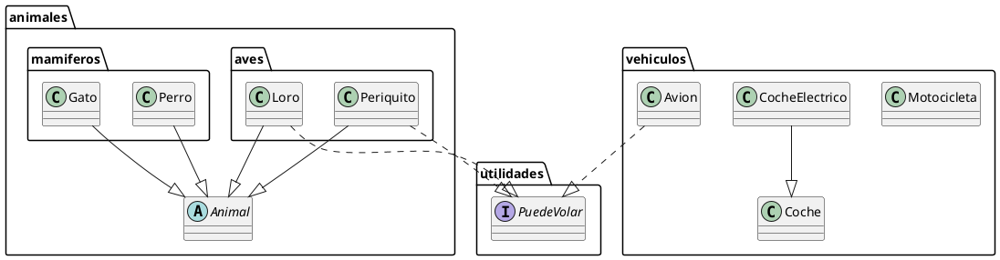

Como se puede observar, puede haber paquetes dentro de paquetes y las clases de un paquete pueden relacionarse con clases de otros paquetes. Los paquetes tienen una relación más de conveniencia a la hora de programar que semántica. 

---

### Actividad 3: Explica el siguiente diagrama

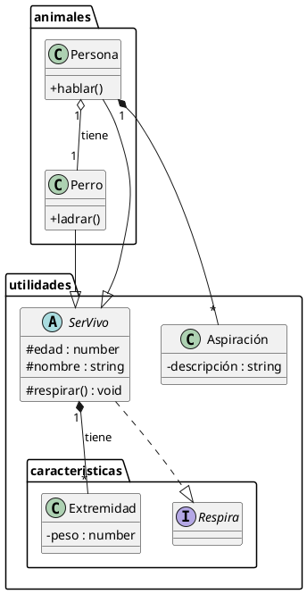

### Actividad 4: Crea un diagrama de la siguiente explicación

La vida es dura, pero la vida de cada persona tiene un grado de dureza diferente, que clasificamos con un número. Las personas asismo tienen algo que las identifica, su propio nombre. Pueden elegir varias profesiones, como carpintero o influencer. Los carpinteros usan la madera para construir muebles. Los influencer usan las mesas, que son muebles, para poner sus ordenadores. Una persona puede tener varios muebles. Las sillas también son muebles.

---

<div style="page-break-after: always;"></div>

# Programació Orientada a Objectes (VAL)

## Relacions entre classes

A través dels diagrames UML podem expressar les relacions entre les classes de múltiples maneres, mitjançant línies que les uneixen. Al seu torn, també podem especificar cardinalitats, com en els diagrames Entitat-Relació emprats en bases de dades, per a quantificar els detalls de les relacions, i fins i tot posar nom a dites relacions (generalment amb un verb). Representem les cardinalitats amb 0, 1, molts (representat a vegades amb `*` o una lletra) o números fixos. Les classes es poden relacionar entre elles de les següents maneres:

- **Herència:** "és un" (relació jeràrquica). Una classe deriva d’una altra. La classe base es denomina a vegades classe pare i la classe derivada classe filla. En alguns casos, la classe pare és una classe abstracta. Això significa que la classe abstracta no pot ser instanciada, però les derivades (mentre no siguen abstractes al seu torn) sí. Les classes abstractes, a l’hora de ser programades, poden tenir mètodes abstractes, que són mètodes sense definir (es defineixen en les classes derivades).

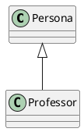

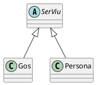

- **Component:** "té un". Una classe conté com a atribut un objecte (o diversos) d’una altra.
- **Composició:** De tipus *component*. En aquest cas, l'atribut és depenent de la classe principal.

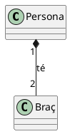

*Una persona té dos braços. Els braços no poden existir sense la persona.*

- **Agregació:** De tipus *component*. En aquest cas, l'atribut no és depenent de la classe principal i pot existir per separat.

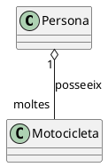

*Una persona posseeix moltes motocicletes. Cada motocicleta pot existir sense la persona.*

- **Associació:** "col·labora amb". Dues classes poden treballar en col·laboració. La col·laboració pot ser simètrica o asimètrica (assinalem la direcció amb una fletxa). Encara que no és exactament el mateix concepte, l’associació es pot utilitzar de forma alternativa a l’agregació i la composició. De fet, moltes vegades, el resultat al programar-la serà el mateix.

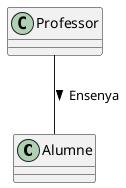

### Altres relacions

A més d’aquestes relacions bàsiques, existeixen altres un poc més avançades.

- **Dependència:** "usa". En aquest tipus de relació, es diu que una classe usa una altra. Aquest ús pot ser mitjançant classes que continguin altres classes o mitjançant la implementació d'interfícies dins d'una classe. Es representa com la herència, però amb línia discontínua. A efectes de programació, una interfície i una classe abstracta són molt semblants. En ambdós casos, no permeten instàncies d'elles, sinó de classes derivades o que les usen. En Java, les interfícies compensen les limitacions que té el fet que no existisca la herència múltiple.

```plantuml
@startuml
skinparam classAttributeIconSize 0
interface PotMoure’s{
    + moure’s() : void
}
class Persona{
    - nom : string
    - edat : number
}
class Motocicleta{
    - cilindrada : string
    - matrícula : string
}
Persona ..|> PotMoure’s
Motocicleta ..|> PotMoure’s
@enduml
```

Un ús molt habitual de les interfícies és el d’agrupar instàncies que semànticament són coses distintes, però que totes poden realitzar la mateixa acció. D’aquesta manera, els podem demanar a totes elles amb un missatge que realitzen dita acció, encara que siguen coses tan dispars com una porta o un termini de lliurament (en ambdós casos, es podrien tancar).

- **Pertinença al mateix paquet:** En cas que vulguem especificar també els paquets, podem encapsular les classes en formes geomètriques per veure-ho clar, de la següent manera:

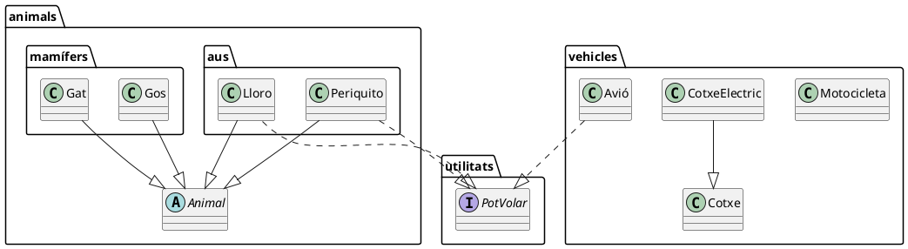

Com es pot observar, pot haver-hi paquets dins de paquets i les classes d'un paquet poden relacionar-se amb classes d'altres paquets. Els paquets tenen una relació més de conveniència a l’hora de programar que semàntica.

---

### Activitat 3: Explica el següent diagrama

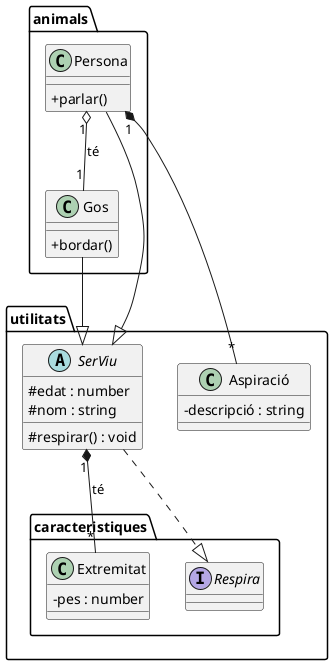

### Activitat 4: Crea un diagrama de la següent explicació

La vida és dura, però la vida de cada persona té un grau de duresa diferent, que classifiquem amb un número. Les persones així mateix tenen alguna cosa que les identifica, el seu propi nom. Poden triar diverses professions, com fuster o influencer. Els fusters usen la fusta per a construir mobles. Els influencers usen les taules, que són mobles, per a col·locar els seus ordinadors. Una persona pot tenir diversos mobles. Les cadires també són mobles.