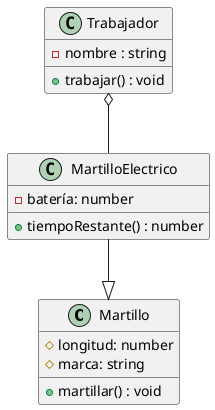
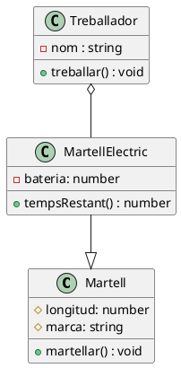

<style>

body{
    font-family: Arial, Helvetica, sans-serif;
    font-size: 1rem;
} 
p{
    text-indent: 1rem;
    text-align: justify;
}
h1{
    font-size: 2rem;
    font-weight: bold;
}
h2{
    font-size: 1.5rem;
    font-weight: bold;
}
h3{
    font-size: 1.25rem;
    font-style: italic;
    font-weight: bold;
}
img{
    display: block;
    margin: 0 auto;
}
</style>

- [Programación Orienada a Objetos (CAS)](#programación-orienada-a-objetos-cas)
  - [1. Definición de clases en Java](#1-definición-de-clases-en-java)
    - [Actividad 5: Clases a partir de diagramas](#actividad-5-clases-a-partir-de-diagramas)
  - [2. Constructores, getters y setters. Creación automatizada con IntelliJ](#2-constructores-getters-y-setters-creación-automatizada-con-intellij)
    - [Actividad 6: Constructores, Setters y Getters](#actividad-6-constructores-setters-y-getters)
  - [5. Empaquetado de clases. Importaciones](#5-empaquetado-de-clases-importaciones)
    - [Actividad 7: Empaquetado de clases](#actividad-7-empaquetado-de-clases)
- [Programació Orientada a Objectes (VAL)](#programació-orientada-a-objectes-val)
  - [1. Definició de classes en Java](#1-definició-de-classes-en-java)
    - [Activitat 5: Classes a partir de diagrames](#activitat-5-classes-a-partir-de-diagrames)
  - [2. Constructors, getters i setters. Creació automatitzada amb IntelliJ](#2-constructors-getters-i-setters-creació-automatitzada-amb-intellij)
    - [Activitat 6: Constructors, Setters i Getters](#activitat-6-constructors-setters-i-getters)
  - [5. Paquetització de classes. Importacions](#5-paquetització-de-classes-importacions)
    - [Activitat 7: Paquetització de classes](#activitat-7-paquetització-de-classes)

<div style="page-break-after: always;"></div>

# Programación Orienada a Objetos (CAS)

## 1. Definición de clases en Java

En Java, como en cualquier otro lenguaje de programación, podemos trasladar cualquier diagrama UML de clases a programación. Veamos unos ejemplos:



```java
class Martillo{
    protected float longitud;
    protected String marca;
    public void martillar(){
        //hace lo que hacen los martillos
    }
}
class MartilloElectrico extends Martillo{
    private float bateria;
    public int tiempoRestante(){
        int tiempo;
        //hace un cálculo y devuelve el tiempo restante
        return tiempo;
    }
}
class Trabajador{
    private String nombre;
    private MartilloElectrico martilloElectrico;
    public void Trabajar(){

    }
}
```

Como vemos, las relaciones de herencia se expresan de manera explícita a través de la palabra reservada `extends`, mientras que las relaciones de componente se representan como atributos dentro de las clases donde son contenidos los componentes.

A la hora de programar en Java, cada archivo se corresponde con una clase pública con el mismo nombre. Por convención, las clases se escriben con la primera letra en mayúscula y usando CamelCase (cada nueva palabra empieza en mayúscula), mientras que las variables se escriben con la primera letra en minúscula, pero usando CamelCase también.

Además de la clase pública, cada archivo puede tener una o más clases, aunque no es práctica común.

En Java, si no se especifica ningún tipo de visibilidad, la visibilidad por defecto es de Paquete, que es pública para los miembros del mismo paquete y privada para todos los demás. Se trata de un tipo de visibilidad muy práctica que trabajaremos más adelante.

### Actividad 5: Clases a partir de diagramas

Crea un proyecto nuevo en IntelliJ. Añade un archivo, Libro.java, y crea en él la clase Libro, cuyo diagrama creaste en la actividad 1.

Después, crea un diagrama en uml para representar una estantería de libros. Crea el archivo Estanteria.java (no uses tildes) y codifica la clase.

Haz un programa `main` de la siguiente forma:

```java
public class Main{
    public static void main(String [] args){
        Libro libro = new Libro();
        Estanteria estanteria = new Estanteria();
    }
}
```

---

<div style="page-break-after: always;"></div>

## 2. Constructores, getters y setters. Creación automatizada con IntelliJ

Para crear una instancia de un objeto, necesitamos usar un constructor. Un constructor es un método especial que tiene el mismo nombre que la clase y que se llama cada vez que creamos un objeto con la sintaxis `objeto = new ClaseObjeto();`. Todas las clases tienen un constructor por defecto, pero podemos sobreescribirlo para que se comporte de forma personalizada, ya sea añadiéndole parámetros o cambiando su comportamiento interno. Para acceder a los atributos y métodos de un objeto, usamos la palabra reservada `this`.
Podemos acceder y modificar los atributos privados o protegidos de una clase a través de métodos, que llamamos *getters* y *setters*. Su uso está estandarizado y podemos hacer uso de la generación automática de código de IntelliJ para que, una vez definidos los atributos, nos cree el código para los getters y setters, así como el constructor.

```java
public class Persona{
    String nombre;
    public Persona(String nombre){
        this.nombre = nombre; //'this.nombre' representa el atributo nombre, mientras que 'nombre' representa el parámetro.
    }
    public String getNombre(){
        return this.nombre;
    }
    public void setNombre(String nombre){

    }
    public static void main(String [] args){
        Persona persona = new Persona("Arturo");
    }
}
```

### Actividad 6: Constructores, Setters y Getters

Usa la generación de código de IntelliJ para crear los constructores, los getters y los setters de las clases creadas en el ejercicio anterior.

Modifica el main para que funcione de la siguiente manera:
Tenemos una estantería que contiene 5 libros. Introduce los datos de cada libro de forma manual. Después, muestra por consola los nombres de los libros contenidos en dicha estantería.

---

## 5. Empaquetado de clases. Importaciones

En Java y muchos otros lenguajes de programación, podemos dividir el código en paquetes. A efectos prácticos, un paquete es como una carpeta que contiene varios códigos fuente relacionados. La visibilidad de paquete permite a las clases del mismo trabajar con los métodos y atributos marcados de esa manera como si fueran públicos. Mientras tanto, las clases de fuera del paquete no podrán acceder a ellos, porque los verán como privados.

Para que una clase externa al paquete puede trabajar con alguna clase del paquete, debe importarla. IntelliJ se encarga de hacer la importación de forma automática si usamos la autocompleción (recomendado).

### Actividad 7: Empaquetado de clases

Crea un paquete, `libreria`, y mueve a él las clases `Estanteria` y `Libro`. Acepta las opciones de refactorización que ofrece IntelliJ y fíjate en la cabecera de cada clase para ver cómo han quedado las importaciones. Después, crea una clase vacía, `Biblioteca`, dentro del paquete e impórtala de forma manual en el main. Comprueba que está bien instanciando un objeto de la clase biblioteca.

<div style="page-break-after: always;"></div>

# Programació Orientada a Objectes (VAL)

## 1. Definició de classes en Java

En Java, com en qualsevol altre llenguatge de programació, podem traslladar qualsevol diagrama UML de classes a programació. Vegem uns exemples:



```java
class Martell{
    protected float longitud;
    protected String marca;
    public void martellar(){
        //fa el que fan els martells
    }
}
class MartellElectric extends Martell{
    private float bateria;
    public int tempsRestant(){
        int temps;
        //fa un càlcul i retorna el temps restant
        return temps;
    }
}
class Treballador{
    private String nom;
    private MartellElectric martellElectric;
    public void Treballar(){

    }
}
```

Com veiem, les relacions d’herència s’expressen de manera explícita a través de la paraula reservada `extends`, mentre que les relacions de component es representen com atributs dins de les classes on són continguts els components.

A l’hora de programar en Java, cada fitxer es correspon amb una classe pública amb el mateix nom. Per convenció, les classes s’escriuen amb la primera lletra en majúscula i usant CamelCase (cada nova paraula comença en majúscula), mentre que les variables s’escriuen amb la primera lletra en minúscula, però usant CamelCase també.

A més de la classe pública, cada fitxer pot tenir una o més classes, encara que no és pràctica comuna.

En Java, si no s’especifica cap tipus de visibilitat, la visibilitat per defecte és de Paquet, que és pública per als membres del mateix paquet i privada per a tots els altres. Es tracta d’un tipus de visibilitat molt pràctic que treballarem més endavant.

### Activitat 5: Classes a partir de diagrames

Crea un projecte nou en IntelliJ. Afig un fitxer, Llibre.java, i crea en ell la classe Llibre, el diagrama de la qual vas crear en l’activitat 1.

Després, crea un diagrama en uml per a representar un prestatge de llibres. Crea el fitxer Prestatge.java (no utilitzes accents) i codifica la classe.

Fes un programa `main` de la següent manera:

```java
public class Main{
    public static void main(String [] args){
        Llibre llibre = new Llibre();
        Prestatge prestatge = new Prestatge();
    }
}
```

---

<div style="page-break-after: always;"></div>

## 2. Constructors, getters i setters. Creació automatitzada amb IntelliJ

Per a crear una instància d’un objecte, necessitem usar un constructor. Un constructor és un mètode especial que té el mateix nom que la classe i que es crida cada vegada que creem un objecte amb la sintaxi `objecte = new ClasseObjecte();`. Totes les classes tenen un constructor per defecte, però podem sobreescriure’l perquè es comporte de manera personalitzada, ja siga afegint-li paràmetres o canviant el seu comportament intern. Per a accedir als atributs i mètodes d’un objecte, usem la paraula reservada `this`.

Podem accedir i modificar els atributs privats o protegits d’una classe a través de mètodes, que anomenem *getters* i *setters*. El seu ús està estandarditzat i podem fer ús de la generació automàtica de codi d’IntelliJ perquè, una vegada definits els atributs, ens cree el codi per als getters i setters, així com el constructor.

```java
public class Persona{
    String nom;
    public Persona(String nom){
        this.nom = nom; //'this.nom' representa l’atribut nom, mentre que 'nom' representa el paràmetre.
    }
    public String getNom(){
        return this.nom;
    }
    public void setNom(String nom){

    }
    public static void main(String [] args){
        Persona persona = new Persona("Arturo");
    }
}
```

### Activitat 6: Constructors, Setters i Getters

Usa la generació de codi d’IntelliJ per a crear els constructors, els getters i els setters de les classes creades en l'exercici anterior.

Modifica el main perquè funcione de la següent manera: Tenim un prestatge que conté 5 llibres. Introdueix les dades de cada llibre de forma manual. Després, mostra per consola els noms dels llibres continguts en dit prestatge.

---

## 5. Paquetització de classes. Importacions

En Java i molts altres llenguatges de programació, podem dividir el codi en paquets. A efectes pràctics, un paquet és com una carpeta que conté diversos codis font relacionats. La visibilitat de paquet permet a les classes del mateix treballar amb els mètodes i atributs marcats d’eixa manera com si foren públics. Mentrestant, les classes de fora del paquet no podran accedir-hi, perquè els veuran com a privats.

Perquè una classe externa al paquet puga treballar amb alguna classe del paquet, ha d’importar-la. IntelliJ s’encarrega de fer la importació de manera automàtica si usem l’autocompletat (recomanat).

### Activitat 7: Paquetització de classes

Crea un paquet, `libreria`, i mou-hi les classes `Prestatge` i `Llibre`. Accepta les opcions de refactorització que ofereix IntelliJ i fixa’t en la capçalera de cada classe per a veure com han quedat les importacions. Després, crea una classe buida, `Biblioteca`, dins del paquet i importa-la de manera manual en el main. Comprova que està bé instanciant un objecte de la classe Biblioteca.
