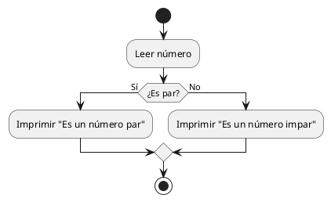
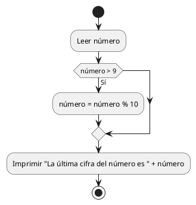
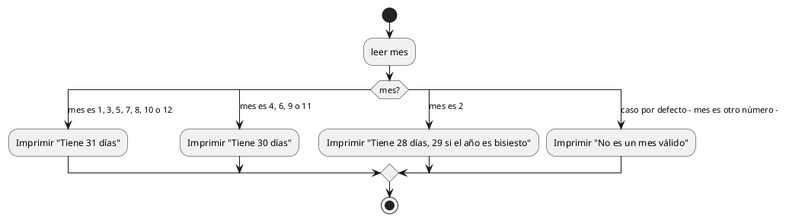
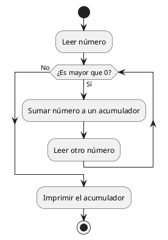
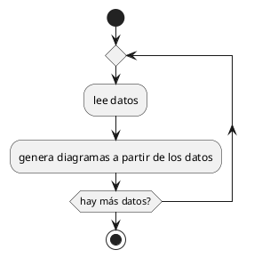
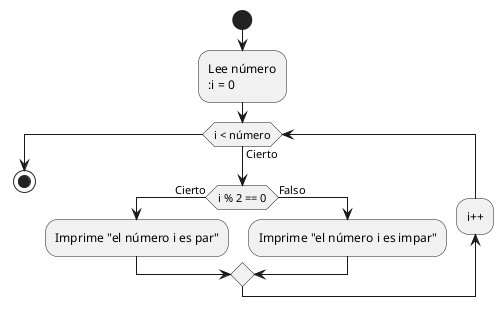

<style>
  body{
    text-align: justify;
  }
  h1,h2,h3,h4{
    font-weight: bold;
  }
</style>
# Sesión 01: Diagramas de actividad I

- [Sesión 01: Diagramas de actividad I](#sesión-01-diagramas-de-actividad-i)
  - [1. Análisis de sistemas: Qué es y para qué sirve](#1-análisis-de-sistemas-qué-es-y-para-qué-sirve)
  - [2. Introducción al concepto de algoritmo](#2-introducción-al-concepto-de-algoritmo)
    - [2.1 Propiedades clave de los algoritmos](#21-propiedades-clave-de-los-algoritmos)
  - [3. Errores comunes en los algoritmos](#3-errores-comunes-en-los-algoritmos)
    - [3.1 Ejercicio 1](#31-ejercicio-1)
  - [4. Algoritmos en lenguaje natural](#4-algoritmos-en-lenguaje-natural)
    - [4.1 Los bucles infinitos, el gran enemigo del diseñador de algoritmos](#41-los-bucles-infinitos-el-gran-enemigo-del-diseñador-de-algoritmos)
      - [Define una condición de terminación clara](#define-una-condición-de-terminación-clara)
      - [Limita el número de iteraciones](#limita-el-número-de-iteraciones)
      - [Evita condiciones ambiguas](#evita-condiciones-ambiguas)
      - [Introduce una forma de detener el algoritmo manualmente](#introduce-una-forma-de-detener-el-algoritmo-manualmente)
      - [Valida los algoritmos antes de usarlos](#valida-los-algoritmos-antes-de-usarlos)
      - [Checklist para evitar bucles infinitos](#checklist-para-evitar-bucles-infinitos)
    - [4.2 Ejercicio 2](#42-ejercicio-2)
    - [4.4 Ejercicio 3](#44-ejercicio-3)
  - [5. Diagramas de flujo o actividad](#5-diagramas-de-flujo-o-actividad)
    - [5.1 Componentes básicos de un diagrama de flujo](#51-componentes-básicos-de-un-diagrama-de-flujo)
    - [5.2 Estructuras comunes parte I](#52-estructuras-comunes-parte-i)
      - [Estructuras if-else, if y switch](#estructuras-if-else-if-y-switch)
      - [Estructuras while, do-while y for](#estructuras-while-do-while-y-for)
    - [5.3 Ejercicio 4](#53-ejercicio-4)
    - [5.2 Ejercicio 5](#52-ejercicio-5)
    - [5.4 Ejercicio 6](#54-ejercicio-6)
    - [5.5 Ejercicio 7](#55-ejercicio-7)

## 1. Análisis de sistemas: Qué es y para qué sirve

El análisis de sistemas es el proceso mediante el cual se estudian y descomponen los componentes de un sistema para entender su funcionamiento, identificar problemas y encontrar soluciones eficaces. Este proceso se utiliza en ingeniería, informática, administración y muchas otras áreas para desarrollar o mejorar sistemas complejos. Entre sus utilidades, encontramos las siguientes:

1. **Identificación de problemas**: Permite detectar cuellos de botella, errores o fallos en un sistema.
2. **Optimización de procesos**: Ayuda a rediseñar procesos para mejorar su eficiencia.
3. **Diseño de nuevos sistemas**: Se utiliza como paso inicial para construir sistemas nuevos y bien estructurados.

El análisis de sistemas es fundamental en el desarrollo de software, ya que proporciona una visión clara de los requisitos del sistema antes de pasar al diseño y la programación.

## 2. Introducción al concepto de algoritmo

Un algoritmo es un conjunto finito de pasos que resuelve un problema o realiza una tarea. No se aplican solamente a programas informáticos, sino a todo problema que se pueda resolver siguiendo una serie de instrucciones. Por ejemplo, los siguientes:

- Preparar un café.
- Ir de casa al trabajo cogiendo un autobús.
- Ir a comprar al supermercado los productos apuntados en una lista.

Cuando un problema se puede resolver de esta manera, se dice que es computable. Todos los problemas computables son susceptibles de ser resueltos (o simulados) en un ordenador.

### 2.1 Propiedades clave de los algoritmos

Para que un algoritmo esté bien redactado, se tienen que cumplir una serie de condiciones:

- Los pasos deben estar ordenados y ejecutarse en el orden correcto.
- Cada paso debe ser preciso y sin ambigüedades.
- El algoritmo debe terminar en un número finito de pasos (aunque el número sea desconocido a priori).

## 3. Errores comunes en los algoritmos

Es habitual, sobre todo al comenzar, cometer uno de los siguientes errores al realizar algoritmos:

- **Falta de precisión:** Si los pasos no son claros, el algoritmo no funcionará correctamente.
- **Pasos redundantes:** Incluir pasos innecesarios puede complicar el algoritmo.
- **Secuencia incorrecta:** Si el orden es erróneo, el resultado final no será correcto.

Vamos a discutir una serie de algoritmos, cada uno de ellos con un problema diferente:

**Hacer la compra**:

1. Ve al supermercado
2. Compra cosas
3. Vuelve a casa

En este caso, el paso 2 es demasiado ambiguo. ¿Qué es *compra cosas*? Un algoritmo debería ser mucho más concreto y explícito con lo que se hace.

**Pela una patata**:

1. Coge la patata
2. Lava la patata
3. Coge el pelador de patatas
4. Pásalo por la piel
5. Pela la patata
6. Lava la patata
7. Deja la patata

En este caso, el paso 4 y el paso 5 son esencialmente lo mismo, dicho de dos formas distintas. Los errores de redundancia son más difíciles de ver, salvo que sean muy obvios como en este caso.

**Haz la fregaza**:

1. Secar los platos.
2. Poner agua y detergente en el fregadero.
3. Enjuagar los platos.
4. Fregar los platos.

Por último, auqí vemos claramente un cambio en el orden de los pasos. El paso 4 y el paso 3 están intercambiados. Además, el paso 1 debería ser el último en realidad. El orden es fundamental en la mayoría de casos para que un algoritmo pueda resolverse con éxito.

### 3.1 Ejercicio 1

Detecta los errores de los siguientes algoritmos:

**1. Hacer un té**:

1. Llena la tetera con agua.  
2. Sirve el té en una taza.  
3. Calienta el agua en la tetera.  
4. Coloca una bolsita de té en la taza.  
5. Hierve el agua.  

**2. Ponerse una camiseta**:

1. Toma la camiseta con las manos.  
2. Mete la cabeza por el agujero para el brazo.  
3. Coloca un brazo en el agujero correspondiente.  
4. Coloca el otro brazo en el agujero.  
5. Ajusta la camiseta al cuerpo.  

**3. Cruzar la calle**:

1. Mira a la derecha.  
2. Cruza la calle.  
3. Mira a la izquierda.  
4. Llega al otro lado.  

**4. Hacer un bocadillo**:

1. Toma dos rebanadas de pan.  
2. Unta la mantequilla en el pan.  
3. Añade el queso.  
4. Guarda el queso en la nevera.  
5. Come el bocadillo.  

**5. Encender un ordenador**:

1. Presiona el botón de encendido en el monitor.  
2. Abre el navegador de internet.  
3. Presiona el botón de encendido en la torre del ordenador.  
4. Escribe la página web que deseas visitar.

**6. Lavar la ropa**:

1. Mete la ropa en la lavadora.  
2. Añade detergente en el compartimento correspondiente.  
3. Cierra la puerta de la lavadora.  
4. Lava la ropa a mano.  
5. Enciende la lavadora.  
6. Elige el programa de lavado adecuado.  

**7. Encender una lámpara**:

1. Coloca la bombilla en el casquillo.  
2. Conecta el cable de la lámpara al enchufe.  
3. Pulsa el interruptor de la lámpara.  
4. Enchufa la lámpara.  

**8. Abrir una puerta cerrada con llave**:

1. Coge la llave.  
2. Introduce la llave en la cerradura.  
3. Gira la llave para desbloquear la puerta.  
4. Empuja la puerta para abrirla.  
5. Cierra la puerta con llave.  

**9. Montar un mueble**:

1. Saca las piezas del mueble de la caja.  
2. Consulta las instrucciones.  
3. Une todas las piezas entre sí con tornillos.  
4. Coloca las piezas pequeñas que sobren.  
5. Ajusta los tornillos con el destornillador.  

**10. Cocinar arroz**:

1. Enciende el fuego.  
2. Pon agua en una olla.  
3. Lava el arroz.  
4. Echa el arroz en la olla.  
5. Hierve el agua.  
6. Saca el arroz de la olla.  

**11. Ir al trabajo**:

1. Ponte los zapatos.  
2. Sal de casa.  
3. Súbete al coche.  
4. Conduce hasta el trabajo.  
5. Arranca el coche.  

**12. Hacer un dibujo**:

1. Toma un papel y un lápiz.  
2. Dibuja un círculo.  
3. Borra el círculo.  
4. Dibuja una línea recta.  
5. Colorea el círculo.

## 4. Algoritmos en lenguaje natural

A esta forma de resolver algoritmos se le llama notación natural o lenguaje natural. Consiste en enumerar una serie de instrucciones, que se deben seguir de forma ordenada salvo que haya un salto condicional o incondicional. Un salto condicional es una instrucción que, si se cumple la condición que presenta, te dirige a otra instrucción concreta (que puede ser anterior o posterior). Un salto incondicional es aquel que ocurre siempre. Generalmente, tiene que haber una forma de eludir el salto incondicional para que no se produzcan bucles infinitos.

*Haz la fregaza mejorada*:

1. Pon los platos sucios en la pila de platos sucios.
2. Si no hay platos en la pila de platos sucios, salta al paso 11.
3. Si el estropajo tiene jabón salta al paso 5, si no, sigue adelante.
4. Pon jabón en el estropajo.
5. Coge un plato de la pila de platos sucios.
6. Échale agua al plato.
7. Friega el plato.
8. Enjuaga el plato.
9. Deja el plato en el escurridor.
10. Salta al paso 2.
11. Guarda los platos en su sitio.

En este algoritmo, podemos ver un salto condicional en el paso 2, que nos llevaría al paso 11 con el que acabaríamos el algoritmo. También vemos un salto incondicional en el paso 10, que nos devuelve al paso 2. En este caso, no se produciría un bucle infinito porque el paso 2 nos lleva al paso 11 si la pila de platos sucios está vacía, y en el paso 5 cogemos un plato sucio, por lo que la vamos vaciando constantemente. También tiene otro salto condicional en el paso 3, que nos permite saltarnos el paso 4 si el estropajo ya tiene jabón.

En cierto sentido, este diseño de algoritmos se asemeja a los libros de *Escoge tu propia aventura*, en los cuales podíamos elegir si ir a una página u otra del libro según nuestras decisiones. Todas las aventuras alcanzaban un final, aunque no necesariamente el mismo.

### 4.1 Los bucles infinitos, el gran enemigo del diseñador de algoritmos

Un **bucle infinito** ocurre cuando un algoritmo nunca llega a un estado de finalización debido a una mala implementación de saltos condicionales o incondicionales. Esto puede hacer que el sistema se bloquee o se comporte de manera incorrecta. Se trata de uno de los errores más comunes y peligrosos cuando se trabaja con saltos a la hora de diseñar algoritmos, y es fundamental evitarlos. A continuación, se presentan las claves para evitar este error:

#### Define una condición de terminación clara

- **Qué es:** Una condición de terminación es un criterio que asegura que el algoritmo finalizará en algún momento.
- **Cómo aplicarlo:**
  - Antes de escribir un salto, pregúntate: "¿Cuándo terminará este bucle?".
  - Asegúrate de que exista al menos un paso dentro del algoritmo que modifique el estado actual y acerque al sistema a cumplir esa condición.

**Ejemplo malo:**

```plaintext
1. Si hay ropa sucia, salta al paso 1.
2. Da por terminada la tarea.
```

> *Problema:* Nunca se cambia el estado de "ropa sucia", por lo que el algoritmo sigue saltando al paso 1 infinitamente.

**Ejemplo bueno:**

```plaintext
1. Si hay ropa sucia, lávala y salta al paso 1.
2. Da por terminada la tarea.
```

> *Solución:* El estado "ropa sucia" cambia (se lava), lo que garantiza que eventualmente no quedará ropa sucia y el bucle finalizará.

#### Limita el número de iteraciones

- **Qué es:** Define un límite explícito para cuántas veces se puede repetir un conjunto de pasos.
- **Cómo aplicarlo:**
  - Usa contadores o listas de elementos para medir el progreso.
  - Asegúrate de reducir el contador o vaciar la lista en cada iteración.

**Ejemplo malo:**

```plaintext
1. Coge un plato de la pila.
2. Lava el plato.
3. Salta al paso 1.
```

> *Problema:* No hay una condición que limite el bucle, lo que puede llevar a un bucle infinito si no se vacía la pila.

**Ejemplo bueno:**

```plaintext
1. Si hay platos en la pila, coge uno.
2. Lávalo.
3. Si la pila sigue teniendo platos, salta al paso 1.
4. Da por terminada la tarea.
```

> *Solución:* Se verifica que la pila tiene platos antes de saltar, y la pila se vacía progresivamente.

#### Evita condiciones ambiguas

- **Qué es:** Una condición ambigua ocurre cuando los saltos dependen de criterios que no están claramente definidos o que no cambian dentro del algoritmo.
- **Cómo aplicarlo:**
  - Asegúrate de que cada condición sea concreta, medible y esté basada en un cambio que ocurre durante la ejecución del algoritmo.

**Ejemplo malo:**

```plaintext
1. Si el arroz no está cocido, salta al paso 1.
2. Sirve el arroz.
```

> *Problema:* No se especifica cómo verificar si el arroz está cocido ni qué acción tomar para cocerlo.

**Ejemplo bueno:**

```plaintext
1. Si el agua no está hirviendo, espera 1 minuto y salta al paso 1.
2. Añade el arroz.
3. Si el arroz no está cocido, espera 5 minutos y salta al paso 3.
4. Sirve el arroz.
```

> *Solución:* Se define una acción para cada estado y se asegura que el arroz progresará hacia la cocción.

#### Introduce una forma de detener el algoritmo manualmente

- **Qué es:** Proporcionar un mecanismo que permita detener el proceso si detectas un error o un bucle infinito.
- **Cómo aplicarlo:**
  - Añade una instrucción que permita salir del bucle si se cumple una condición específica o si el algoritmo ha iterado más de lo esperado.

**Ejemplo bueno:**

```plaintext
1. Si hay más de 10 iteraciones, salta al paso 4.
2. Repite los pasos necesarios.
3. Salta al paso 1.
4. Da por terminado el algoritmo.
```

> *Solución:* Se asegura que el bucle no se ejecute indefinidamente.

#### Valida los algoritmos antes de usarlos

- **Qué es:** Revisar el diseño del algoritmo con cuidado antes de implementarlo.
- **Cómo aplicarlo:**
  - Simula el algoritmo en papel o con datos simples para verificar que la condición de terminación se cumple.
  - Identifica posibles estados iniciales o condiciones que podrían causar bucles infinitos.

#### Checklist para evitar bucles infinitos

1. ¿Existe una condición clara que haga terminar el algoritmo?
2. ¿Cada salto condicional está diseñado para modificar el estado o progresar hacia el fin?
3. ¿Se limita explícitamente el número de iteraciones, si es necesario?
4. ¿Se verifica que todas las condiciones sean claras y medibles?
5. ¿Hay mecanismos para detectar y corregir errores en tiempo de ejecución?

Con estas indicaciones se puede tomar consciencia para evitar diseñar algoritmos con bucles infinitos. En general, los bucles infinitos deben ser evitados salvo para algunas aplicaciones concretas, pero esos son casos avanzados que no se corresponden con este nivel de diseño de algoritmos.

### 4.2 Ejercicio 2

Diseña un algoritmo en lenguaje natural que tenga saltos condicionales e incondicionales para las siguientes tareas:

- Limpiar la casa (consta de habitaciones, cocina, baños, pasillos, terraza y salón).
- Hacer una tortilla de patatas.
- Controlar en una excursión del colegio que el autobús pueda salir sin que se quede ningún niño en tierra. Como responsable, debes buscar a los niños que falten.
- Hacer los ejercicios de clase.

### 4.4 Ejercicio 3

Analiza los siguientes algoritmos y determina qué errores tienen, en el caso de que estén mal. Algunos errores son sutiles, así que mantente vigilante:

**1. Regar las plantas**:

1. Llena la regadera con agua.  
2. Si la regadera está vacía, salta al paso 1.  
3. Riega una planta.  
4. Si hay plantas sin regar, salta al paso 3.  
5. Deja la regadera en su lugar.  

**2. Hacer palomitas**:

1. Saca un paquete de palomitas.  
2. Si no hay paquetes de palomitas, salta al paso 7.  
3. Coloca el paquete en el microondas.  
4. Enciende el microondas por 3 minutos.  
5. Si escuchas que las palomitas han dejado de reventar, apaga el microondas y salta al paso 6
6. Saca las palomitas del microondas.  
7. Disfruta de las palomitas.  

**3. Organizar un escritorio**:

1. Recoge todos los objetos del escritorio.
2. Si hay basura, tírala a la papelera.  
3. Coloca los objetos útiles en el lugar correspondiente.  
4. Si el escritorio no está vacío, salta al paso 2.  
5. Limpia el escritorio con un paño húmedo.  
6. Si hay objetos sobre el escritorio, salta al paso 3.  
7. Da por terminada la tarea.  

**4. Vestirse para salir**:

1. Ponte la ropa interior.  
2. Ponte los pantalones.  
3. Si hace frío, salta al paso 5.  
4. Ponte una camiseta.  
5. Ponte un abrigo o chaqueta.  
6. Si estás vestido correctamente, salta al paso 8.  
7. Revisa qué falta y vuelve al paso 1.  
8. Sal de casa.

**5. Cocinar pasta**:

1. Llena una olla con agua.  
2. Si el agua está hirviendo, salta al paso 4.  
3. Añade la pasta a la olla.  
4. Si no está lista, salta al paso 3.  
5. Escurre la pasta.  
6. Sirve la pasta en un plato.  
7. Añade salsa y disfruta.  

**6. Buscar un libro en la biblioteca**:

1. Entra en la biblioteca.  
2. Ve al estante de libros.  
3. Busca el libro que necesitas.  
4. Si no encuentras el libro, salta al paso 7.  
5. Toma el libro y llévalo al mostrador.  
6. Sal de la biblioteca.  
7. Busca en otro estante.  

**7. Poner la mesa**:

1. Si no hay platos en el armario, salta al paso 6.  
2. Coloca un plato en cada asiento.  
3. Si no hay cubiertos en el cajón, salta al paso 6.  
4. Coloca los cubiertos junto a cada plato.  
5. Si faltan vasos, salta al paso 6.  
6. Coloca un vaso en cada asiento.  
7. Da por terminada la tarea.  

**8. Preparar un bocadillo**:

1. Toma dos rebanadas de pan.  
2. Si tienes ingredientes para rellenar el bocadillo, salta al paso 4.  
3. Salta al paso 7.  
4. Coloca los ingredientes entre las rebanadas de pan.  
5. Si no hay ingredientes suficientes, salta al paso 2.  
6. Cierra el bocadillo.  
7. Come el bocadillo.

## 5. Diagramas de flujo o actividad

Los diagramas de flujo son representaciones gráficas de algoritmos o procesos, en las que se usan símbolos específicos para mostrar los pasos y decisiones. Son una herramienta esencial en la planificación, análisis y comunicación de sistemas.

### 5.1 Componentes básicos de un diagrama de flujo

1. **Óvalo**: Representa el inicio o fin del proceso.
2. **Rectángulo**: Indica una acción o proceso.
3. **Rombo**: Representa una decisión, como una bifurcación.
4. **Flechas**: Conectan los diferentes símbolos y muestran el flujo del proceso.

### 5.2 Estructuras comunes parte I

#### Estructuras if-else, if y switch

Estas estructuras se utilizan para representar decisiones lógicas.  
**Ejemplo de if-else:**



**Ejemplo de if:**



**Ejemplo de Switch-case



#### Estructuras while, do-while y for

Los bucles permiten repetir una acción varias veces.  
**Ejemplo de bucle while que pide suma números hasta que introduces 0:**



**Ejemplo de bucle do-while para hacer diagramas:**



**Ejemplo de bucle for para separar los números pares e impares desde 0 hasta una entrada dada por el usuario:**



### 5.3 Ejercicio 4

Dibuja un diagrama de flujo que determine si un número es positivo, negativo o cero.

### 5.2 Ejercicio 5

Crea un diagrama de flujo para sumar todos los números entre dos números entrados por el usuario en un bucle. Comprueba cuál de los dos números es mayor para establecer el orden de forma correcta. Si el resultado tiene una cifra, escribe "una cifra", si tiene dos escribe "dos cifras" y si tiene más escribe "Tres o más cifras".

### 5.4 Ejercicio 6

Realiza un diagrama de actividad de cada una de las actividades descritas en el ejercicio 2

### 5.5 Ejercicio 7

Realiza un diagrama de actividad de cada una de las siguientes actividades:

- Determinar la cantidad de días que tiene un mes en un año, ambos datos introducidos por el usuario. Los datos se imprimen por pantalla. El programa termina si el usuario introduce un número de mes incorrecto (menor que 1 o mayor que 12).
- Un programa que calcule el factorial de un número entero y mayor o igual a 1 introducido por el usuario. La fórmula del factorial es Factorial(n) = n * Factorial(n-1) y Factorial(1) = 1. Hazlo de forma iterativa (sin recursividad).
- Un programa que recorra las estanterías de una biblioteca y diga la siguiente información:
  - Qué estantería tiene más libros (están numeradas del 1 al 10)
  - Cuál es el título del libro que más páginas tiene y en qué estantería está
  - Cuántas páginas hay en cada estantería
