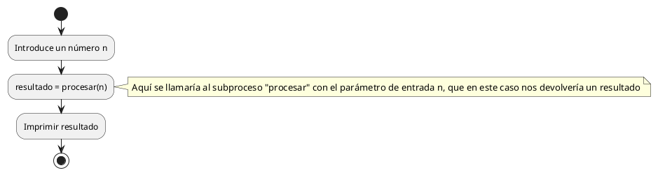
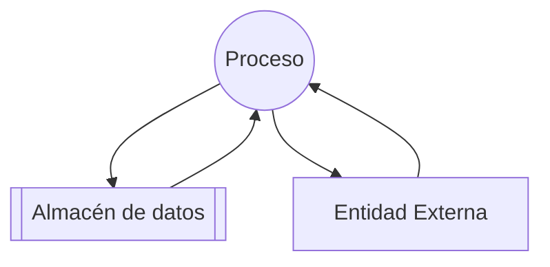
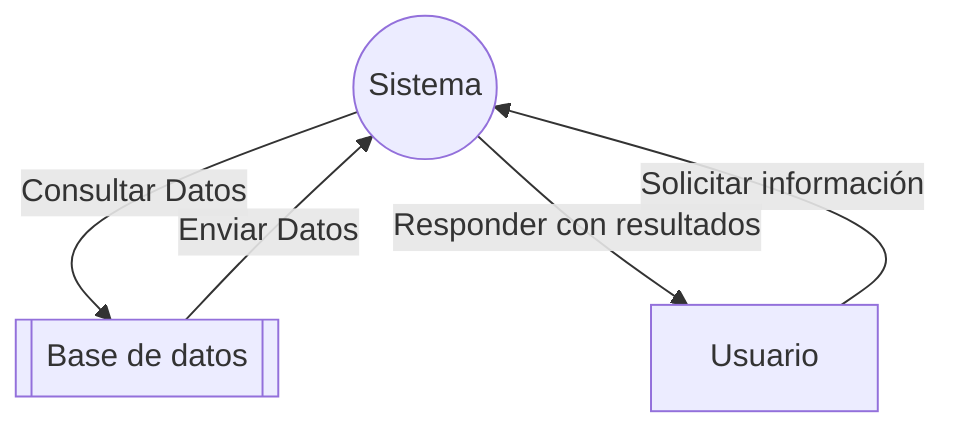
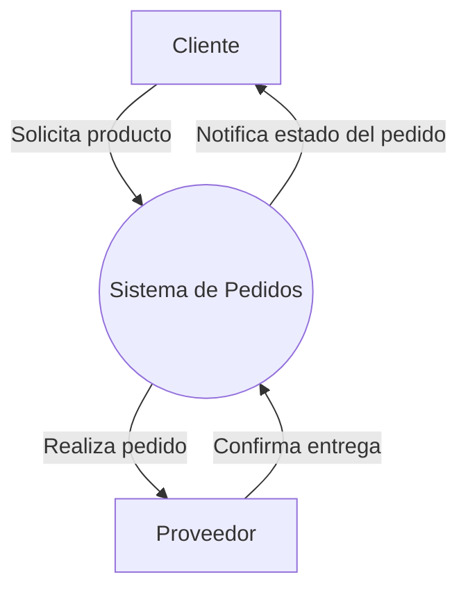
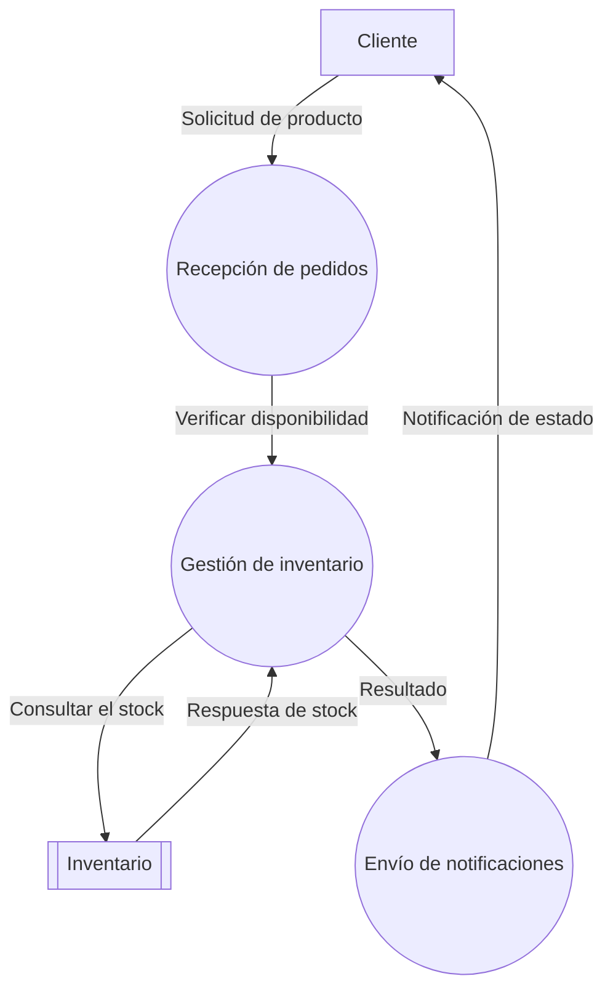
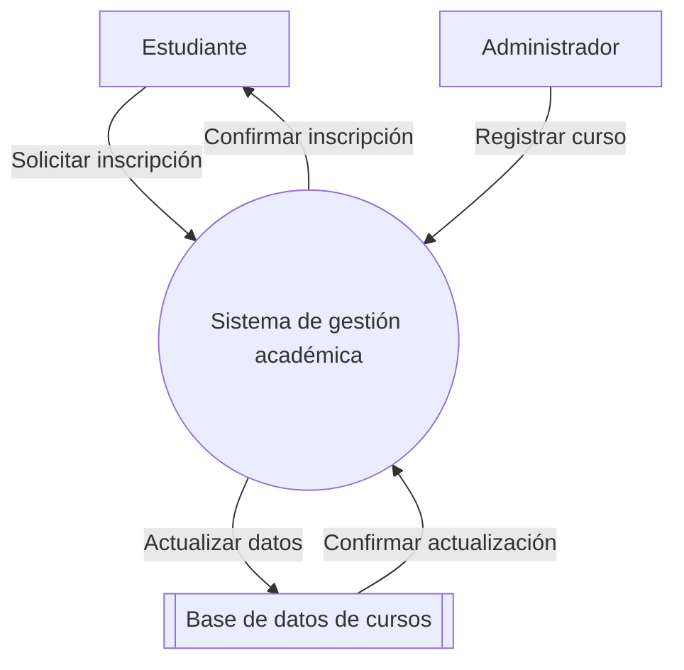
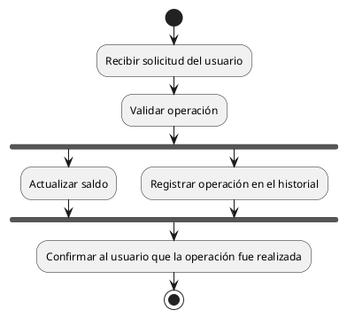

# Sesión 02: Diagramas de actividad II

- [Sesión 02: Diagramas de actividad II](#sesión-02-diagramas-de-actividad-ii)
  - [1. Diagramas de actividad](#1-diagramas-de-actividad)
    - [1.1 Estructuras comunes parte II](#11-estructuras-comunes-parte-ii)
    - [1.2 Subprocesos y llamadas a otros diagramas](#12-subprocesos-y-llamadas-a-otros-diagramas)
    - [1.3 Ejercicio 1](#13-ejercicio-1)
    - [1.4 Ejercicio 2](#14-ejercicio-2)
  - [2. Diagramas de flujo de datos (DFD)](#2-diagramas-de-flujo-de-datos-dfd)
    - [2.1 Componentes de un DFD](#21-componentes-de-un-dfd)
    - [2.2 Cómo se estructuran los DFD](#22-cómo-se-estructuran-los-dfd)
    - [2.3 Reglas básicas para construir DFD](#23-reglas-básicas-para-construir-dfd)
    - [2.4 De un DFD simple a uno detallado](#24-de-un-dfd-simple-a-uno-detallado)
      - [Nivel 0 (DFD de contexto)](#nivel-0-dfd-de-contexto)
      - [Nivel 1 (DFD de primer nivel)](#nivel-1-dfd-de-primer-nivel)
    - [2.5 Ejercicio 3: Construcción de un DFD](#25-ejercicio-3-construcción-de-un-dfd)
    - [2.6 Ejercicio 4: Interpretación de un DFD](#26-ejercicio-4-interpretación-de-un-dfd)
    - [2.7 Importancia de los DFD](#27-importancia-de-los-dfd)
    - [2.8 Ejercicio 5: Combinando DFDs y Diagramas de Flujo](#28-ejercicio-5-combinando-dfds-y-diagramas-de-flujo)
  - [3. Concurrencia en diagramas de actividad](#3-concurrencia-en-diagramas-de-actividad)
    - [3.1 Representación de los hilos](#31-representación-de-los-hilos)
    - [3.2 Ejercicio 6: Coordinación de Tareas en una Cocina](#32-ejercicio-6-coordinación-de-tareas-en-una-cocina)
  - [4. Ejercicios de ampliación sobre diagramas de actividad y DFD](#4-ejercicios-de-ampliación-sobre-diagramas-de-actividad-y-dfd)
    - [4.1 Ejercicio 7: Proceso de Compra en una Tienda Online](#41-ejercicio-7-proceso-de-compra-en-una-tienda-online)
    - [4.2 Ejercicio 8: Sistema de Registro de Asistencia](#42-ejercicio-8-sistema-de-registro-de-asistencia)
    - [4.3 Ejercicio 9: Sistema de Reservas para un Gimnasio](#43-ejercicio-9-sistema-de-reservas-para-un-gimnasio)
    - [4.4 Ejercicio 10: Sistema de Seguimiento de Paquetes](#44-ejercicio-10-sistema-de-seguimiento-de-paquetes)

## 1. Diagramas de actividad

### 1.1 Estructuras comunes parte II

### 1.2 Subprocesos y llamadas a otros diagramas

Los subprocesos permiten dividir un diagrama en partes más manejables y reutilizables. Es lo que en programación conocemos como "llamar a una función". Podemos indicarlo como cualquier otra instrucción.

### 1.3 Ejercicio 1

Dibuja un diagrama de flujo para calcular el área de varios triángulos introducidos por el usuario. Define un subproceso para calcular el área de un triángulo e invócalo en el momento adecuado.

### 1.4 Ejercicio 2

Realiza un diagrama de actividad de las siguientes actividades, usando llamadas a subprocesos:

- Determinar la cantidad de días que tiene un mes en un año, ambos datos introducidos por el usuario. Los datos se imprimen por pantalla. El programa termina si el usuario introduce un número de mes incorrecto (menor que 1 o mayor que 12).
- Un programa que calcule el factorial de un número entero y mayor o igual a 1 introducido por el usuario. La fórmula del factorial es Factorial(n) = n * Factorial(n-1) y Factorial(1) = 1. Hazlo de forma recursiva.
- Un programa que recorra las estanterías de una biblioteca y diga la siguiente información:
  - Cuál es el libro que más páginas tiene de cada estantería (necesitas un diagrama para indicar en una estantería cuál es el libro con más páginas)
  - Cuál es la estantería que más autores diferentes tiene (necesitas un diagrama para indicar en una estantería cuántos autores diferentes tiene)

## 2. Diagramas de flujo de datos (DFD)

Los diagramas de flujo de datos (DFD) son una herramienta gráfica utilizada para representar cómo la información se mueve dentro de un sistema, detallando las entradas, procesos, salidas y almacenamiento de datos. Son especialmente útiles en el análisis de sistemas para comprender y modelar sistemas informáticos, pero también pueden aplicarse en otros contextos donde se maneje información.

A diferencia de los diagramas de flujo tradicionales, los DFD no se centran en las decisiones ni en el control del flujo, sino en el flujo de datos y las transformaciones que estos sufren.

### 2.1 Componentes de un DFD

Los DFD están formados por los siguientes elementos clave:

1. **Procesos**: Representados por círculos o elipses. Muestran las transformaciones que sufren los datos dentro del sistema.
2. **Entidades externas (o agentes externos)**: Representadas por cuadrados. Son los actores externos al sistema que interactúan con él (por ejemplo, usuarios o sistemas externos).
3. **Almacenes de datos**: Representados por líneas paralelas o rectángulos abiertos. Indican lugares donde se almacenan datos, como bases de datos o archivos.
4. **Flujo de datos**: Representado por flechas. Indican cómo los datos se mueven entre procesos, entidades externas y almacenes de datos.

### 2.2 Cómo se estructuran los DFD

Los DFD se diseñan en **niveles jerárquicos**, desde lo general a lo específico:

1. **Nivel 0 (DFD de contexto)**: Es la representación más simple. Muestra el sistema como un único proceso, las entidades externas que interactúan con él y los flujos de datos entre ellas. Este nivel sirve para dar una visión global del sistema.

2. **Nivel 1 (DFD de primer nivel)**: Descompone el sistema en sus principales subprocesos, mostrando cómo interactúan entre sí y con las entidades externas.

3. **Niveles más detallados (Nivel 2 en adelante)**: Descomponen cada subproceso en procesos más pequeños, proporcionando detalles más específicos sobre el funcionamiento interno del sistema. En nuestras especificaciones, podemos sustituirlos por diagramas de actividad.

### 2.3 Reglas básicas para construir DFD

1. Todos los procesos deben tener al menos una entrada y una salida.
2. Los flujos de datos deben tener un origen (entidad externa o almacén de datos) y un destino (proceso, entidad externa o almacén de datos).
3. No deben conectarse directamente dos entidades externas o dos almacenes de datos; siempre debe haber un proceso intermediario.
4. Evitar ciclos innecesarios en el flujo de datos.

A continuación, un ejemplo simple de un DFD de contexto para un sistema de consulta de datos:

**Descripción del ejemplo**:

- Un usuario (entidad externa) envía una solicitud al sistema (proceso principal).
- El sistema consulta la información necesaria en la base de datos (almacén de datos).
- La base de datos responde con los datos requeridos.
- El sistema procesa la respuesta y la envía al usuario.

### 2.4 De un DFD simple a uno detallado

#### Nivel 0 (DFD de contexto)

En este nivel, el sistema se presenta como un único proceso que interactúa con entidades externas.

#### Nivel 1 (DFD de primer nivel)

El proceso "Sistema de pedidos" se divide en subprocesos más específicos.

### 2.5 Ejercicio 3: Construcción de un DFD

**Enunciado**: Diseña un DFD de contexto y un DFD de nivel 1 para un sistema de registro de estudiantes. El sistema debe:

- Recibir solicitudes de inscripción de estudiantes.
- Consultar una base de datos para verificar disponibilidad en los cursos.
- Confirmar la inscripción del estudiante.

### 2.6 Ejercicio 4: Interpretación de un DFD

**Instrucción**: Observa el siguiente DFD (te lo proporciono en PlantUML) y responde:

- ¿Qué actores externos interactúan con el sistema?
- ¿Qué procesos realiza el sistema?
- ¿Cómo se mueven los datos entre los procesos?

### 2.7 Importancia de los DFD

- **Facilitan la comunicación**: Al ser visuales, son fáciles de entender incluso para personas no técnicas.
- **Clarifican procesos complejos**: Permiten identificar redundancias o errores en los flujos de datos.
- **Base para el diseño de sistemas**: Sirven como referencia para la implementación técnica.

### 2.8 Ejercicio 5: Combinando DFDs y Diagramas de Flujo

**Planteamiento:**  
Diseña un sistema para modelar el funcionamiento de un cajero automático que permite al usuario realizar múltiples operaciones, siguiendo estas características:  

1. **Operaciones disponibles:**
   - Ingresar dinero: El sistema debe permitir añadir una cantidad al saldo de la cuenta.
   - Extraer dinero: Antes de realizar una extracción, el sistema debe comprobar si hay saldo suficiente en la cuenta. Si no hay saldo, debe mostrar un mensaje de error.
   - Finalizar sesión: El usuario puede cerrar la sesión en cualquier momento.

2. **Funcionamiento general:**  
   - El usuario puede realizar tantas operaciones consecutivas como desee, hasta que decida finalizar su sesión.  
   - Al finalizar la sesión, el sistema debe cerrar correctamente el flujo de datos y permitir que el usuario retire su tarjeta.  

3. **Tareas a realizar:**
   - **DFD (Nivel 0 y Nivel 1):** Representa cómo fluyen los datos en el sistema, incluyendo las entidades externas (como el usuario), procesos internos y almacenes de datos (como la cuenta bancaria).  
   - **Diagrama de flujo:** Diseña el flujo completo del sistema, utilizando estructuras como:
     - Un **switch** para manejar las diferentes operaciones.
     - Un **if-else** para verificar condiciones (como el saldo suficiente para una extracción).
     - Un **while** para permitir múltiples operaciones consecutivas.
  
## 3. Concurrencia en diagramas de actividad

Aunque no se trabaja programación concurrente en el primer curso del ciclo, es apropiado conocer cómo representar flujos paralelos (hilos) en un diagrama de actividad. Esta técnica es útil cuando se modelan procesos que pueden ejecutarse simultáneamente, algo común en sistemas donde las operaciones independientes pueden ocurrir al mismo tiempo (como cuando se consulta una base de datos externa o se trabaja con interfaces gráficas).

### 3.1 Representación de los hilos

En un diagrama de actividad, los hilos (o actividades concurrentes) se representan mediante **ramificaciones paralelas**, utilizando nodos de bifurcación (*fork*) y unión (*join*):

- **Fork (Bifurcación):** Representado por una línea horizontal o vertical gruesa. Indica que el flujo se divide en varios caminos paralelos que se ejecutan simultáneamente.  
- **Join (Unión):** También representado por una línea gruesa, marca el punto donde los flujos paralelos se sincronizan para continuar con un único flujo.  

Por ejemplo, Supongamos un sistema de cajero automático que debe realizar dos tareas en paralelo:

1. **Actualizar el saldo de la cuenta.**  
2. **Registrar la operación en un historial de transacciones.**

Ambas tareas pueden ejecutarse de forma concurrente, ya que no dependen entre sí, pero deben completarse antes de que el sistema pueda finalizar la operación.

**Representación en un diagrama de actividad:**

En este caso, se puede observar que el diagrama representa las siguientes acciones:

1. **Inicio del flujo:** El sistema recibe la solicitud del usuario y valida que la operación sea posible.  
2. **Bifurcación:** El flujo se divide en dos hilos: uno para actualizar el saldo y otro para registrar la operación en el historial.  
3. **Unión:** Ambos hilos se sincronizan para continuar con el flujo principal.  
4. **Fin del flujo:** El sistema confirma al usuario que la operación fue realizada.

Es importante no confundir los hilos con las diferentes opciones que nos proporciona un `if-else` o un `switch`. En el caso de los hilos, **todas** las acciones desde el **fork** se llevan a cabo de manera simultánea y el programa espera en el punto de encuentro, el **join**. Como curiosidad, el nombre de **fork** viene de tenedor (**fork** en inglés es tenedor), pues su representación se asemeja a un tenedor (en realidad no, viene de bifurcación, que es el otro significado de fork, pero sirve como regla mnemotécnica).

Aunque no vayamos a hacer programación concurrente este curso, la división en hilos sí que nos permite representar las siguientes cosas:

- Visualizar procesos que pueden ejecutarse en paralelo, optimizando tiempos.  
- Detectar posibles dependencias entre actividades que podrían causar errores.  
- Representar sistemas más complejos con mayor precisión.
- Planificar los sprints de un equipo de desarrollo.

### 3.2 Ejercicio 6: Coordinación de Tareas en una Cocina

En una cocina, varios trabajadores deben colaborar para preparar y entregar hamburguesas según los pedidos de los clientes. Cada trabajador tiene una tarea específica, y el pedido solo puede ser entregado cuando todos hayan terminado su parte. El flujo de trabajo se divide en las siguientes actividades:  

1. **Cocinero 1:** Cocina la carne de la hamburguesa.  
2. **Cocinero 2:** Prepara el pan (lo corta y lo coloca).  
3. **Cocinero 3:** Añade los condimentos (queso, salsas, etc.). Solo se puede hacer si el pan está preparado.  
4. **Cocinero 4:** Prepara la guarnición (patatas fritas, ensaladas, etc.).  
5. **Trabajador de entrega:** Ensambla el pedido y lo entrega al cliente, pero **solo puede hacerlo cuando todos los cocineros hayan terminado sus tareas**.

Modela el sistema de preparación de pedidos de hamburguesas mediante un **diagrama de actividad**, representando los flujos paralelos de trabajo.

## 4. Ejercicios de ampliación sobre diagramas de actividad y DFD

### 4.1 Ejercicio 7: Proceso de Compra en una Tienda Online

**Enunciado:** Diseña un sistema para modelar el proceso de compra en una tienda online. El sistema debe contemplar los siguientes pasos:

1. El cliente selecciona los productos que desea comprar y los añade al carrito.
2. El cliente procede al pago. Antes de realizar el pago, se verifica si hay stock suficiente para cada producto en el carrito.
3. Si el stock es suficiente, el sistema calcula el total a pagar y solicita al cliente los datos de pago.
4. Se procesa el pago. Si el pago es exitoso, el sistema genera una orden de compra y actualiza el stock. En caso contrario, se notifica al cliente del error.
5. El cliente recibe la confirmación de la compra y el sistema programa el envío del pedido.

**Tareas a realizar:**

- Crea un **diagrama de actividad** que represente el flujo completo del proceso de compra.
- Diseña un **DFD de contexto** para modelar las interacciones entre el cliente, el sistema y los almacenes de datos (como el carrito y el inventario).
- Desarrolla un **DFD de nivel 1** que detalle los subprocesos involucrados en la verificación de stock y el procesamiento del pago.

### 4.2 Ejercicio 8: Sistema de Registro de Asistencia

**Enunciado:** Una institución educativa desea implementar un sistema digital para registrar la asistencia de los estudiantes. El sistema debe realizar las siguientes funciones:

1. El profesor inicia sesión y selecciona el grupo al que va a pasar lista.
2. El sistema muestra una lista de estudiantes matriculados en el grupo.
3. El profesor marca la asistencia de cada estudiante como "presente", "ausente" o "justificado".
4. Al finalizar, el sistema almacena los datos en una base de datos y genera un reporte con los porcentajes de asistencia de los estudiantes.
5. El profesor puede descargar el reporte o consultarlo en pantalla.

**Tareas a realizar:**

- Diseña un **diagrama de actividad** que modele el flujo del registro de asistencia.
- Crea un **DFD de contexto** que represente las interacciones entre el profesor, el sistema y la base de datos de estudiantes.
- Realiza un **DFD de nivel 1** que detalle los subprocesos de registro de asistencia y generación de reportes.

### 4.3 Ejercicio 9: Sistema de Reservas para un Gimnasio

**Enunciado:** Un gimnasio necesita automatizar su sistema de reservas para clases grupales. El sistema debe permitir las siguientes acciones:

1. Los clientes pueden consultar las clases disponibles, incluyendo el horario, el instructor y el número de plazas.
2. Para reservar una clase, el cliente debe iniciar sesión en el sistema y seleccionar una clase.
3. El sistema verifica si hay plazas disponibles. Si hay, registra la reserva y actualiza el número de plazas. Si no hay, notifica al cliente de la falta de disponibilidad.
4. Los clientes pueden cancelar una reserva hasta 24 horas antes de la clase. En este caso, el sistema actualiza el número de plazas.
5. El sistema debe permitir al personal administrativo consultar el estado de las reservas y generar reportes de ocupación.

**Tareas a realizar:**

- Crea un **diagrama de actividad** que modele el flujo para realizar y cancelar una reserva.
- Diseña un **DFD de contexto** para representar las interacciones entre los clientes, el sistema y la base de datos de reservas.
- Elabora un **DFD de nivel 1** que detalle los subprocesos de consulta de disponibilidad, registro de reserva y cancelación.

### 4.4 Ejercicio 10: Sistema de Seguimiento de Paquetes

**Enunciado:** Una empresa de mensajería desea implementar un sistema que permita a los clientes rastrear sus envíos. El sistema debe realizar las siguientes acciones:

1. El cliente introduce el código de seguimiento del paquete en una aplicación web.
2. El sistema consulta una base de datos para obtener el estado actual del paquete.
3. Si el paquete ha sido entregado, el sistema muestra la fecha de entrega y el nombre del receptor.
4. Si el paquete está en tránsito, el sistema muestra la ubicación actual y el siguiente paso programado.
5. Si el código no es válido, el sistema notifica al cliente del error.

**Tareas a realizar:**

- Diseña un **diagrama de actividad** que represente el flujo del seguimiento de paquetes.
- Crea un **DFD de contexto** que modele las interacciones entre el cliente, el sistema y la base de datos de paquetes.
- Realiza un **DFD de nivel 1** que detalle los subprocesos de consulta de datos y notificación al cliente.
