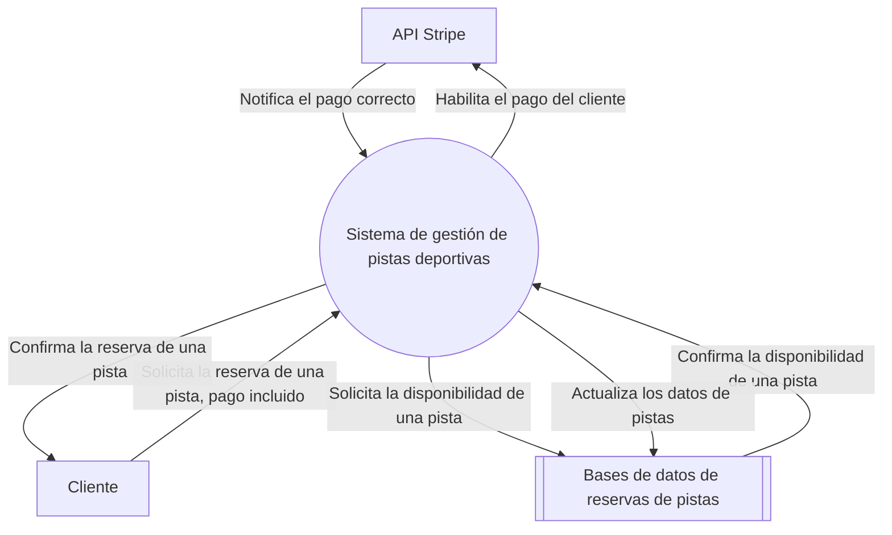
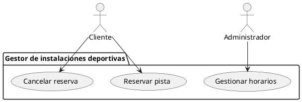
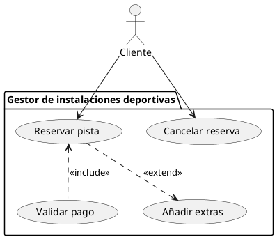
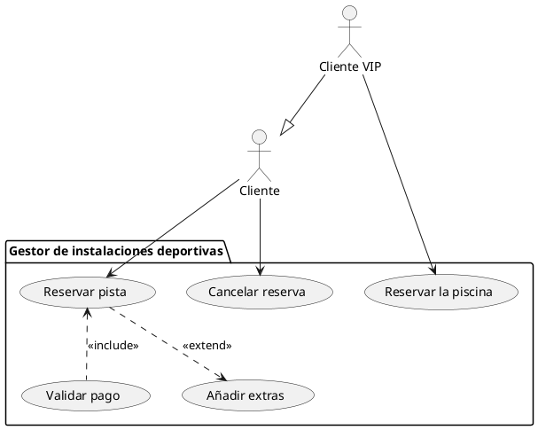
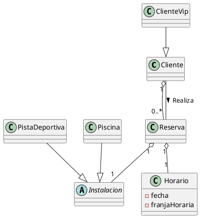
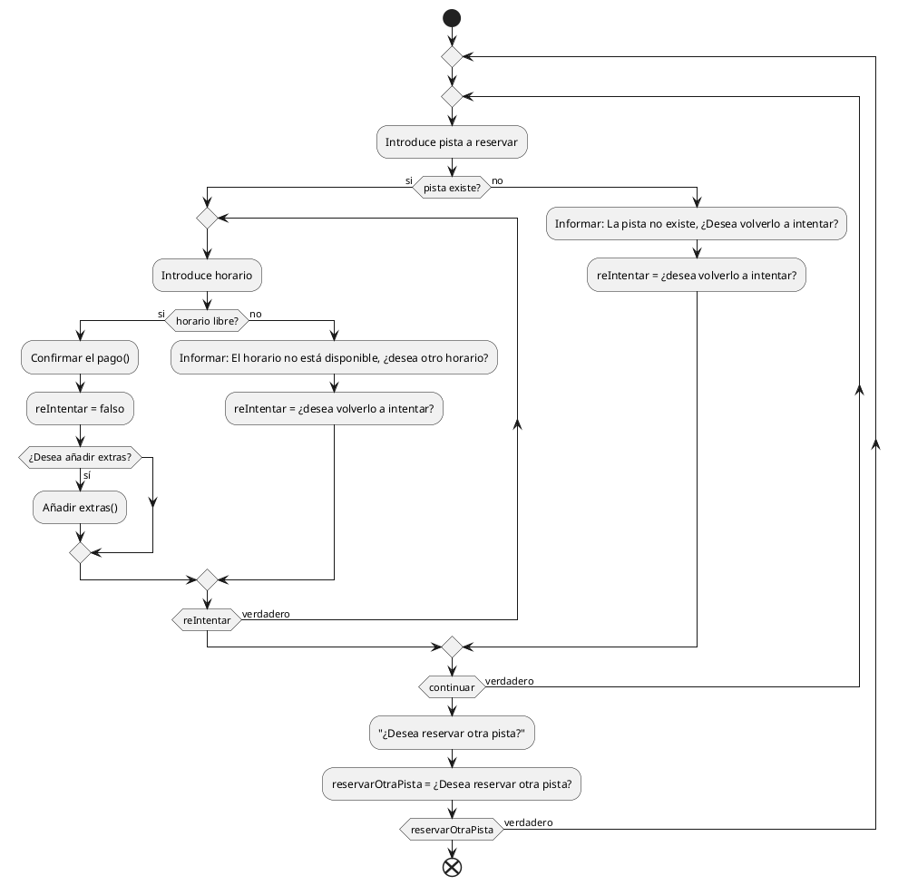

# Sesión 03: Especificación de Requisitos del Sistema (SRS) y Diagramas UML de Casos de Uso

- [Sesión 03: Especificación de Requisitos del Sistema (SRS) y Diagramas UML de Casos de Uso](#sesión-03-especificación-de-requisitos-del-sistema-srs-y-diagramas-uml-de-casos-de-uso)
  - [1. Especificación de Requisitos del Sistema (SRS)](#1-especificación-de-requisitos-del-sistema-srs)
    - [1.1 Las partes de un SRS](#11-las-partes-de-un-srs)
    - [1.1 Ejercicio 1](#11-ejercicio-1)
    - [1.2 Ejercicio 2](#12-ejercicio-2)
  - [2. Diagramas UML de Casos de Uso](#2-diagramas-uml-de-casos-de-uso)
    - [2.1 Pasos para crear un diagrama de casos de uso](#21-pasos-para-crear-un-diagrama-de-casos-de-uso)
    - [2.2 Ejercicio 3](#22-ejercicio-3)
  - [3 Relaciones avanzadas](#3-relaciones-avanzadas)
    - [3.1 Relaciones `<<extend>>` y `<<include>>`](#31-relaciones-extend-y-include)
    - [3.2 Ejercicio 4](#32-ejercicio-4)
    - [3.3 Generalización](#33-generalización)
    - [3.4 Ejercicio 4](#34-ejercicio-4)
  - [4. Cuando usar DFD, diagramas de caso de uso o diagramas de actividades](#4-cuando-usar-dfd-diagramas-de-caso-de-uso-o-diagramas-de-actividades)
    - [4.1 Ejercicio 5](#41-ejercicio-5)

## 1. Especificación de Requisitos del Sistema (SRS)

La **Especificación de Requisitos del Sistema (SRS)** es un documento que define **qué hará el sistema** y **cómo interactuará con su entorno**, sin entrar en detalles técnicos de implementación. Su propósito es establecer una visión compartida entre los stakeholders (clientes, desarrolladores, testers, etc.). Un SRS es esencial en el desarrollo de software debido a los siguientes puntos:

1. **Proporciona claridad:** Ayuda a evitar malentendidos durante el desarrollo.
2. **Facilita el diseño y las pruebas:** Los desarrolladores y testers lo usan como base para su trabajo.
3. **Control de alcance:** Ayuda a gestionar cambios en los requisitos.

Un buen SRS cumplir con las siguientes características:

- **Compleción:** Cubre todos los requisitos del sistema.
- **Consistencia:** Evita contradicciones internas.
- **Estructuración:** Fácil de entender y navegar.

### 1.1 Las partes de un SRS

**1. Introducción**:

- **Propósito del documento:** Explica el objetivo del sistema y del SRS.
- **Alcance del sistema:** Describe el sistema en términos generales.
  - Ejemplo: "Este sistema permitirá gestionar la reserva de pistas deportivas, automatizando la asignación de horarios y pagos."
- **Definiciones:** Lista de términos clave y acrónimos utilizados.

**2. Descripción general**:

- **Perspectiva del producto**:
  - Explica cómo encaja el sistema en un entorno mayor.
  - Ejemplo: "El sistema estará conectado con un sistema de pagos externo para procesar tarjetas de crédito."
- **Restricciones:** Factores que limitan el diseño o desarrollo.
  - Ejemplo: "Debe ser accesible desde dispositivos móviles y navegadores."

**3. Requisitos de sistema**:

- Define las conexiones con otros sistemas (bases de datos, APIs, etc.).
  - Ejemplo: "Se integrará con la API de Stripe para los pagos."
- Los diagramas DFD que vimos en la unidad anterior son útiles para especificar cómo se conecta nuestro sistema con las entidades externas:

**4. Requisitos funcionales**:

- Estos describen **lo que hará el sistema** desde el punto de vista del usuario. Se trata de acciones concisas que luego tendrán gran importancia en el diseño del producto:
  - Ejemplo:
     1. "El sistema permitirá a los usuarios reservar una pista."
     2. "El sistema permitirá al administrador modificar una reserva."
     3. "El sistema enviará un correo electrónico de confirmación tras completar la reserva."

**5. Requisitos no funcionales**:

- Incluyen aspectos que no son críticos para el funcionamiento del producto, como rendimiento, seguridad y usabilidad.
- Ejemplo:
  - Rendimiento: "El sistema deberá procesar una reserva en menos de 2 segundos."
  - Seguridad: "La información de pago deberá estar encriptada usando AES-256."

### 1.1 Ejercicio 1

Completa los siguientes ejercicios:

1. **Redacta el propósito y el alcance** del SRS para un sistema de control de acceso a un aeropuerto.
2. Define tres requisitos funcionales y dos no funcionales para un sistema de alquiler de vehículos.
3. En el caso anterior, redacta algunos requisitos de sistema y luego diseña un DFD para representarlos.

### 1.2 Ejercicio 2

Queremos desarrollar una aplicación para gestionar los turnos de un hospital. Los usuarios son el personal del hospital y todos ellos deben ser capaces de ver sus turnos asignados. Los empleados normales deben poder solicitar una permuta con otros empleados, aceptar una propuesta de permuta y también solicitar sus vacaciones. El administrador puede confirmar las permutas y las vacaciones. El administrador también puede modificar los turnos de los empleados. Este sistema se debe conectar con el gestor interno de correos electrónicos del hospital para notificar cambios y verificaciones al personal. El sistema debe ser rápido, seguro y accesible desde dispositivos móviles.

## 2. Diagramas UML de Casos de Uso

Un diagrama de casos de uso especifica cómo funciona un sistema. Más concretamente, qué puede hacer cada usuario que interactúe con el sistema. Para ello, se requieren cuatro elementos principales: Los casos de uso, los actores, las relaciones y el sistema.

El **sistema** es el programa que vamos a desarrollar, y engloba todos los casos de uso. Se representa con un recuadro con una etiqueta.
Un **actor** es un usuario o un sistema externo que interactúa con el sistema.
Un **caso de uso** describe cómo un actor interactúa con el sistema para lograr un objetivo. Es una forma de **especificar requisitos funcionales** de manera visual y comprensible.
Por último, una **relación** es una conexión que se establece dentre un actor y un caso de uso. También se pueden establecer relaciones especiales entre casos de uso.

En general, un diagrama de casos de uso describe qué hace nuestro sistema y quién hace las acciones del mismo, pero no cómo las hace.

### 2.1 Pasos para crear un diagrama de casos de uso

Para crear un diagrama de casos de uso, nos basamos en los requisitos funcionales del SRS. De ellos, determinamos los siguientes aspectos:

**1. Actores**:

- Determinamos quién interactuará con el sistema.
- Ejemplo: En un sistema de reservas de pistas deportivas:
  - **Cliente:** Hace reservas.
  - **Administrador:** Gestiona horarios.

**2. Casos de uso**:

- Pensamos en las acciones principales que los actores quieren realizar.
- Ejemplo:
  - "Reservar pista."
  - "Cancelar reserva."
  - "Gestionar horarios."

Con esta información, podemos finalmente crear su representación visual en forma de diagrama de casos de uso:

### 2.2 Ejercicio 3

Crea un diagrama de casos de uso a partir del enunciado del ejercicio 2.

## 3 Relaciones avanzadas

### 3.1 Relaciones `<<extend>>` y `<<include>>`

Además de las relaciones básicas, los diagramas de casos de uso cuentan con relaciones avanzadas que se dan entre diferentes casos de uso. Nos sirven para dividir un comportamiento del sistema en distintos casos de uso, lo que ayuda a la modularidad y planificación del desarrollo.

La relación de tipo `<<extend>>` sirve para añadir una funcionalidad **opcional** que se puede lanzar después de un caso de uso. Por ejemplo, después del caso de uso `reservar pista` podríamos añadir una extensión que fuera `añadir extras` (como el alquiler de un balón). Este caso de uso podría darse o no, dependiendo de las elecciones del usuario.

La relación de tipo `<<include>>` sirve para añadir una funcionalidad **obligatoria** que se lanzará siempre después de un caso de uso. Por ejemplo, después del caso de uso `reservar pista` podríamos añadir una extensión que fuera `validar pago`. Esta validación se tendría que dar siempre después de cada reserva para que esta se realizara con éxito.

Las relaciones `<<extend>>` y `<<include>>` se representan así:

### 3.2 Ejercicio 4

1. Crea un diagrama de casos de uso para un sistema de gestión de reservas de un aeropuerto, incluyendo relaciones <<include>> y <<extend>>.
2. Interpreta el siguiente diagrama (se proporcionará uno en clase).

### 3.3 Generalización

Aparte de las relaciones `extend` y `include` contamos con relaciones de generalización entre actores, que funcionan de manera similar a lo ya visto en los diagramas de clases. Si unimos un actor **A** a un actor **B** mediante una flecha de generalización que apunta de A a B, lo que estamos diciendo es que el actor A es una especificación del actor B, es decir, cuenta con todos los casos de uso del actor B más los suyos propios.

Continuando con el ejemplo de las pistas deportivas, vamos a añadir un subtipo de cliente, el cliente VIP que, además de los casos de uso del cliente, también puede reservar la piscina.

### 3.4 Ejercicio 4

Volviendo al ejercicio 2, completa el diagrama añadiendo al menos una generalización.

## 4. Cuando usar DFD, diagramas de caso de uso o diagramas de actividades

Uno de los problemas comunes a la hora de diseñar programas es confundir la aplicación de los distintos diagramas. Cada diagrama sirve para representar una pequeña cantidad de información, no representa el total del sistema. Cada uno de los que hemos trabajado tiene una función concreta: El diagrama de actividad sirve para representar **cómo funciona** un proceso, el DFD para ver **cómo se comunica** nuestro sistema con entidades externas y el diagrama de casos de uso para especificar **qué puede hacer cada actor** del sistema. Por otro lado, los diagramas de clases y los diagramas entidad relación sirven para definir los datos y las relaciones entre ellos, con un enfoque más acercado a la programación o al diseño de bases de datos respectivamente.

| **Tipo de diagrama**     | **¿Cuándo usarlo?**                                                                            |
|---------------------------|-----------------------------------------------------------------------------------------------|
| **DFD**                  | Cuando se desea modelar el flujo de datos entre procesos y entidades externas.                |
| **Diagrama de Casos de Uso** | Cuando se requiere modelar funcionalidades desde la perspectiva de los usuarios.             |
| **Diagrama de Actividad** | Cuando se necesita describir el flujo interno de un proceso complejo. Un proceso puede ser un caso de uso de un diagrama de casos de uso.                       |

A la hora de diseñar un sistema, es común definirlo empleando varios diagramas según lo que se quiera describir. Generalmente, empezaremos con el SRS y desde ahí diseñaremos el resto de diagramas necesarios (DFD, Diagrama de casos de uso, diagramas de clases, diagramas de actividad, etc.).

Por ejemplo, podemos añadir los siguientes diagramas a nuestro programa de gestión de la reserva de pistas:

1. Diagrama de clases:

En este caso, añadimos una clase general `Instalacion` para agrupar las piscinas y las pistas deportivas, ya que de ambas se pueden hacer reservas. Para gestionar las reservas, añadimos una clase extra que contenga la instalación que se reserva y un horario (que consiste en una fecha y una franja horaria).

2. Diagrama de actividad "Reserva Pista":

Este diagrama representa el proceso de reservar una pista. Para reservar una pista, primero se elige una pista y después se confirma si existe o no. El siguiente paso es introducir el horario. Si el horario está disponible, se procede a la confirmación del pago, que es otro proceso, y a la posibilidad de añadir extras que también es otro proceso. Si no está libre, se presenta la opción de volver a intentar encontrar un horario, Al final, se ofrece la opción de reservar otra pista. Esta opción cubre tanto si la pista no existía como si no se ha encontrado un horario satisfactorio, además de la posibilidad de que el usuario reserve más de una pista.

### 4.1 Ejercicio 5

Dados los siguientes enunciados, realiza un documento de diseño que cuente con los siguientes puntos:

1. Documento SRS con su DFD de nivel 0 que indique las relaciones con sistemas externos.
2. Diagrama de casos de uso basado en el SRS previamente diseñado.
3. Diagrama de clases UML para diseñar las relaciones entre los datos que manejará la aplicación.
4. Diagrama de actividad de algún caso de uso relativamente complejo o importante.

**Sistema de Gestión de Vuelos de un Aeropuerto**:

>Queremos desarrollar una aplicación para gestionar las operaciones de un aeropuerto. Los usuarios son tanto los operadores del aeropuerto como los empleados de las aerolíneas. Los operadores del aeropuerto deben poder asignar pistas de aterrizaje y despegue, modificar las asignaciones según las condiciones climáticas o retrasos, y enviar notificaciones a las aerolíneas sobre los cambios realizados. Los empleados de las aerolíneas pueden consultar los horarios de las pistas asignadas, solicitar cambios en las asignaciones y reportar incidencias técnicas relacionadas con los vuelos. Todos los usuarios pueden ver su historial de acceso a la aplicación. El sistema debe integrarse con los sistemas meteorológicos para alertar automáticamente de posibles retrasos y debe ser accesible en tiempo real desde dispositivos móviles o tablets para el personal en campo.  

**Sistema de Gestión de Inventario para un Almacén**:

>Queremos desarrollar una aplicación para gestionar el inventario de un almacén. Los usuarios son los empleados del almacén y los administradores. Los empleados deben ser capaces de registrar la entrada y salida de productos, consultar el estado actual del inventario y reportar incidencias como productos dañados o caducados. Algunos empleados (revisores) además pueden realizar inspecciones para comprobar que no haya errores. Los administradores pueden agregar nuevos productos al sistema, modificar los niveles mínimos de inventario, y generar reportes de inventario en tiempo real. El sistema debe estar conectado con el sistema de pedidos de la empresa para generar alertas automáticas cuando un producto esté por debajo de su nivel mínimo. Además, debe ser rápido, seguro y accesible desde dispositivos móviles para facilitar su uso dentro del almacén.  

**Sistema de Gestión de Reservas para una Biblioteca Escolar**:

>Queremos desarrollar una aplicación para gestionar el préstamo y reserva de libros en una biblioteca escolar. Los usuarios son los estudiantes, los profesores y los bibliotecarios. Los estudiantes y profesores deben poder buscar libros en el catálogo, realizar reservas y consultar el estado de sus préstamos. Entre los profesores, algunos tienen la designación de jefes de departamento y pueden marcar libros del catálogo como importantes para el departamento. Los bibliotecarios pueden agregar nuevos libros al catálogo, registrar los préstamos realizados y generar notificaciones automáticas para recordar a los usuarios la devolución de los libros. El sistema debe ser accesible desde cualquier dispositivo con conexión a internet y debe permitir gestionar multas por retrasos en la devolución de libros.  
