# Sesión 04: Diagramas de Estados (Máquinas de Estados)

- [Sesión 04: Diagramas de Estados (Máquinas de Estados)](#sesión-04-diagramas-de-estados-máquinas-de-estados)
  - [1. Introducción a los Diagramas de Estados](#1-introducción-a-los-diagramas-de-estados)
    - [1.1 Ejercicio 1](#11-ejercicio-1)
  - [2. Partes de un Diagrama de Estados](#2-partes-de-un-diagrama-de-estados)
    - [2.1. Estado](#21-estado)
      - [2.2. Transición](#22-transición)
      - [2.3. Evento](#23-evento)
      - [2.4. Estado Inicial y Estado Final](#24-estado-inicial-y-estado-final)
  - [3. Ejemplo Práctico: Ciclo de Vida de un Pedido](#3-ejemplo-práctico-ciclo-de-vida-de-un-pedido)
    - [3.1 Ejercicio 2](#31-ejercicio-2)
      - [Diagrama 1: Ciclo de vida de una tarea](#diagrama-1-ciclo-de-vida-de-una-tarea)
      - [Diagrama 2: Sistema de un semáforo](#diagrama-2-sistema-de-un-semáforo)
      - [Diagrama 3: Proceso de pago en línea](#diagrama-3-proceso-de-pago-en-línea)
      - [Diagrama 4: Gestión de una cuenta de usuario](#diagrama-4-gestión-de-una-cuenta-de-usuario)
  - [4. Máquinas de Estados Simples y Compuestas](#4-máquinas-de-estados-simples-y-compuestas)
    - [4.1 Máquina de estados simple](#41-máquina-de-estados-simple)
    - [4.2 Máquinas de estados compuestas](#42-máquinas-de-estados-compuestas)
  - [5. Cómo Crear un Diagrama de Estados](#5-cómo-crear-un-diagrama-de-estados)
    - [5.1 Ejercicio 3](#51-ejercicio-3)
      - [Turnos de un hospital](#turnos-de-un-hospital)
      - [Gestión de una máquina de café automática](#gestión-de-una-máquina-de-café-automática)
      - [Control de acceso a un edificio inteligente](#control-de-acceso-a-un-edificio-inteligente)
    - [5.2 Ejercicio 4](#52-ejercicio-4)
      - [Ciclo de vida de un teléfono móvil](#ciclo-de-vida-de-un-teléfono-móvil)
      - [Proceso de reserva de un vuelo](#proceso-de-reserva-de-un-vuelo)
      - [Gestión de una máquina expendedora](#gestión-de-una-máquina-expendedora)
  - [6. Máquinas Finitas de Estados (Historia y Evolución)](#6-máquinas-finitas-de-estados-historia-y-evolución)
    - [7. Relación de los Diagramas de Estados con Otros Diagramas UML](#7-relación-de-los-diagramas-de-estados-con-otros-diagramas-uml)
    - [7.1 Relación con Diagramas de Clases](#71-relación-con-diagramas-de-clases)
    - [7.2 Relación con Diagramas de Casos de Uso](#72-relación-con-diagramas-de-casos-de-uso)
    - [7.3 Relación con Diagramas de Actividad](#73-relación-con-diagramas-de-actividad)
    - [7.4 Relación con Diagramas de Secuencia](#74-relación-con-diagramas-de-secuencia)
    - [7.5 Ejercicio 5: Relación con el resto de diagramas UML](#75-ejercicio-5-relación-con-el-resto-de-diagramas-uml)
      - [Gestión de una máquina de café automática (2)](#gestión-de-una-máquina-de-café-automática-2)

## 1. Introducción a los Diagramas de Estados

Un diagrama de estados es una representación gráfica del **comportamiento dinámico** de un objeto o sistema, mostrando los **estados** en los que puede encontrarse y las **transiciones** entre ellos debido a eventos.

Un diagrama de estados facilita el modelado de sistemas en los que un objeto cambia de estado a medida que ocurren **eventos**. Por lo tanto, es útil en sistemas secuenciales como **máquinas expendedoras, procesos de pedidos, autenticación de usuarios, etc.**.

Imagina que un semáforo es como un sistema que cambia de estado (verde, amarillo, rojo) en función de eventos (el tiempo transcurrido o la llegada de un coche). Así funcionan las máquinas de estados.

### 1.1 Ejercicio 1

Señala tres ejemplos de la vida cotidiana, como el del semáforo, donde se pudiera aplicar un diagrama de estados.

## 2. Partes de un Diagrama de Estados

### 2.1. Estado

Un **estado** representa una condición en la que se encuentra un objeto.

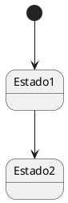

- El punto negro (*) representa el **estado inicial**.
- `Estado1` y `Estado2` son ejemplos de **estados**.

#### 2.2. Transición

Una **transición** conecta dos estados y ocurre cuando se dispara un **evento**. Las transiciones tienen un solo sentido.

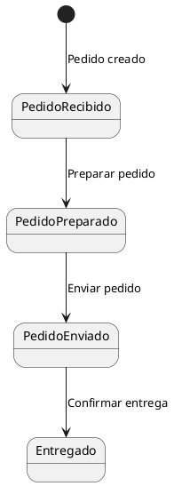

- **Eventos**: "Pedido creado", "Preparar pedido", "Enviar pedido", etc.
- Cada flecha entre estados representa una **transición**. Una transición cambia desde el estado de donde nace la flecha hasta el estado donde apunta la flecha y ocurre cuando se dispara el evento.

#### 2.3. Evento

El **evento** es la acción que provoca una transición. Puede escribirse como texto en las flechas.

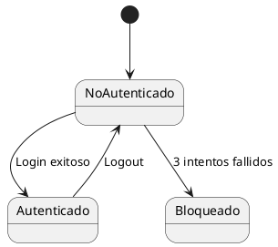

- Estados: *NoAutenticado*, *Autenticado*, *Bloqueado*.
- Eventos: *Login exitoso*, *3 intentos fallidos*, *Logout*.

#### 2.4. Estado Inicial y Estado Final

- **Estado inicial**: Punto de partida del sistema (círculo relleno).
- **Estado final**: Punto donde el proceso termina (círculo doble). El proceso puede ser cíclico y no terminar.

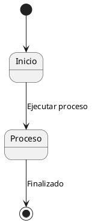

## 3. Ejemplo Práctico: Ciclo de Vida de un Pedido

Este ejemplo muestra cómo un pedido pasa por varios estados durante su procesamiento.

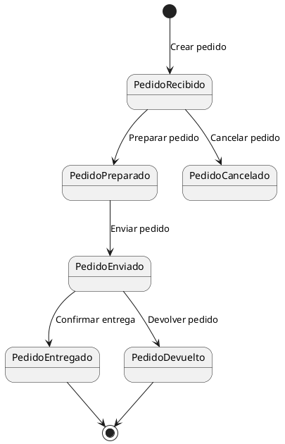

En este diagrama podemos observar lo siguiente:

1. **Estados**: PedidoRecibido, PedidoPreparado, PedidoEnviado, PedidoEntregado, PedidoCancelado, PedidoDevuelto.
2. **Transiciones**:
   - *Crear pedido*: De `[ * ]` a `PedidoRecibido`.
   - *Preparar pedido*: De `PedidoRecibido` a `PedidoPreparado`.
   - *Enviar pedido*: De `PedidoPreparado` a `PedidoEnviado`.
   - *Cancelar pedido*: Transición directa a `PedidoCancelado`.

### 3.1 Ejercicio 2

**Identifica el significado de los siguientes diagramas de estados.** Para ello, sigue los siguientes pasos:

- ¿Qué representa cada estado?  
- ¿Qué significado tienen las transiciones?  
- ¿Qué proceso o sistema modela el diagrama?  

Finalmente, escribe una descripción breve (de 3-5 líneas) para cada diagrama, explicando su **función y aplicación en el mundo real**.

#### Diagrama 1: Ciclo de vida de una tarea

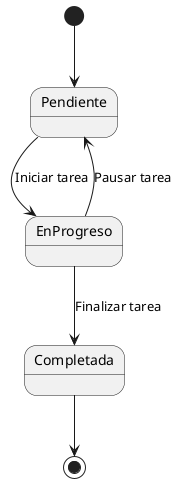

#### Diagrama 2: Sistema de un semáforo

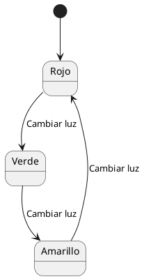

#### Diagrama 3: Proceso de pago en línea

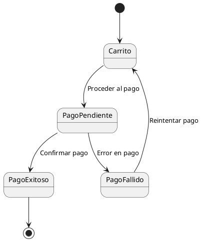

#### Diagrama 4: Gestión de una cuenta de usuario

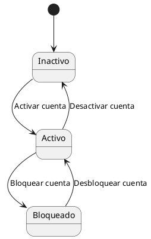

## 4. Máquinas de Estados Simples y Compuestas

### 4.1 Máquina de estados simple

Una máquina de estados simple representa de forma lineal los estados y las transiciones.

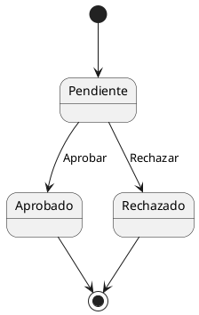

### 4.2 Máquinas de estados compuestas

Una máquina de estados compuesta representa estados que pueden contener **subestados**.

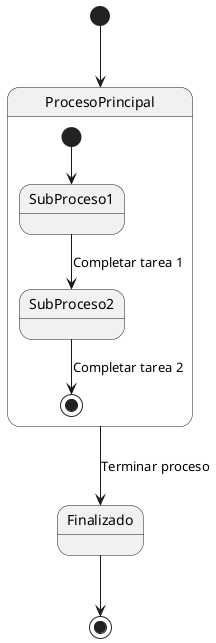

## 5. Cómo Crear un Diagrama de Estados

A la hora de realizar diagramas de estados debemos seguir los siguientes pasos:

1. Identificar los **estados** del objeto.
2. Determinar los **eventos** que provocan transiciones.
3. Dibujar el **estado inicial** y el **estado final**.
4. Conectar los estados mediante **transiciones** etiquetadas.
5. Revisar la lógica y corregir posibles inconsistencias.

Por supuesto, si queremos que la máquina sea compuesta, por cada estado que deseamos convertir a su vez en una máquina de estados debemos seguir el mismo proceso.

Los errores más comunes a la hora de realizar diagramas de estados son:

- Olvidar el estado inicial o final.
- No etiquetar correctamente las transiciones.
- Confundir estados con eventos.

### 5.1 Ejercicio 3

Diseña diagramas de estados a partir de las siguientes especificaciones:

#### Turnos de un hospital

>Para gestionar los turnos de un hospital y evitar que se acumulen horas excesivas en los profesionales, debemos tener en cuenta que un miembro del personal puede estar trabajando, descansando o en expectativa de turno. El periodo de descanso empieza inmediatamente después de haber estado trabajando y dura 12 horas. En el momento en que vencen esas 12 horas, un trabajador puede o bien volver a trabajar o bien quedarse en expectativa de turno. Un trabajador en expectativa de turno puede ser asignado para trabajar por el gestor de turnos. El trabajador comienza siempre en expectativa de turno.

#### Gestión de una máquina de café automática

>Una máquina de café automática gestiona la preparación y entrega de bebidas calientes. En su funcionamiento, la máquina puede encontrarse en varios estados. Al inicio, la máquina está a la espera de que un usuario realice una selección. Cuando el usuario elige una bebida (como café, té o chocolate caliente), la máquina pasa a un proceso de preparación específico según la bebida seleccionada. Si el proceso de preparación concluye sin problemas, la máquina entrega el producto al usuario y regresa al estado inicial para una nueva solicitud.  
>
>Sin embargo, si durante la preparación ocurre un error, como falta de ingredientes o una avería técnica, la máquina debe entrar en un estado de error que bloquea nuevas solicitudes hasta que un técnico de mantenimiento intervenga. El técnico podrá reiniciar el sistema y devolver la máquina a su estado inicial. Además, el proceso de **preparación** debe incluir detalles específicos dependiendo del tipo de bebida elegida: preparar café, preparar té o preparar chocolate caliente.  

#### Control de acceso a un edificio inteligente  

>El sistema de control de acceso de un edificio inteligente se encarga de gestionar la entrada y salida de las personas. Una persona comienza siempre fuera del edificio. Cuando intenta acceder, debe escanear su tarjeta, iniciando así un proceso de verificación. Durante este proceso de acceso, se realizan varios pasos, como la validación de la tarjeta y un escaneo de seguridad. Si todo es correcto, la persona puede entrar al edificio y pasar al estado de estar dentro.  
>
>Sin embargo, si la tarjeta es inválida o se detecta algún problema de seguridad, el acceso se deniega y la persona entra en un estado bloqueado. Para salir de este estado, un guardia de seguridad puede intervenir y decidir si la persona debe volver al inicio, es decir, al estado fuera del edificio, o si puede intentar nuevamente el acceso. Por último, una vez que una persona se encuentra dentro del edificio, puede salir en cualquier momento, regresando al estado inicial fuera del edificio.  

### 5.2 Ejercicio 4

Describe los siguientes diagramas de estados siguiendo estas pautas:

1. **Analiza cada diagrama compuesto**:  
   - Identifica los **estados principales** y los **subestados**.  
   - Describe el flujo general del sistema y qué proceso representa.  

2. **Escribe una breve explicación** para cada diagrama, enfocándote en:  
   - **Qué sistema modela** (por ejemplo: máquina expendedora, proceso de reserva de vuelo).  
   - **Cómo los subestados mejoran la comprensión del sistema**.

#### Ciclo de vida de un teléfono móvil

Este diagrama modela el comportamiento de un teléfono móvil cuando se encuentra bloqueado, desbloqueado o apagado.

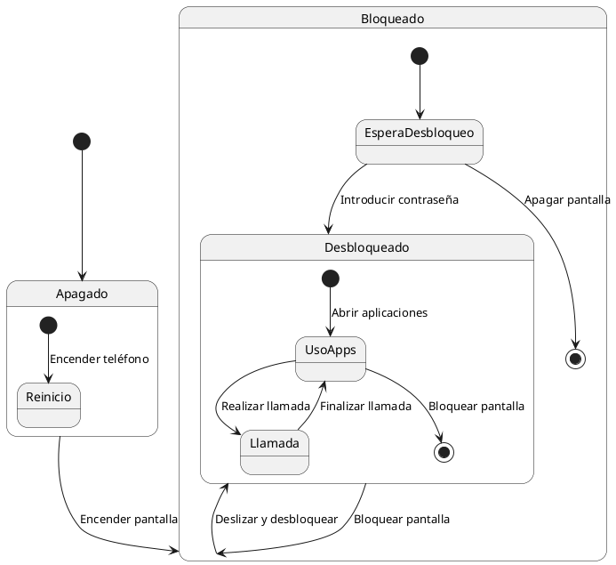

#### Proceso de reserva de un vuelo

Este diagrama describe el flujo de estados en el sistema de reservas de una aerolínea, con subestados para el proceso de pago.

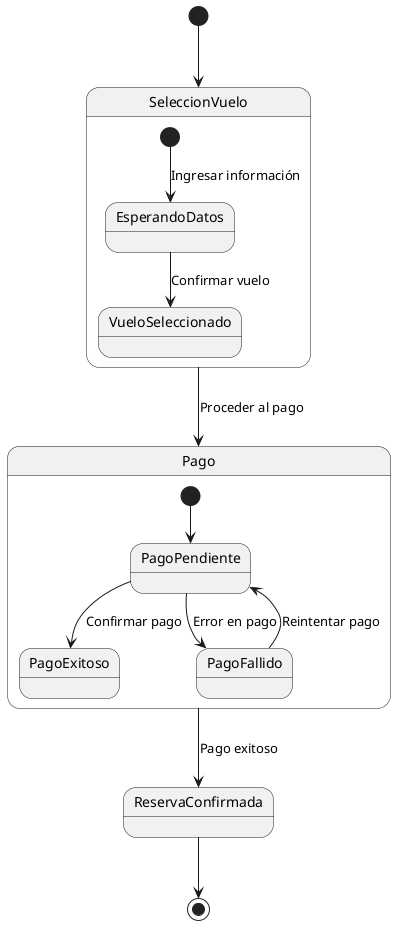

#### Gestión de una máquina expendedora 

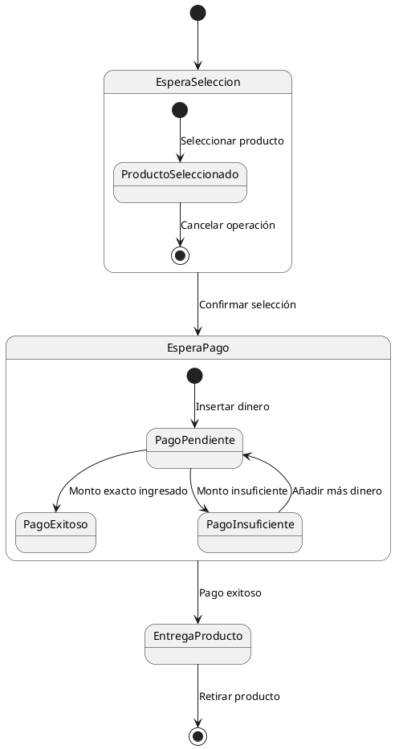

## 6. Máquinas Finitas de Estados (Historia y Evolución)  

Los diagramas de estados dervian de las **máquinas de estados finitos** (FSM). Estas tienen sus orígenes en la teoría de la computación:

- **Alan Turing** (1936): Introdujo el concepto de la **máquina de Turing**, un modelo teórico que definió los límites de la computación. Aunque no es exactamente una FSM, sentó las bases para entender cómo un sistema puede procesar información paso a paso, cambiando de estado.
- **Claude Shannon** y **Warren McCulloch** (1940s): Estudiaron las **redes lógicas** y los autómatas, dando lugar a las máquinas de estados finitos como modelos para representar sistemas secuenciales.  
- **Avances modernos**:  
  - Las FSM evolucionaron hacia máquinas **deterministas** y **no deterministas**, fundamentales en teoría de autómatas.  
  - Su aplicación se amplió a lenguajes formales, **inteligencia artificial**, sistemas operativos y **modelado UML**.

### 7. Relación de los Diagramas de Estados con Otros Diagramas UML  

Los diagramas de estados no funcionan de forma aislada. Se relacionan con otros diagramas UML, aportando una visión más completa del sistema:

### 7.1 Relación con Diagramas de Clases

- Los **estados** suelen estar asociados a **objetos** definidos en los diagramas de clases.  
- Cada clase puede tener un **diagrama de estados** que describe cómo cambian sus instancias a lo largo del tiempo.  
- **Ejemplo**: Un objeto `Pedido` en el diagrama de clases tendrá un diagrama de estados con los estados "Recibido", "Preparado", etc.

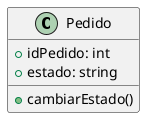

### 7.2 Relación con Diagramas de Casos de Uso

- Los **diagramas de casos de uso** muestran **interacciones entre actores y el sistema**.  
- Los diagramas de estados detallan cómo el sistema **reacciona** cuando un actor realiza una acción.  
- **Ejemplo**: En el caso de uso *"Procesar pedido"*, el diagrama de estados muestra cómo evoluciona el pedido a distintos estados.

### 7.3 Relación con Diagramas de Actividad

- Los diagramas de actividad modelan el **flujo de control** y las **acciones** ejecutadas.  
- Los diagramas de estados se centran en los **cambios de estado** que ocurren como resultado de esas acciones.  
- **Ejemplo**:  
  - Diagrama de actividad: "Preparar pedido" incluye pasos como "Recoger productos" y "Empaquetar".  
  - Diagrama de estados: "PedidoPreparado" es el estado final tras completar esa actividad.

### 7.4 Relación con Diagramas de Secuencia

Aunque todavía no los hemos trabajado, los diagramas de secuencia muestran cómo **objetos interactúan** intercambiando mensajes a lo largo del tiempo. Se relacionan con los diagramas de estados de la siguiente forma:

- Los diagramas de estados complementan la información de los diagramas de secuencia mostrando cómo los objetos **cambian de estado** como consecuencia de los mensajes que se envían.  
  - **Ejemplo**: Un mensaje *"Confirmar entrega"* en un diagrama de secuencia puede provocar el cambio de estado de `Pedido` a "Entregado".  

### 7.5 Ejercicio 5: Relación con el resto de diagramas UML

Volvamos al enunciado de la máquina de café:

#### Gestión de una máquina de café automática (2)

>Una máquina de café automática gestiona la preparación y entrega de bebidas calientes. En su funcionamiento, la máquina puede encontrarse en varios estados. Al inicio, la máquina está a la espera de que un usuario realice una selección. Cuando el usuario elige una bebida (como café, té o chocolate caliente), la máquina pasa a un proceso de preparación específico según la bebida seleccionada. Si el proceso de preparación concluye sin problemas, la máquina entrega el producto al usuario y regresa al estado inicial para una nueva solicitud.  
>
>Sin embargo, si durante la preparación ocurre un error, como falta de ingredientes o una avería técnica, la máquina debe entrar en un estado de error que bloquea nuevas solicitudes hasta que un técnico de mantenimiento intervenga. El técnico podrá reiniciar el sistema y devolver la máquina a su estado inicial. Además, el proceso de **preparación** debe incluir detalles específicos dependiendo del tipo de bebida elegida: preparar café, preparar té o preparar chocolate caliente.

Realiza a partir de esta descripción el diagrama de clases, el SRS, el diagrama de casos de uso y los diagramas de actividad que necesites para describir el sistema. Si no has hecho todavía el diagrama de estados, ahora es el momento.
