# Sesión 05: Diagramas de Secuencia

- [Sesión 05: Diagramas de Secuencia](#sesión-05-diagramas-de-secuencia)
  - [1. ¿Qué es un diagrama de secuencia y para qué se usa?](#1-qué-es-un-diagrama-de-secuencia-y-para-qué-se-usa)
  - [2. Componentes básicos de un diagrama de secuencia y cómo construirlo](#2-componentes-básicos-de-un-diagrama-de-secuencia-y-cómo-construirlo)
    - [2.1 Actores y Objetos](#21-actores-y-objetos)
    - [2.2 Líneas de vida](#22-líneas-de-vida)
      - [Líneas de vida y bloques de activación](#líneas-de-vida-y-bloques-de-activación)
      - [Fragmentos combinados: condicionales y bucles](#fragmentos-combinados-condicionales-y-bucles)
      - [Condicional (alt)](#condicional-alt)
      - [Bucle (loop)](#bucle-loop)
      - [Combinación de activación y fragmentos](#combinación-de-activación-y-fragmentos)
      - [Añadir estados al diagrama de secuencia](#añadir-estados-al-diagrama-de-secuencia)
    - [2.3 Mensajes](#23-mensajes)
    - [2.4 Construcción de diagramas de secuencia](#24-construcción-de-diagramas-de-secuencia)
    - [2.5 Ejercico 1](#25-ejercico-1)
      - [Autenticación de un usuario](#autenticación-de-un-usuario)
      - [Compra en línea](#compra-en-línea)
      - [Retiro de efectivo en un cajero automático](#retiro-de-efectivo-en-un-cajero-automático)
      - [Soporte técnico automatizado](#soporte-técnico-automatizado)
    - [2.6 Ejercicio 2](#26-ejercicio-2)
      - [Turnos de un hospital](#turnos-de-un-hospital)
      - [Gestión de una máquina de café automática](#gestión-de-una-máquina-de-café-automática)
      - [Control de acceso a un edificio inteligente](#control-de-acceso-a-un-edificio-inteligente)
  - [3. Combinación de los diagramas de secuencia con los otros diagramas](#3-combinación-de-los-diagramas-de-secuencia-con-los-otros-diagramas)
    - [3.1 Con diagramas de casos de uso](#31-con-diagramas-de-casos-de-uso)
    - [3.2 Con diagramas de actividad](#32-con-diagramas-de-actividad)
    - [3.3 Con diagramas de clases](#33-con-diagramas-de-clases)
    - [3.4 Ejercicio 3](#34-ejercicio-3)
    - [3.5 Ejercicio 4 : Documento de diseño](#35-ejercicio-4--documento-de-diseño)
  - [4. ANEXO: Uso de mermaid.js para diagramas](#4-anexo-uso-de-mermaidjs-para-diagramas)

## 1. ¿Qué es un diagrama de secuencia y para qué se usa?

Un **diagrama de secuencia** es un tipo de diagrama de comportamiento en UML que modela la interacción entre actores (usuarios u otros sistemas) y los objetos de un sistema en un orden temporal. Su principal objetivo es mostrar el flujo de mensajes o eventos que ocurren entre diferentes participantes a lo largo del tiempo, destacando el **orden cronológico** de las interacciones.

Se utiliza para:

- **Especificar** cómo se desarrolla un proceso dentro del sistema (por ejemplo, cómo se valida un pedido o cómo un usuario realiza una compra).
- **Diseñar o analizar escenarios** concretos de interacción entre componentes del sistema.
- **Comunicar ideas entre desarrolladores**, analistas y diseñadores.

Un ejemplo típico sería la interacción entre un cliente, un cajero automático y un banco para retirar dinero. El cliente introduce su tarjeta, el cajero se conecta al banco para validar los datos, el cliente realiza la operación y finalmente, si todo es correcto, entrega el dinero (En el caso de que la operación fuera sacar el dinero).

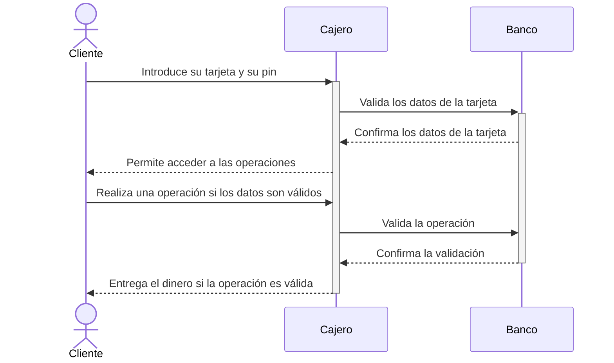

## 2. Componentes básicos de un diagrama de secuencia y cómo construirlo

Un diagrama de secuencia se compone de los siguientes elementos:

### 2.1 Actores y Objetos

Representan las entidades participantes:

- Los actores suelen ser personas o sistemas externos.
- Los objetos son instancias del sistema que participan en la interacción.

Se representan como una línea y el nombre de la entidad aparece tanto al principio como al final de esta. Es común acompañar los nombres de símbolos representativos:

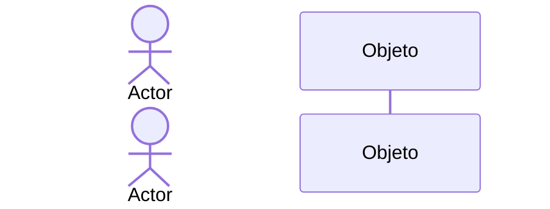

### 2.2 Líneas de vida

Son líneas verticales asociadas a cada actor/objeto. Representan el tiempo durante el cual estos están activos. Dentro de ellas se puede incluir determinada información:

1. **Bloques de activación**:
Rectángulos sobre las líneas de vida que indican que el actor/objeto está realizando una tarea. Pueden contener incluso estados como los trabajados en los diagramas de estados.

2. **Fragmentos combinados**:
Estructuras condicionales o repetitivas que representan lógica compleja (por ejemplo, bucles o decisiones).

A continuación, vamos a profundizar un poco más en las líneas de vida:

#### Líneas de vida y bloques de activación

Las líneas de vida son las líneas verticales asociadas a actores y objetos, y los bloques de activación son los rectángulos sobre estas líneas que indican que un actor/objeto está realizando una tarea específica.

En el siguiente ejemplo se representa una conversación entre un cliente y un sistema, donde se activa un bloque durante la validación de credenciales.

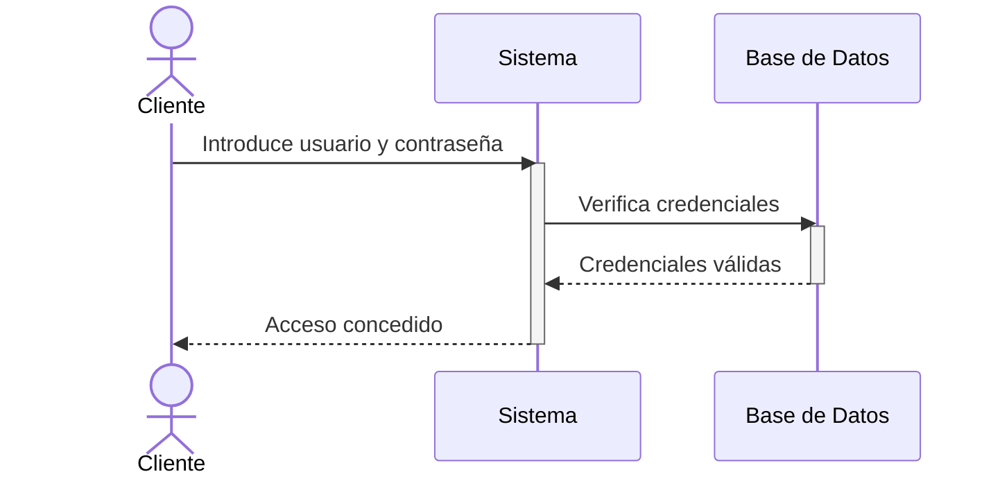

En este caso:

- El **Sistema** está activo mientras procesa la solicitud del cliente.
- La **Base de Datos** está activa mientras verifica las credenciales.

#### Fragmentos combinados: condicionales y bucles

Los fragmentos combinados son estructuras que muestran flujos condicionales (`alt`) o repetitivos (`loop`).

#### Condicional (alt)

El **fragmento condicional** permite modelar flujos donde existen diferentes caminos dependiendo de una condición.

**Ejemplo: Validación de credenciales con diferentes respuestas:**

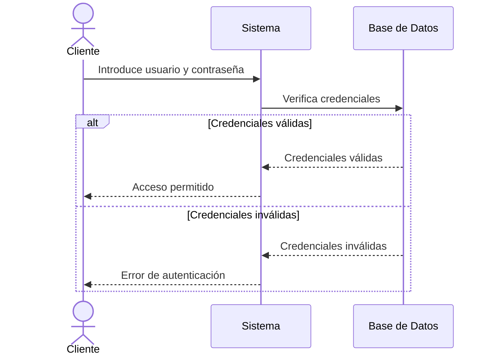

En este caso:

- Si las credenciales son válidas, el cliente recibe acceso.
- Si las credenciales son inválidas, se le notifica un error.

#### Bucle (loop)

El **fragmento de bucle** representa procesos que se repiten hasta cumplir una condición.

**Ejemplo: Reintento de inicio de sesión (máximo 3 intentos):**

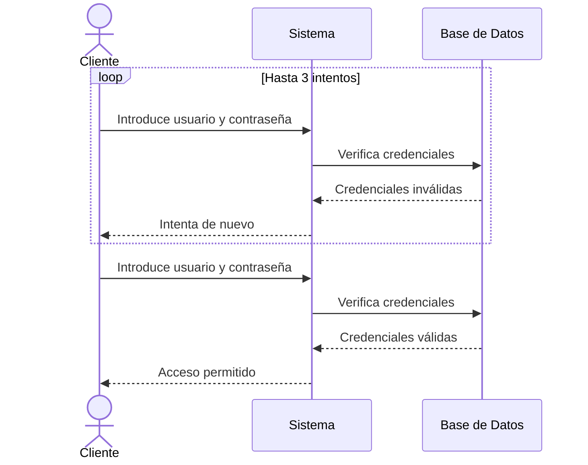

En este caso:

- El cliente puede intentar ingresar sus credenciales hasta tres veces. Si en algún intento las credenciales son válidas, el flujo termina con acceso permitido.

#### Combinación de activación y fragmentos

En muchos escenarios, los **bloques de activación** y los **fragmentos combinados** se combinan para modelar interacciones más complejas. Por ejemplo:

**Ejemplo: Compra en línea con verificación de inventario y pago:**

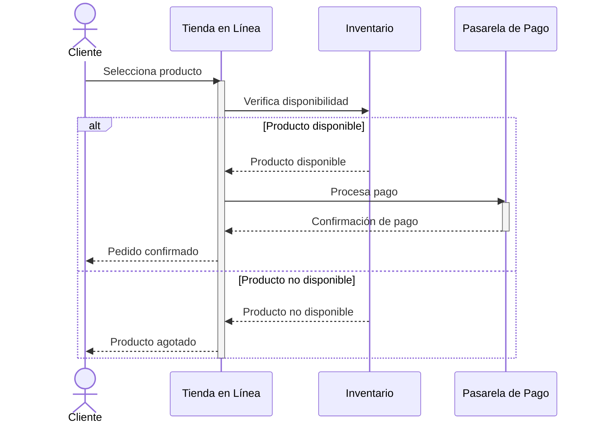

En este ejemplo:

1. **Bloques de activación**:
   - La **Tienda** está activa mientras verifica el inventario y procesa el pago.
   - El **Inventario** y la **Pasarela de Pago** están activos mientras realizan sus tareas específicas.
2. **Fragmento condicional**:
   - Si el producto está disponible, se procesa el pago.
   - Si no está disponible, se informa al cliente.

#### Añadir estados al diagrama de secuencia

Otra práctica que puede ser de utilidad es indicar los cambios de estado que se producen en la línea de vida de un proceso. Estos cambios se pueden indicar dentro de la línea de vida o, como en el siguiente ejemplo, en una nota aparte.

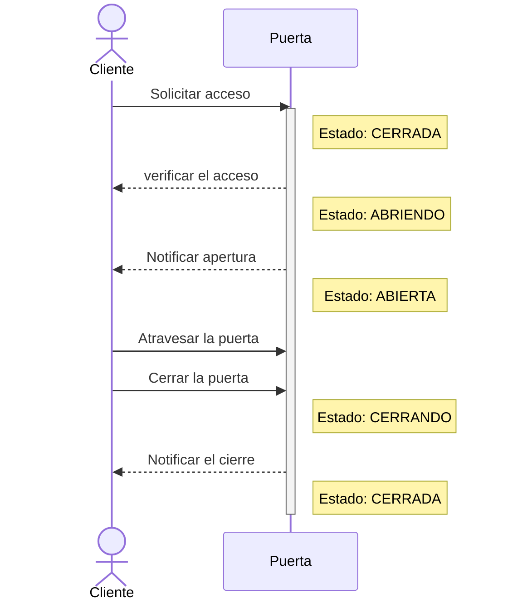

Este sería el diagrama de estados correspondiente de la puerta:

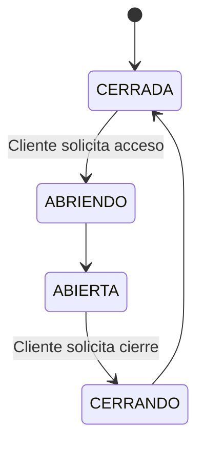

### 2.3 Mensajes

Las flechas indican la comunicación entre actores/objetos. Los tipos principales son:

- **Mensajes síncronos**: llamadas o peticiones que esperan una respuesta. Se representan con una flecha normal y una línea continua.

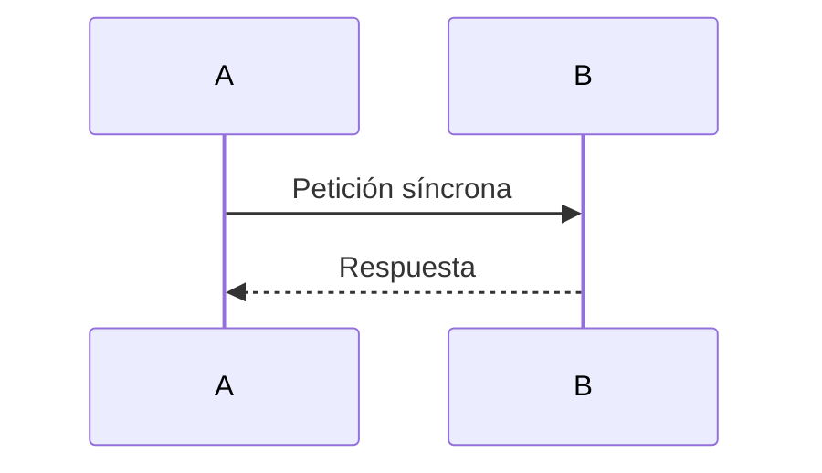

- **Mensajes asíncronos**: peticiones que no esperan una respuesta inmediata. Se representan con una flecha abierta y una línea discontinua.

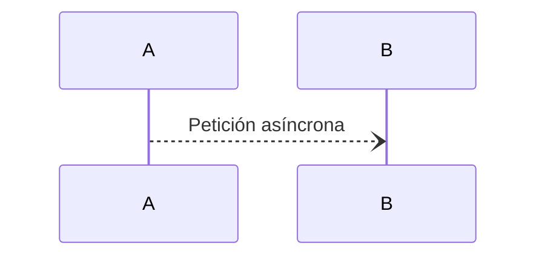

- **Mensajes de retorno**: respuestas enviadas tras una petición. Se representan con una línea discontinua. La flecha será abierta o cerrada dependiendo de si son retornos asíncronos o síncronos respectivamente

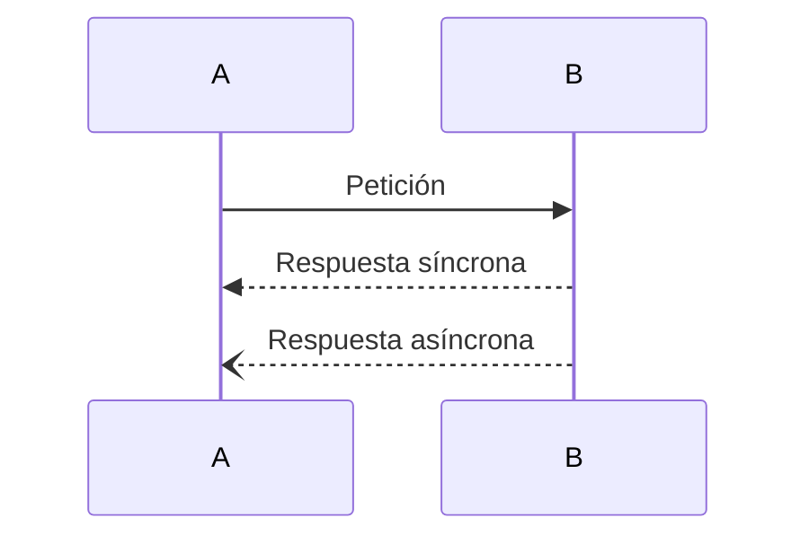

A continuación, un ejemplo con los tres tipos de mensajes:

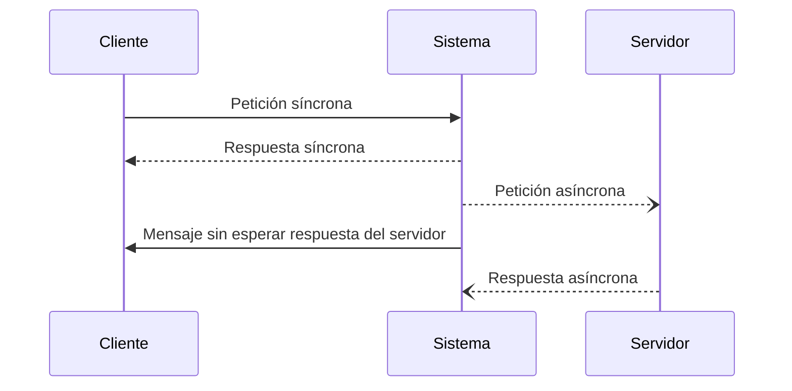

### 2.4 Construcción de diagramas de secuencia

Para construir un diagrama de secuencia, debemos seguir los siguientes pasos:

1. **Identificar los actores y objetos** que participan en el escenario.
2. **Establecer el flujo de mensajes** entre ellos, respetando el orden cronológico.
3. Agregar activaciones, retornos y fragmentos combinados según sea necesario.

El siguiente ejemplo muestra cómo un cliente interactúa con un sistema de autenticación.

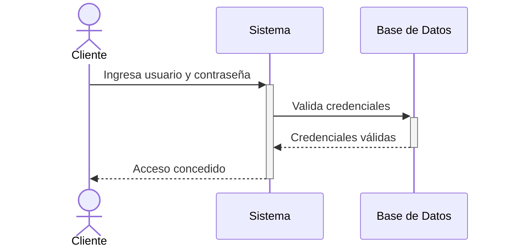

Los diagramas de secuencia son especialmente útiles en casos donde es necesario modelar **escenarios específicos y ordenados de interacción**.

### 2.5 Ejercico 1

Explica lo que ocurre en los siguientes diagramas de secuencia:

#### Autenticación de un usuario

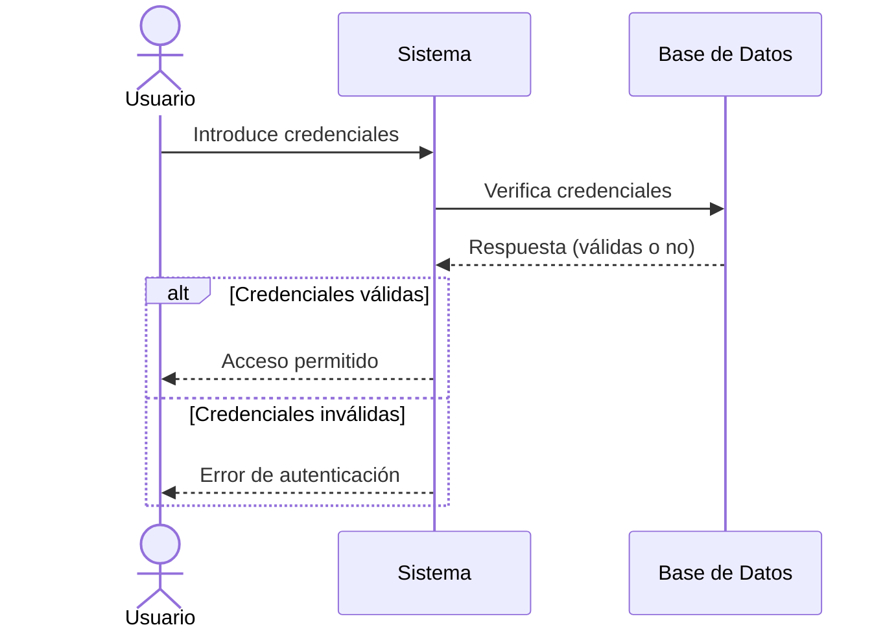

#### Compra en línea

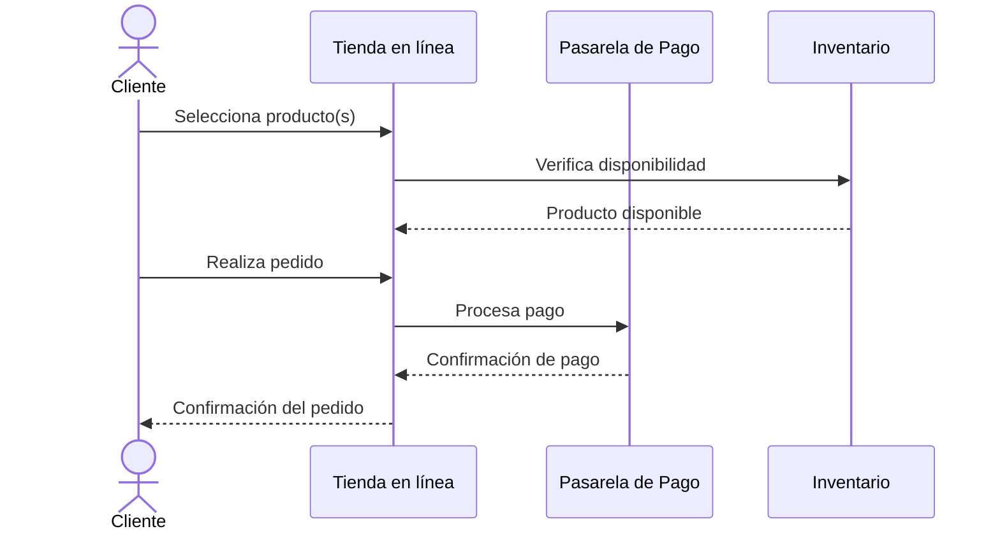

#### Retiro de efectivo en un cajero automático

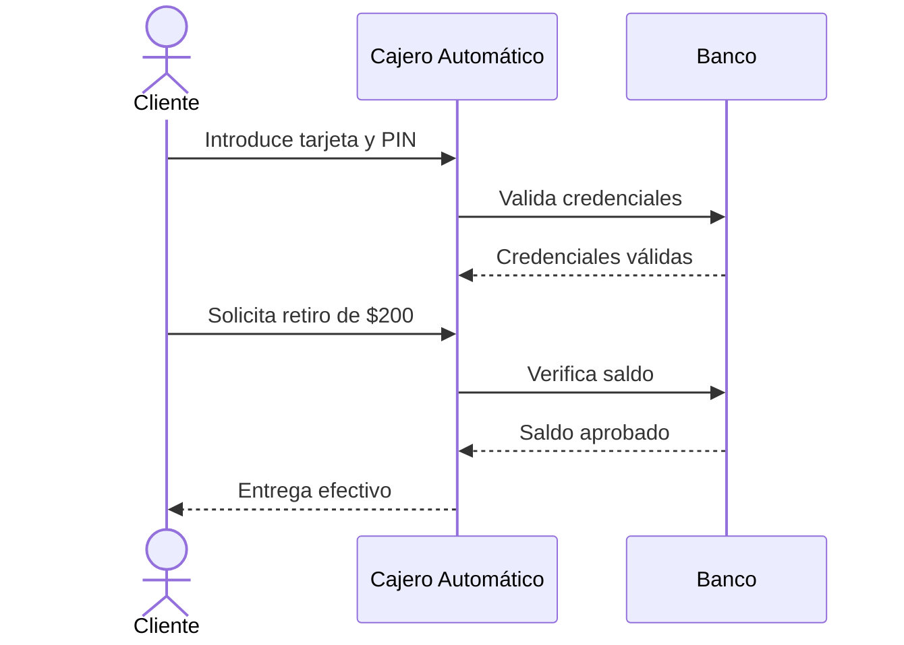

#### Soporte técnico automatizado

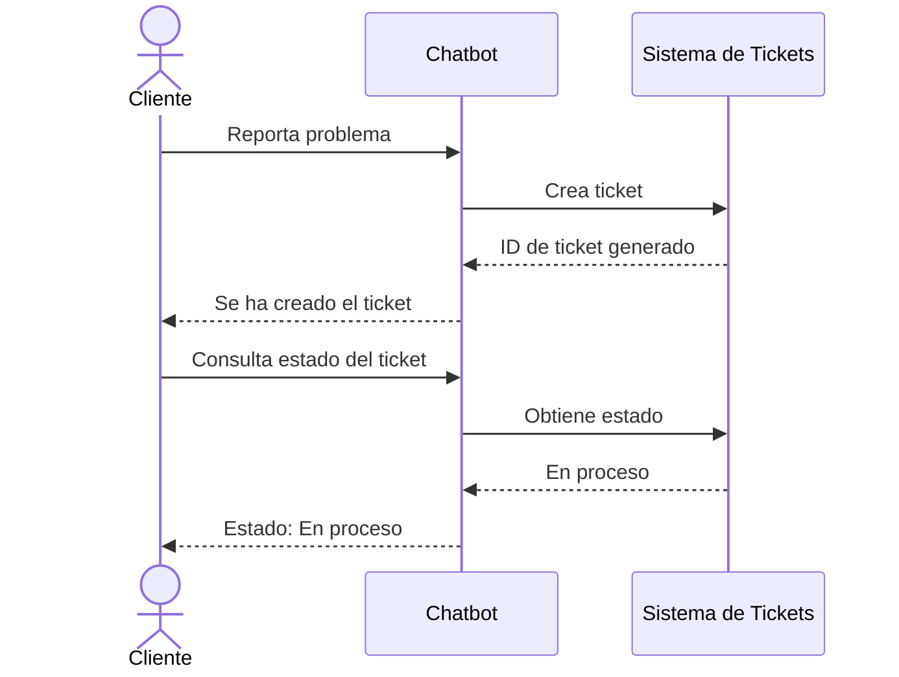

### 2.6 Ejercicio 2

Construye diagramas de secuencia atendiendo a las siguientes casuísticas:

#### Turnos de un hospital

>Para gestionar los turnos de un hospital y evitar que se acumulen horas excesivas en los profesionales, debemos tener en cuenta que un miembro del personal puede estar trabajando, descansando o en expectativa de turno. El periodo de descanso empieza inmediatamente después de haber estado trabajando y dura 12 horas. En el momento en que vencen esas 12 horas, un trabajador puede o bien volver a trabajar o bien quedarse en expectativa de turno. Un trabajador en expectativa de turno puede ser asignado para trabajar por el gestor de turnos. El trabajador comienza siempre en expectativa de turno.

#### Gestión de una máquina de café automática

>Una máquina de café automática gestiona la preparación y entrega de bebidas calientes. En su funcionamiento, la máquina puede encontrarse en varios estados. Al inicio, la máquina está a la espera de que un usuario realice una selección. Cuando el usuario elige una bebida (como café, té o chocolate caliente), la máquina pasa a un proceso de preparación específico según la bebida seleccionada. Si el proceso de preparación concluye sin problemas, la máquina entrega el producto al usuario y regresa al estado inicial para una nueva solicitud.  
>
>Sin embargo, si durante la preparación ocurre un error, como falta de ingredientes o una avería técnica, la máquina debe entrar en un estado de error que bloquea nuevas solicitudes hasta que un técnico de mantenimiento intervenga. El técnico podrá reiniciar el sistema y devolver la máquina a su estado inicial. Además, el proceso de **preparación** debe incluir detalles específicos dependiendo del tipo de bebida elegida: preparar café, preparar té o preparar chocolate caliente.  

#### Control de acceso a un edificio inteligente

>El sistema de control de acceso de un edificio inteligente se encarga de gestionar la entrada y salida de las personas. Una persona comienza siempre fuera del edificio. Cuando intenta acceder, debe escanear su tarjeta, iniciando así un proceso de verificación. Durante este proceso de acceso, se realizan varios pasos, como la validación de la tarjeta y un escaneo de seguridad. Si todo es correcto, la persona puede entrar al edificio y pasar al estado de estar dentro.  
>
>Sin embargo, si la tarjeta es inválida o se detecta algún problema de seguridad, el acceso se deniega y la persona entra en un estado bloqueado. Para salir de este estado, un guardia de seguridad puede intervenir y decidir si la persona debe volver al inicio, es decir, al estado fuera del edificio, o si puede intentar nuevamente el acceso. Por último, una vez que una persona se encuentra dentro del edificio, puede salir en cualquier momento, regresando al estado inicial fuera del edificio.  

Se trata de los enunciados de los ejercicios sobre diagramas de estados que trabajamos en el apartado anterior.

## 3. Combinación de los diagramas de secuencia con los otros diagramas

Los diagramas de secuencia no funcionan de forma aislada. Para entender completamente un sistema, es necesario combinar los diagramas de secuencia con otros diagramas UML. Ya hemos visto durante esta sección cómo integrarlos con los **diagramas de estados**, sin embargo, también podemos integrarlos con el resto de diagramas:

### 3.1 Con diagramas de casos de uso

El diagrama de casos de uso define los escenarios principales de interacción entre actores y el sistema. Los diagramas de secuencia detallan **cómo** se implementa cada caso de uso.

**Ejemplo**:

- Caso de uso: "Autenticar usuario".
- Secuencia: Verificación de credenciales (ya descrita anteriormente).

### 3.2 Con diagramas de actividad

Un diagrama de actividad describe un flujo de trabajo general. Un diagrama de secuencia especifica las **interacciones detalladas** en uno de los pasos.

### 3.3 Con diagramas de clases

Los objetos que interactúan en un diagrama de secuencia están definidos en el diagrama de clases. Por ejemplo:

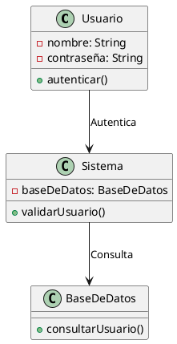

### 3.4 Ejercicio 3

Sobre los enunciados del ejercicio 2, integra todos los diagramas trabajados hasta el momento. El de *Gestión de una máquina de café automática* ya deberías tenerlo terminado al haber completado el ejercicio anterior.

### 3.5 Ejercicio 4 : Documento de diseño

*Este ejercicio será parecido al del examen*. Diseña un documento con el SRS, el diagrama de casos de uso, el diagrama de clases, el diagrama de secuencia, los diagramas de actividad y los diagramas de estado que necesites de la siguiente especificación:

> Queremos gestionar las reservas de un aula de estudio en una biblioteca. Las aulas, dentro de una franja horaria, pueden estar libres, reservadas u ocupadas. Un aula libre se puede reservar y ocupar. Una reserva se cancela automáticamente si no se confirma una hora antes. Los usuarios de la biblioteca pueden ocupar aulas que estén libres. Si el usuario es además estudiante de la universidad, también puede reservarlas si están libres. Una reserva se puede cancelar.
>
> El administrador de la biblioteca puede modificar las reservas de los usuarios, y registrar a usuarios como estudiantes de la universidad. Un usuario debe notificar cuando entra y cuando sale de una sala.
>
> Además, existe un sistema de notificaciones mediante el cual un estudiante puede solicitar que se le avise si un aula concreta que estaba reservada queda libre, para así poder elegir si reservarla u ocuparla.

## 4. ANEXO: Uso de mermaid.js para diagramas

Los diagramas de estados y secuencia de esta sección están escritos empleando mermaid.js, combinado con markdown de forma similar a como se usa plantuml para otros diagramas. Para usar mermaid en VS CODE hay que seguir los siguientes pasos:

- Instalar la extensión "Markdown Preview Mermaid" y "Mermaid Preview".
- Cambiar el servidor de renderizado a `https://unpkg.com/mermaid@9.4.3/dist/mermaid.min.js`
  - Para ello, accede a `File->Preferences->Settings` y busca el servidor de Mermaid que usa Mardownpdf
