# Sesión 01: Aspectos básicos del paradigma orientado a objetos

- [Sesión 01: Aspectos básicos del paradigma orientado a objetos](#sesión-01-aspectos-básicos-del-paradigma-orientado-a-objetos)
  - [1. El paradigma orientado a objetos](#1-el-paradigma-orientado-a-objetos)
    - [1.1 Representación de una clase en UML](#11-representación-de-una-clase-en-uml)
    - [Actividad 1: Creación de diagramas a partir de una definición](#actividad-1-creación-de-diagramas-a-partir-de-una-definición)
    - [Actividad 2: Explicación de diagramas](#actividad-2-explicación-de-diagramas)
  - [2. Relaciones entre clases](#2-relaciones-entre-clases)
    - [2.1 Relaciones principales entre clases](#21-relaciones-principales-entre-clases)
    - [2.2 Otras relaciones](#22-otras-relaciones)
    - [Actividad 3: Explica el siguiente diagrama](#actividad-3-explica-el-siguiente-diagrama)
    - [Actividad 4: Crea un diagrama de la siguiente explicación](#actividad-4-crea-un-diagrama-de-la-siguiente-explicación)

## 1. El paradigma orientado a objetos

Un paradigma de programación consiste en un enfoque y una serie de reglas que nos ayudan a resolver problemas. En el caso del paradigma orientado a objetos, definimos la realidad a través de objetos. Los objetos tienen una serie de propiedades, que llamamos atributos, y pueden realizar una serie de acciones, que llamamos métodos. Asimismo, los objetos se comunican entre ellos a través del paso de mensajes.

La programación orientada a objetos puede basarse en prototipos, como ocurre en Javascript, en la cual unos objetos sirven como base de otros; o bien basarse en clases. Una clase es un patrón que define una serie de atributos y métodos propios que tendrán los objetos que pertenezcan a la misma. A estos objetos, se los conoce como *instancias* de la clase.

### 1.1 Representación de una clase en UML

Para representar una clase emplearemos diagramas de clases del estándar UML. Cada clase se representa con una caja que tiene tres apartados:

- **Superior**: Se coloca el nombre de la clase y su tipo. Puede ser una clase normal (C), una clase abstracta (A) o una interfaz (I). En Java, se emplea CamelCase para los nombres. Es decir, la primera letra de cada palabra en mayúscula y sin espacios. Se evitan caracteres especiales que no pertenezcan al ANSII (como tildes, ñ o ç).
- **Medio**: En este espacio se colocan los atributos de la clase, en CamelCase pero con la primera letra en minúscula. El tipo se puede colocar antes, como en Java o C#, o después, como en TypeScript.
- **Inferior**: En este espacio se colocan los métodos. Se nombran como los atributos, pero al final tienen paréntesis. Dentro del paréntesis puede haber parámetros (con su tipo correspondiente) y, si el método devuelve algo, se coloca al lado el tipo de datos del retorno.

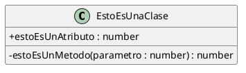

Podemos pensar en los atributos y métodos de una clase de la siguiente forma:

- **Atributos:** Conforman las propiedades del objeto.
- **Métodos:** Conforman el comportamiento del objeto.

Cuando definimos una clase, los diferentes componentes tienen una visibilidad determinada:

- Si un componente es **público**, es accesible por cualquier otro objeto. Lo representamos con un +:

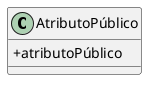

- Si un componente es **privado**, es accesible solo por el mismo objeto. Lo representamos con un -:

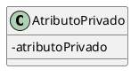

- Si un componente es **protegido**, funciona como privado excepto cuando el objeto que quiere acceder a él es de una clase derivada, que entonces funciona como público. Lo representamos con un #:

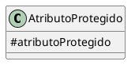

- Si un componente tiene visibilidad de **paquete**, funciona como público para todos los miembros del paquete y privado para todos los demás. Es una visibilidad característica del lenguaje de programación Java (es la visibilidad por defecto, de hecho). En UML se representa con el signo ~:

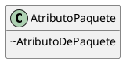

Para estos diagramas se está usando [PlantUML](https://plantuml.com/es/class-diagram). Para que aparezcan los signos indicados se debe especificar antes de empezar a escribir el diagrama la línea `skinparam classAttributeIconSize 0`. Si no se hace, aparecen formas geométricas de diferentes colores según la visibilidad, y están rellenas o no según si son atributo o método:

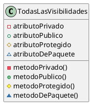

### Actividad 1: Creación de diagramas a partir de una definición

Crea un diagrama de clase que se corresponda con cada una de estas definiciones:

- Para representar un libro, necesitamos saber su autor, su editorial, su año de publicación, su ISBN y su número de páginas. Un libro se puede leer.
- Para representar a un perro, necesitamos saber su nombre, su raza y su edad. Un perro puede ladrar y pasear.

### Actividad 2: Explicación de diagramas

Explica los siguientes diagramas:

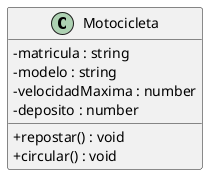

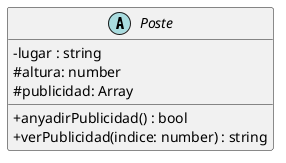

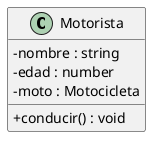

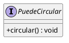

## 2. Relaciones entre clases

A través de los diagramas UML podemos expresar las relaciones entre las clases de múltiples maneras, mediante líneas que las unen. A su vez, también podemos especificar cardinalidades, como en los diagramas Entidad-Relación empleados en base de datos, para cuantificar los detalles de las relaciones, e incluso nombrar a dichas relaciones (generalmente con un verbo). Representamos las cardinalidades con 0, 1, muchos (representado a veces con `*` o una letra) o números fijos.

### 2.1 Relaciones principales entre clases

- **Herencia:** "es un" (relación jerárquica). Una clase deriva de otra. La clase base se denomina a veces clase padre y la clase derivda clase hija. En algunos casos, la clase padre es una clase abstracta. Esto significa que la clase abstracta no puede ser instanciada, pero las derivadas (mientras no sean abstractas a su vez) sí. Las clases abstractas, a la hora de ser programadas, pueden tener métodos abstractos, que son métodos sin definir (se definen en las clases derivadas).

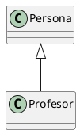

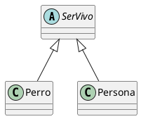

- **Componente:** "tiene un". Una clase contiene como atributo un objeto (o varios) de otra.
- **Composición:** De tipo *componente*. En este caso, el atributo es dependiente de la clase principal.

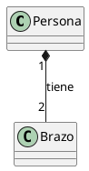

*Una persona tiene dos brazos. Los brazos no pueden existir sin la persona.*

- **Agregación:** De tipo *componente*. En este caso, el atributo no es dependiente de la clase principal y puede existir por separado.

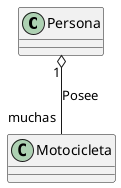

*Una persona posee muchas motocicletas. Cada motocicleta puede existir sin la persona.*

- **Asociación:** "colabora con". Dos clases pueden trabajar en colaboración. La colaboración puede ser simétrica o asimétrica (señalamos la dirección con una flecha). Aunque no es exactamente el mismo concepto, la asociación se puede usar de forma alternativa a la agregación y la composición. De hecho, muchas veces, el resultado al programarla será el mismo.

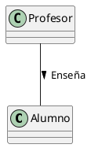

### 2.2 Otras relaciones

Además de esas relaciones básicas, existen otras un poco más avanzadas.

- **Dependencia:** "usa". En este tipo de relación, se dice que una clase usa a otra. Este uso puede ser mediante clases que contengan otras clases o mediante la implementación de interfaces dentro de una clase. Se representa como la herencia, pero con línea discontinua. A efectos de programación, una interfaz y una clase abstracta son muy similares. En ambos casos, no permiten instancias de ellas, sino de clases derivadas o que las usen. En Java, las interfaces vienen a compensar las limitaciones que tiene el hecho de que no exista la herencia múltiple.

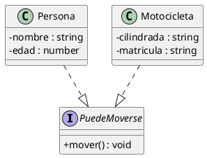

Un uso muy habitual de las interfaces es el de agrupar instancias que semánticamente son cosas distintas, pero que todas pueden realizar la misma acción. De esta forma, les podemos pedir a todas ellas con un mensaje que realicen dicha acción, aunque sean cosas tan dispares como una puerta o un plazo de entrega (en ambos casos, se podrían cerrar).

- **Pertenencia al mismo paquete:** En caso de que queramos especificar también los paquetes, podemos encapsular las clases en formas geométricas para verlo claro, de la siguiente manera:

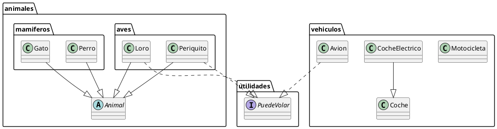

Como se puede observar, puede haber paquetes dentro de paquetes y las clases de un paquete pueden relacionarse con clases de otros paquetes. Los paquetes tienen una relación más de conveniencia a la hora de programar que semántica.

### Actividad 3: Explica el siguiente diagrama

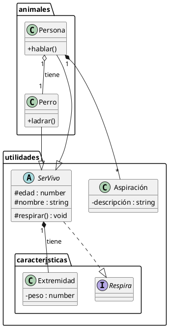

### Actividad 4: Crea un diagrama de la siguiente explicación

La vida es dura, pero la vida de cada persona tiene un grado de dureza diferente, que clasificamos con un número. Las personas asismo tienen algo que las identifica, su propio nombre. Pueden elegir varias profesiones, como carpintero o influencer. Los carpinteros usan la madera para construir muebles. Los influencer usan las mesas, que son muebles, para poner sus ordenadores. Una persona puede tener varios muebles. Las sillas también son muebles.
