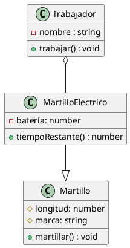

# Sesión 02: Del diagrama al programa en Java

- [Sesión 02: Del diagrama al programa en Java](#sesión-02-del-diagrama-al-programa-en-java)
  - [1. Definición de clases en Java](#1-definición-de-clases-en-java)
    - [Actividad 5: Clases a partir de diagramas](#actividad-5-clases-a-partir-de-diagramas)
  - [2. Constructores, getters y setters. Creación automatizada con IntelliJ](#2-constructores-getters-y-setters-creación-automatizada-con-intellij)
    - [Actividad 6: Constructores, Setters y Getters](#actividad-6-constructores-setters-y-getters)
  - [5. Empaquetado de clases. Importaciones](#5-empaquetado-de-clases-importaciones)
    - [Actividad 7: Empaquetado de clases](#actividad-7-empaquetado-de-clases)

## 1. Definición de clases en Java

En Java, como en cualquier otro lenguaje de programación, podemos trasladar cualquier diagrama UML de clases a programación. Veamos unos ejemplos:



```java
class Martillo{
    protected float longitud;
    protected String marca;
    public void martillar(){
        //hace lo que hacen los martillos
    }
}
class MartilloElectrico extends Martillo{
    private float bateria;
    public int tiempoRestante(){
        int tiempo;
        //hace un cálculo y devuelve el tiempo restante
        return tiempo;
    }
}
class Trabajador{
    private String nombre;
    private MartilloElectrico martilloElectrico;
    public void Trabajar(){

    }
}
```

Como vemos, las relaciones de herencia se expresan de manera explícita a través de la palabra reservada `extends`, mientras que las relaciones de componente se representan como atributos dentro de las clases donde son contenidos los componentes.

A la hora de programar en Java, cada archivo se corresponde con una clase pública con el mismo nombre. Por convención, las clases se escriben con la primera letra en mayúscula y usando CamelCase (cada nueva palabra empieza en mayúscula), mientras que las variables se escriben con la primera letra en minúscula, pero usando CamelCase también.

Además de la clase pública, cada archivo puede tener una o más clases, aunque no es práctica común.

En Java, si no se especifica ningún tipo de visibilidad, la visibilidad por defecto es de Paquete, que es pública para los miembros del mismo paquete y privada para todos los demás. Se trata de un tipo de visibilidad muy práctica que trabajaremos más adelante.

### Actividad 5: Clases a partir de diagramas

Crea un proyecto nuevo en IntelliJ. Añade un archivo, Libro.java, y crea en él la clase Libro, cuyo diagrama creaste en la actividad 1.

Después, crea un diagrama en uml para representar una estantería de libros. Crea el archivo Estanteria.java (no uses tildes) y codifica la clase.

Haz un programa `main` de la siguiente forma:

```java
public class Main{
    public static void main(String [] args){
        Libro libro = new Libro();
        Estanteria estanteria = new Estanteria();
    }
}
```

## 2. Constructores, getters y setters. Creación automatizada con IntelliJ

Para crear una instancia de un objeto, necesitamos usar un constructor. Un constructor es un método especial que tiene el mismo nombre que la clase y que se llama cada vez que creamos un objeto con la sintaxis `objeto = new ClaseObjeto();`. Todas las clases tienen un constructor por defecto, pero podemos sobreescribirlo para que se comporte de forma personalizada, ya sea añadiéndole parámetros o cambiando su comportamiento interno. Para acceder a los atributos y métodos de un objeto, usamos la palabra reservada `this`.
Podemos acceder y modificar los atributos privados o protegidos de una clase a través de métodos, que llamamos *getters* y *setters*. Su uso está estandarizado y podemos hacer uso de la generación automática de código de IntelliJ para que, una vez definidos los atributos, nos cree el código para los getters y setters, así como el constructor.

```java
public class Persona{
    String nombre;
    public Persona(String nombre){
        this.nombre = nombre; //'this.nombre' representa el atributo nombre, mientras que 'nombre' representa el parámetro.
    }
    public String getNombre(){
        return this.nombre;
    }
    public void setNombre(String nombre){

    }
    public static void main(String [] args){
        Persona persona = new Persona("Arturo");
    }
}
```

### Actividad 6: Constructores, Setters y Getters

Usa la generación de código de IntelliJ para crear los constructores, los getters y los setters de las clases creadas en el ejercicio anterior.

Modifica el main para que funcione de la siguiente manera:
Tenemos una estantería que contiene 5 libros. Introduce los datos de cada libro de forma manual. Después, muestra por consola los nombres de los libros contenidos en dicha estantería.

## 5. Empaquetado de clases. Importaciones

En Java y muchos otros lenguajes de programación, podemos dividir el código en paquetes. A efectos prácticos, un paquete es como una carpeta que contiene varios códigos fuente relacionados. La visibilidad de paquete permite a las clases del mismo trabajar con los métodos y atributos marcados de esa manera como si fueran públicos. Mientras tanto, las clases de fuera del paquete no podrán acceder a ellos, porque los verán como privados.

Para que una clase externa al paquete puede trabajar con alguna clase del paquete, debe importarla. IntelliJ se encarga de hacer la importación de forma automática si usamos la autocompleción (recomendado).

### Actividad 7: Empaquetado de clases

Crea un paquete, `libreria`, y mueve a él las clases `Estanteria` y `Libro`. Acepta las opciones de refactorización que ofrece IntelliJ y fíjate en la cabecera de cada clase para ver cómo han quedado las importaciones. Después, crea una clase vacía, `Biblioteca`, dentro del paquete e impórtala de forma manual en el main. Comprueba que está bien instanciando un objeto de la clase biblioteca.
