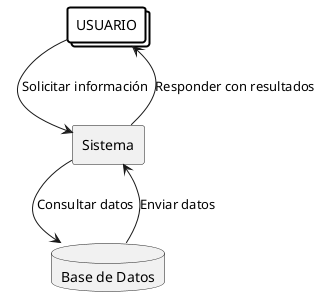

```plantuml
@startuml
skinparam defaultTextAlignment center

' Define custom style for external entities
skinparam collections {
    BorderColor black
    BorderThickness 2
    BackgroundColor white
    ArrowColor Black
}

' External entities
collections Usuario as "USUARIO"

' Processes
rectangle "Sistema" as Sistema

' Data stores
database "Base de Datos" as BaseDeDatos

' Data flows with labeled arrows
Usuario -down-> Sistema : "Solicitar información"
Sistema -down-> BaseDeDatos : "Consultar datos"
BaseDeDatos -up-> Sistema : "Enviar datos"
Sistema -up-> Usuario : "Responder con resultados"
@enduml
```