# Retos de diagramas de comportamiento

## Formación de equipos

Para esta unidad de programación, la formación de los equipos se hará a través del método [*Dinámica de los colores*](https://drive.google.com/file/d/19V9e3BR_IXAjEKVoDU1BxUgsK0heF0S2/view).

Observa la siguiente tabla de colores:

--- PLACEHOLDER ---

¿Con qué colores te identificas más? Escoge en la encuesta en FORMS tu primera y tu segunda opción. En base a ella, se crearán los equipos de la clase intentando tener representados todos los colores.

## Actividades de refuerzo

Las siguientes actividades se resolverán en la sesión final de cada *sprint*. En dicha sesión se escogerá un estudiante al azar mediante una ruleta de la fortuna. El agraciado tendrá la oportunidad de resolver el ejercicio en la pizarra para el resto de la clase. Por salir, obtendrá un punto de participación. La participación en las actividades de clase es un elemento evaluable del módulo, y su puntuación final depende de los puntos de participación. El objetivo es que la participación de la clase esté equilibrada, pero no es obligatorio salir (aunque perderás los puntos de participación). Lo que puntúa es salir a hacerlo, no hacerlo bien o equivocarse.

### Sprint 1: Diagramas de casos de uso

> **Actividad:** Describe el funcionamiento de los siguientes sistemas según su diagrama de casos de uso.
>
**Diagrama 1:**

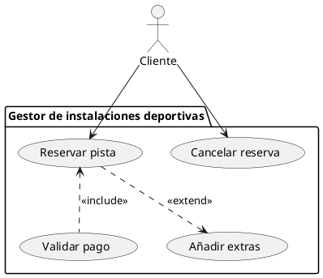
**Diagrama 2:**

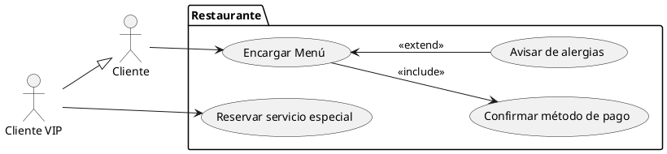

**Diagrama 3:**

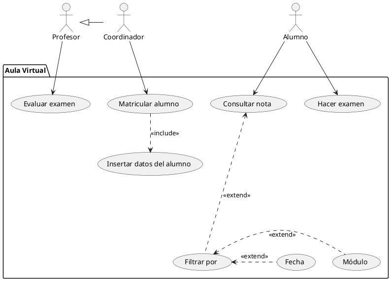

### Sprint 2: Diagramas de transición de estados

>**Actividad:** Identifica el significado de los siguientes diagramas de estados. Para ello, sigue los siguientes pasos:
>
>- ¿Qué representa cada estado?
>- ¿Qué significado tienen las transiciones?
>- ¿Qué proceso o sistema modela el diagrama?
>
>Finalmente, describe brevemente cada diagrama, explicando su **función y aplicación en el mundo real**.

**Diagrama 1: Ciclo de vida de una tarea**

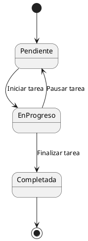

**Diagrama 2: Sistema de un semáforo**

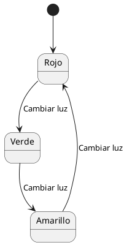

**Diagrama 3: Proceso de pago en línea**

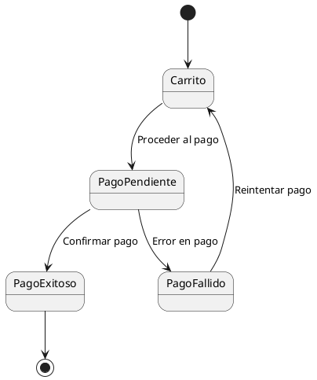

**Diagrama 4: Gestión de una cuenta de usuario**

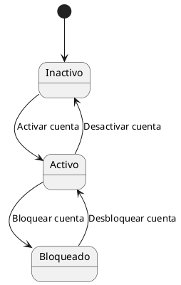

>**Actividad:** Describe los siguientes diagramas de estados siguiendo estas pautas:
>
>1. **Analiza cada diagrama compuesto**:
>    - Identifica los **estados principales** y los **subestados**.
>    - Describe el flujo general del sistema y qué proceso representa.
>
>2. **Escribe una breve explicación** para cada diagrama, enfocándote en:
>    - **Qué sistema modela** (por ejemplo: máquina expendedora, proceso de reserva de vuelo).
>    - **Cómo los subestados mejoran la comprensión del sistema**.
>

**Ciclo de vida de un teléfono móvil**

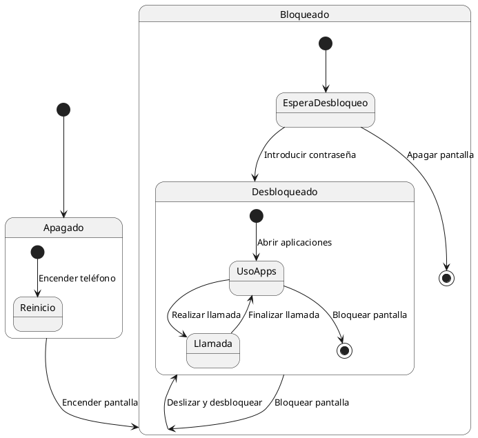

**Proceso de reserva de un vuelo**

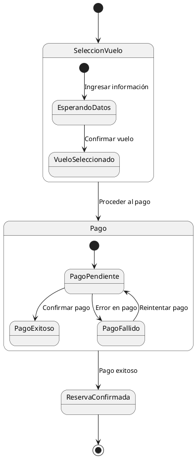

**Gestión de una máquina expendedora**

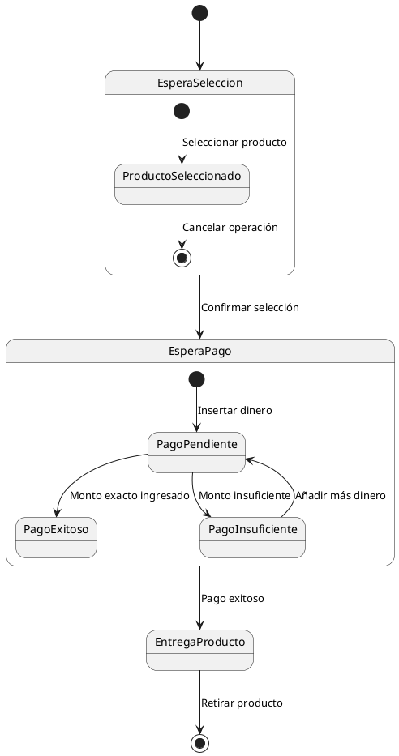
### Sprint 3: Diagramas de actividad

>**Actividad:** Dibuja un diagrama de flujo que determine si un número es positivo, negativo o cero.

>**Actividad:** Crea un diagrama de flujo para sumar todos los números entre dos números entrados por el usuario en un bucle. Comprueba cuál de los dos números es mayor para establecer el orden de forma correcta. Si el resultado tiene una cifra, escribe "una cifra", si tiene dos escribe "dos cifras" y si tiene más escribe "Tres o más cifras".

>**Actividad:** Realiza un diagrama de actividad de cada una de las siguientes actividades:
>
>- Determinar la cantidad de días que tiene un mes en un año, ambos datos introducidos por el usuario. Los datos se imprimen por pantalla. El programa termina si el usuario introduce un número de mes incorrecto (menor que 1 o mayor que 12).
>- Un programa que calcule el factorial de un número entero y mayor o igual a 1 introducido por el usuario. La fórmula del factorial es Factorial(n) = n * Factorial(n-1) y Factorial(1) = 1. Hazlo de forma iterativa (sin recursividad).
>- Un programa que recorra las estanterías de una biblioteca y diga la siguiente información:
>   - Qué estantería tiene más libros (están numeradas del 1 al 10)
>   - Cuál es el título del libro que más páginas tiene y en qué estantería está
>   - Cuántas páginas hay en cada estantería

>**Actividad:** Dibuja un diagrama de flujo para calcular el área de varios triángulos introducidos por el usuario. Define un subproceso para calcular el área de un triángulo e invócalo en el momento adecuado.

>**Actividad:** Coordinación de Tareas en una Cocina
>
>En una cocina, varios trabajadores deben colaborar para preparar y entregar hamburguesas según los pedidos de los clientes. Cada trabajador tiene una tarea específica, y el pedido solo puede ser entregado cuando todos hayan terminado su parte. El flujo de trabajo se divide en las siguientes actividades:
>
>1. **Cocinero 1:** Cocina la carne de la hamburguesa.
>2. **Cocinero 2:** Prepara el pan (lo corta y lo coloca).
>3. **Cocinero 3:** Añade los condimentos (queso, salsas, etc.). Solo se puede hacer si el pan está preparado.
>4. **Cocinero 4:** Prepara la guarnición (patatas fritas, ensaladas, etc.).
>5. **Trabajador de entrega:** Ensambla el pedido y lo entrega al cliente, pero **solo puede hacerlo cuando todos los cocineros hayan terminado sus tareas**.
>
>Modela el sistema de preparación de pedidos de hamburguesas mediante un **diagrama de actividad**, representando los flujos paralelos de trabajo.

### Sprint 4: Diagramas de interacción

>**Actividad:** Explica lo que ocurre en los siguientes diagramas de secuencia:

**Autenticación de un usuario**

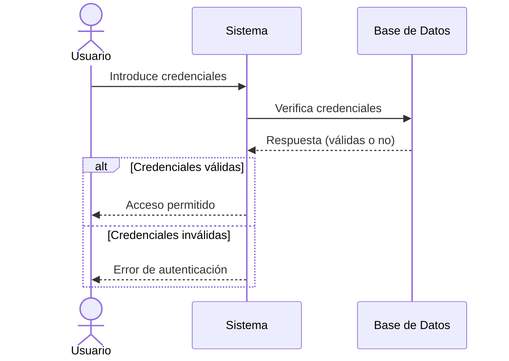

**Compra en línea**

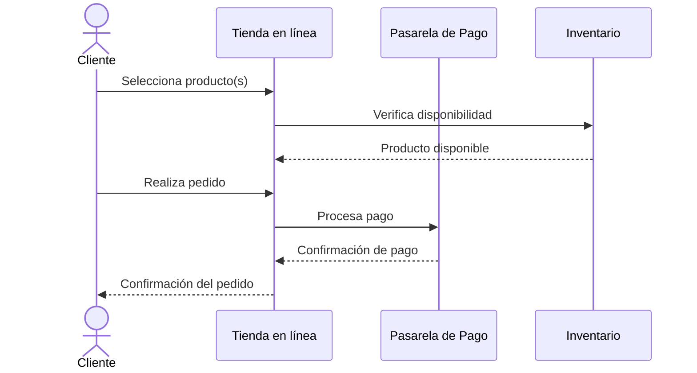

**Retiro de efectivo en un cajero automático**

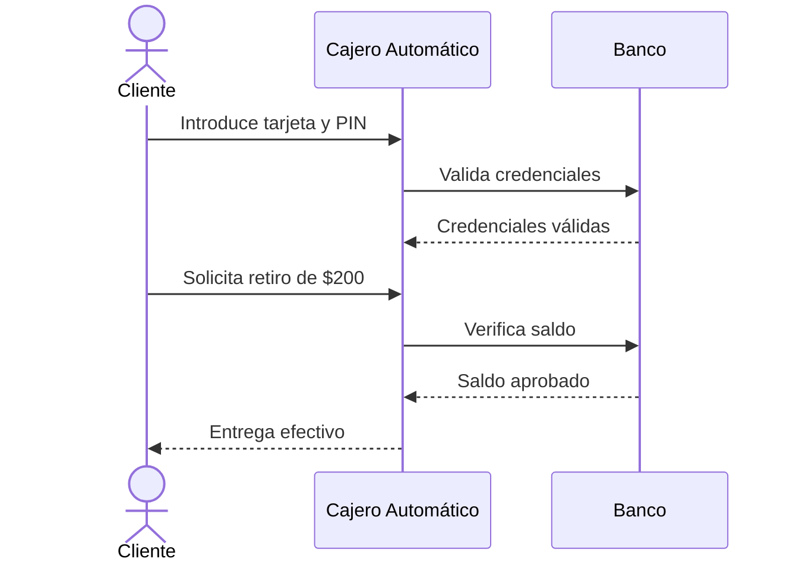

**Soporte técnico automatizado**

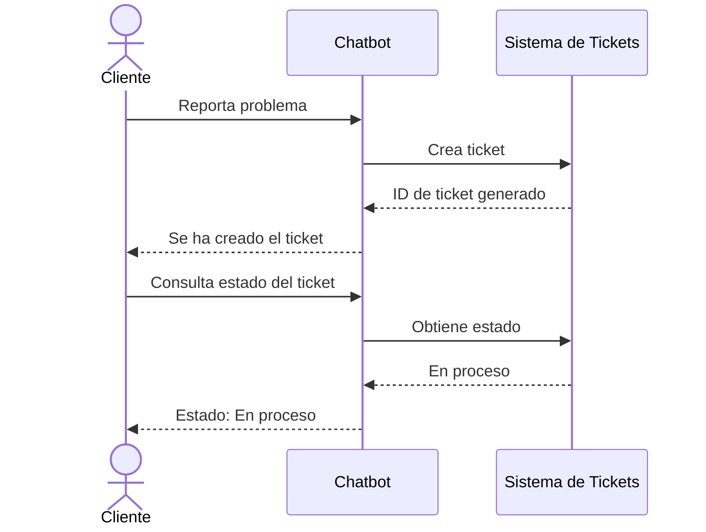

## Sprint 5: Retos

Los retos son la actividad colaborativa más importante. Cada equipo tiene al menos uno de los enunciados asignados y debe de completar los requerimientos, en este caso, el diseño de los diagramas.

Es obligatorio hacer uno de los enunciados, los demás son parte del contenido de ampliación opcional, que sirve para mejorar la nota.

#### Dados los siguientes enunciados, diseña los diagramas de comportamiento necesarios

Lee el enunciado de cada problemática y establece, según los criterios del IEEE 830 estudiado en la primera unidad, los requisitos funcionales de cada aplicación. A continuación, basándote en dicha información, realiza los siguientes diagramas:

- Diagrama de casos de uso
- Diagrama/s de transición de estados
- Diagrama/s de actividad
- Diagrama/s de interacción

**Sistema de Gestión de Inventario para un Almacén**:

>Queremos desarrollar una aplicación para gestionar el inventario de un almacén. Los usuarios son los empleados del almacén y los administradores. Los empleados deben ser capaces de registrar la entrada y salida de productos, consultar el estado actual del inventario y reportar incidencias como productos dañados o caducados. Algunos empleados (revisores) además pueden realizar inspecciones para comprobar que no haya errores. En caso de que haya un error, se debe enviar una notificación de alerta en el sistema. Los administradores pueden agregar nuevos productos al sistema, modificar los niveles mínimos de inventario, y generar reportes de inventario en tiempo real. El sistema debe estar conectado con el sistema de pedidos de la empresa para generar alertas automáticas cuando un producto esté por debajo de su nivel mínimo. Además, debe ser rápido, seguro y accesible desde dispositivos móviles para facilitar su uso dentro del almacén. Todos los usuarios pueden buscar pedidos en el inventario por tipo, nombre o referencia.

**Sistema de Gestión de Reservas para una Biblioteca Escolar**:

>Queremos desarrollar una aplicación para gestionar el préstamo y reserva de libros en una biblioteca escolar. Los usuarios son los estudiantes, los profesores y los bibliotecarios. Los estudiantes y profesores deben poder buscar libros en el catálogo, realizar reservas y consultar el estado de sus préstamos. Entre los profesores, algunos tienen la designación de jefes de departamento y pueden marcar libros del catálogo como importantes para el departamento. Los bibliotecarios pueden agregar nuevos libros al catálogo, registrar los préstamos realizados y generar notificaciones automáticas para recordar a los usuarios la devolución de los libros. El sistema debe ser accesible desde cualquier dispositivo con conexión a internet y debe permitir gestionar multas por retrasos en la devolución de libros. Queremos implementar el sistema de tal forma que en el futuro se puedan añadir discos o revistas, con sus propias características, pero que puedan ser susceptibles de ser prestados y reservados.

**Turnos de un hospital**

>Para gestionar los turnos de un hospital y evitar que se acumulen horas excesivas en los profesionales, debemos tener en cuenta que un miembro del personal puede estar trabajando, descansando o en expectativa de turno. El periodo de descanso empieza inmediatamente después de haber estado trabajando y dura 12 horas. En el momento en que vencen esas 12 horas, un trabajador puede o bien volver a trabajar o bien quedarse en expectativa de turno. Un trabajador en expectativa de turno puede ser asignado para trabajar por el gestor de turnos. El trabajador comienza siempre en expectativa de turno. Los trabajadores pueden ser enfermeros, médicos o administrativos. Solo los administrativos son capaces de gestionar turnos, pero todos los trabajadores pueden solicitar permutas o permisos, así como consultar sus turnos y su estado actual.
>

**Gestión de una máquina de café automática**

>
>Una máquina de café automática gestiona la preparación y entrega de bebidas calientes. En su funcionamiento, la máquina puede encontrarse en varios estados. Al inicio, la máquina está a la espera de que un usuario realice una selección. Cuando el usuario elige una bebida (como café, té o chocolate caliente), la máquina pasa a un proceso de preparación específico según la bebida seleccionada. Si el proceso de preparación concluye sin problemas, la máquina entrega el producto al usuario y regresa al estado inicial para una nueva solicitud.
>
>Sin embargo, si durante la preparación ocurre un error, como falta de ingredientes o una avería técnica, la máquina debe entrar en un estado de error que bloquea nuevas solicitudes hasta que un técnico de mantenimiento intervenga. El técnico podrá reiniciar el sistema y devolver la máquina a su estado inicial. Además, el proceso de **preparación** debe incluir detalles específicos dependiendo del tipo de bebida elegida: preparar café, preparar té o preparar chocolate caliente.

**Control de acceso a un edificio inteligente**
>
>El sistema de control de acceso de un edificio inteligente se encarga de gestionar la entrada y salida de las personas. Una persona comienza siempre fuera del edificio. Cuando intenta acceder, debe escanear su tarjeta, iniciando así un proceso de verificación. Durante este proceso de acceso, se realizan varios pasos, como la validación de la tarjeta y un escaneo de seguridad. Si todo es correcto, la persona puede entrar al edificio y pasar al estado de estar dentro.
>
>Sin embargo, si la tarjeta es inválida o se detecta algún problema de seguridad, el acceso se deniega y la persona entra en un estado bloqueado. Para salir de este estado, un guardia de seguridad puede intervenir y decidir si la persona debe volver al inicio, es decir, al estado fuera del edificio, o si puede intentar nuevamente el acceso. Por último, una vez que una persona se encuentra dentro del edificio, puede salir en cualquier momento, regresando al estado inicial fuera del edificio.

**Sistema de Gestión de Vuelos de un Aeropuerto**:

>Queremos desarrollar una aplicación para gestionar las operaciones de un aeropuerto. Los usuarios son tanto los operadores del aeropuerto como los empleados de las aerolíneas. Los operadores del aeropuerto deben poder asignar pistas de aterrizaje y despegue, modificar las asignaciones según las condiciones climáticas o retrasos, y enviar notificaciones a las aerolíneas sobre los cambios realizados. Los empleados de las aerolíneas pueden consultar los horarios de las pistas asignadas, solicitar cambios en las asignaciones y reportar incidencias técnicas relacionadas con los vuelos. Todos los usuarios pueden ver su historial de acceso a la aplicación. El sistema debe integrarse con los sistemas meteorológicos para alertar automáticamente de posibles retrasos y debe ser accesible en tiempo real desde dispositivos móviles o tablets. 
>Un vuelo primero aparece en el aire sin pista asignada. Se le asigna la primera pista libre que haya adecuada para él. A continuación, el vuelo pasa a aterrizar. Una vez en tierra, comienza la fase de desembarco. De manera opcional, el vuelo puede repostar combustible. A partir de este punto, el vuelo cambia su código y se transforma en un vuelo nuevo, que comienza en fase de embarque y pasa a fase de despegue. Una vez está fuera del área del aeropuerto, el vuelo deja de estar presente en el sistema.
