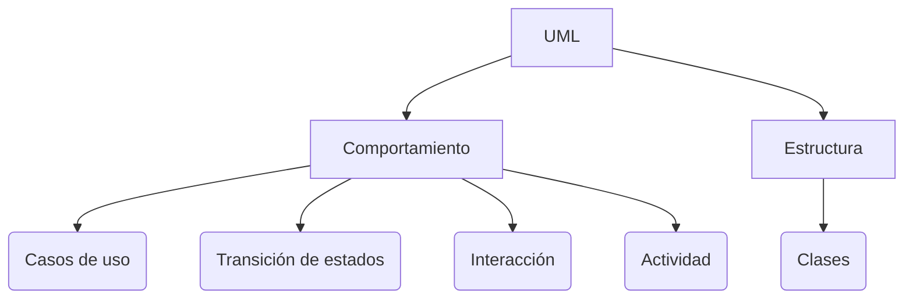
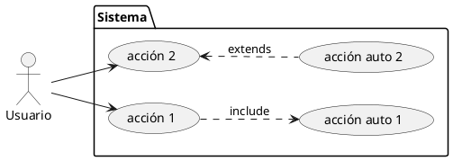
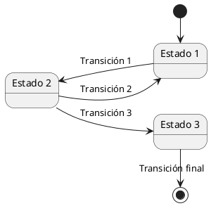
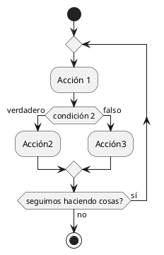
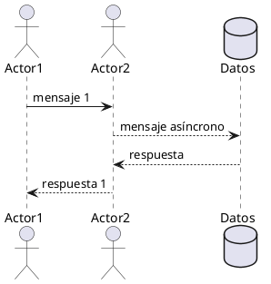
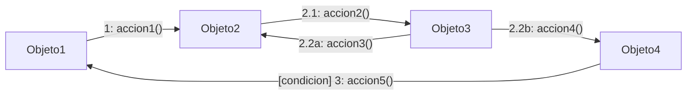

---
presentation:
    width: 800
    height: 600
    theme: beige.css
---

<!-- slide -->
## Diagramas UML: 

#### Diagramas de comportamiento
---

Parten del diseño orientado a objetos

---

<!-- slide -->

### Usos de los diagramas UML de comportamiento (I)
---
- Metodologías tradicionales
  - Después de especificar los requisitos del sistema
  - Después de especificar el diseño

<!-- slide -->

### Usos de los diagramas UML de comportamiento (I)
---
- Metodologías ágiles
  - Como mapa para comenzar el desarrollo
  - En la fase final del desarrollo, para documentación y soporte.

<!-- slide -->

### Diagramas de Casos de Uso

---
Determina qué cosas se hacen en el sistema y quién las hace:

---

<!-- slide -->

### Diagramas de Transición de estados

---

Determina las fases del sistema (o elementos) y cómo se cambia entre fases:

---

<!-- slide -->

### Diagramas de Actividad

---
Determina cómo se comporta un proceso concreto:

---
<!-- slide -->

### Diagramas de Interacción

---

Determina cómo y cuándo interactúan los diferentes actores del sistema, centrándose en el cuándo:

---
<!-- slide -->
### Diagramas de comunicación

Determina cómo y cuándo interactúan los diferentes actores del sistema, centrándose en el cómo:

<!-- slide -->

#### Herramientas para la confección de diagramas

---

| Editores gráficos | A través de Markdown |
| --- | --- |
| Lucidchart | Markdown Enhanced Preview |
| Visual Paradigm | Plantuml |
| Miro | Mermaid.js |

<!-- slide -->

#### Diagramas importantes que no son UML

---

- Diagramas ERE (Entidad Relación Extendido)
- Diagramas de Flujo de Datos (DFD)
- Diagramas de Flujo (similares a los de Actividad)