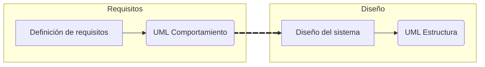
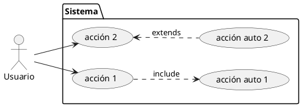
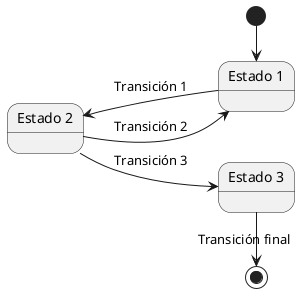
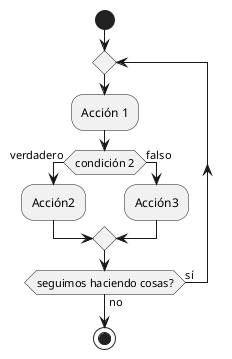
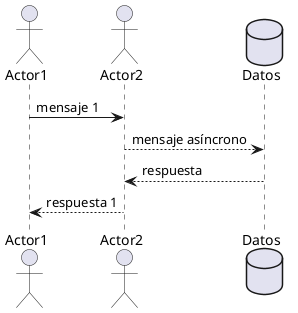

# Introducción a UML

<!-- @import "[TOC]" {cmd="toc" depthFrom=1 depthTo=6 orderedList=false} -->

<!-- code_chunk_output -->

- [Introducción a UML](#introducción-a-uml)
  - [¿Qué es UML?](#qué-es-uml)
  - [La importancia de UML en el mundo de las metodologías ágiles](#la-importancia-de-uml-en-el-mundo-de-las-metodologías-ágiles)
  - [Los diagramas de comportamiento](#los-diagramas-de-comportamiento)
  - [Herramientas para el diseño de diagramas](#herramientas-para-el-diseño-de-diagramas)
    - [Código en Plantuml de los ejemplos](#código-en-plantuml-de-los-ejemplos)

<!-- /code_chunk_output -->


## ¿Qué es UML?

UML responde a las siglas de *Unified Modeling Language*. Es un lenguaje de modelado que nos permite representar comportamientos y datos para a través de diagramas. No se trata de un único lenguaje, sino de un conjunto de sublenguajes compatibles entre sí.

UML permite modelar dos categorías de diagramas: **Diagramas de comportamiento** y **Diagramas de estructura**.

Dado que UML se basa en el diseño orientado a objetos, es especialmente útil para representar problemas dentro de este paradigma. Sin embargo, tiene limitaciones al expresar otros enfoques de programación.

Su primera aparición fue en 1994 y, con el tiempo, se ha convertido en un estándar reconocido por la ISO (ISO/IEC 19501).

## La importancia de UML en el mundo de las metodologías ágiles

Los diagramas UML alcanzaron su máxima popularidad en la época de las metodologías tradicionales, como RUP. Sin embargo, con la adopción de metodologías ágiles, centradas en la adaptabilidad y la evolución constante de los requisitos, su uso ha disminuido.

En las metodologías ágiles, los diagramas de comportamiento se definían después de obtener la definición de requisitos y los diagramas de estructura después del diseño del sistema, todo ello dentro de la fase *Análisis* dentro del modelo de desarrollo de tipo ***Cascada***.


El desafío con UML en entornos ágiles es que los diagramas deberían actualizarse continuamente a medida que cambian los requisitos, lo cual puede ser poco práctico. Aun así, siguen siendo valiosos como punto de partida para el desarrollo y como documentación adicional en la fase de mantenimiento, facilitando el soporte y la comprensión del sistema.

Además, desde un enfoque pedagógico, la confección de diagramas ayuda a estructurar el pensamiento lógico y adaptarlo al desarrollo de software. Por ello, UML sigue siendo una herramienta poderosa en el aprendizaje de la informática y la programación.

>**Actividad:** Busca en internet cuántas versiones de UML hay, cuál es la actual y todos los diagramas UML que la componen, organizados.

## Los diagramas de comportamiento

En esta unidad de programación vamos a trabajar algunos diagramas de comportamiento UML:
- Los **diagramas de casos de uso** permiten expresar qué actor hace qué función (caso de uso) en nuestro sistema. Algunas funciones se ejecutan automáticamente por el sistema.


- Los **diagramas de transición de estados** permiten expresar por qué estados puede pasar un elemento del sistema (o el sistema entero) y qué eventos regulan dichos cambios de estado (transiciones).


- Los **diagramas de actividad** permiten ilustrar el flujo de acción de un proceso y sirven para ilustrar cómo se realiza una actividad.


- Los **diagramas de interacción** permiten expresar cómo se interactúan los diferentes elementos de nuestro sistema a través del paso de mensajes.



Estos diagramas, trabajando de manera conjunta, nos permiten modelar el comportamiento de nuestro sistema, una tarea importante que pertenece a la fase de diseño dentro del desarrollo de una aplicación. En esta unidad de programación, profundizaremos en estos 4 diagramas de comportamiento, pero como puedes comprobar, hay muchos más.

## Herramientas para el diseño de diagramas

Existen varias herramientas para realizar diagramas UML. Por un lado, tienes editores WYSIWYG (What you see is what you get) que nos permiten *pintar* los diagramas. Podríamos usar cualquier editor de imágenes para ello, pero existen varias opciones especializadas como Visual Paradigm, cuya [versión online](https://online.visual-paradigm.com/es/) es gratuita; [lucidchart](https://www.lucidchart.com/pages) o, un poco más genérica pero muy potente, [Miro](https://miro.com/).

>**Actividad:** Emplea alguna herramienta de las mencionadas, u otra de tu gusto, para dibujar los diagramas de los ejemplos. Si no tienes claro cuál, usa Visual Paradigm Online.

Por otro lado, para incluir diagramas en documentos de texto, es habitual combinar la [sintaxis de Markdown](https://markdown.es/sintaxis-markdown/) con lenguajes como plantuml, mermaidjs o d2. Estos lenguajes se procesan dentro de los bloques de código que nos permite usar markdown y generan los diagramas de forma automática. En estos documentos se usa plantuml y, en menor medida, mermaidjs (o simplemente mermaid).

Esta última forma requiere el uso de algún editor de código, como Visual Studio Code, y la adición de algunos plugins como:
- [**Markdown preview Enhanced**](https://shd101wyy.github.io/markdown-preview-enhanced/#/) es la extensión que convierte el código markdown en documento, incluyendo la interpretación de los diagramas plantuml y mermaid.
- [**Plantuml**](https://plantuml.com/es/) para las opciones de plantuml (resaltado de sintaxis).
- **Mermaid Markdown Syntax** para el resaltado de la sintaxis de [**mermaidjs**](https://mermaid.js.org/).

Hay que tener en cuenta que estas extensiones dependen de un servidor externo, que puede fallar.

Por otro lado, markdown admite la sintaxis de HTML, así que conforme avances en el módulo *Lenguajes de Marcas y Sistemas de Gestión de la Información* podrás mejorar las capacidades de tus documentos en markdown.

>**Actividad:** Prepara tu entorno Visual Studio Code para realizar diagramas en plantuml. Puedes copiar el código de los ejemplos para comprobar que funciona de forma adecuada.

### Código en Plantuml de los ejemplos

**Diagrama de Casos de Uso:**
```
@startuml
left to right direction
actor Usuario as u
package Sistema as s{
        usecase "acción 1" as a1
        usecase "acción 2" as a2
        usecase "acción auto 1" as aa1
        usecase "acción auto 2" as aa2
    
}
u-->a1
u-->a2
a1 .down.>aa1 : include
aa2 .up.>a2 : extends
@enduml
```
**Diagrama de Transición de Estados:**
```
@startuml
left to right direction
state "Estado 1" as e1
state "Estado 2" as e2
state "Estado 3" as e3
[*] -right-> e1
e1 -up-> e2 : Transición 1
e2 --> e1 : Transición 2
e2 --> e3 : Transición 3
e3 -right-> [*] : Transición final
@enduml
```
**Diagrama de actividad:**
```
@startuml
start
repeat
    :Acción 1;
    if (condición 2) is (verdadero) then
        :Acción2;
    else (falso)
        :Acción3;
    endif
repeat while(seguimos haciendo cosas?) is (sí) not (no)
stop
@enduml
```

**Diagrama de interacción:**
```
@startuml
actor Actor1
actor Actor2
database Datos
Actor1 -> Actor2 : mensaje 1
Actor2 --> Datos : mensaje asíncrono
Datos --> Actor2 : respuesta
Actor2 --> Actor1 : respuesta 1
@enduml
```
En estos diagramas puedes ver algunos *trucos* para colocar los elementos de una forma específica, ya que por defecto plantuml coloca de forma automática los elementos y no permite la colocación manual. Prueba con las diferentes opciones hasta que consigas darle a tus diagramas la forma que desees (o la que más te convenza).
