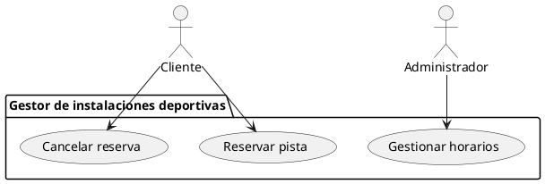
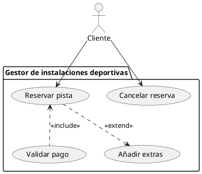
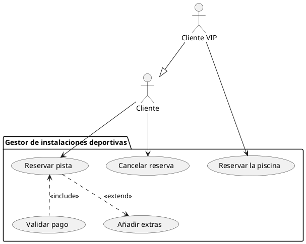

# Diagramas de casos de uso

## Diagramas UML de Casos de Uso

Un diagrama de casos de uso especifica cómo funciona un sistema. Más concretamente, qué puede hacer cada usuario que interactúe con el sistema. Para ello, se requieren cuatro elementos principales: Los casos de uso, los actores, las relaciones y el sistema.

- El **sistema** es el programa que vamos a desarrollar, y engloba todos los casos de uso. Se representa con un recuadro con una etiqueta.
- Un **actor** es un usuario o un sistema externo que interactúa con el sistema.
- Un **caso de uso** describe cómo un actor interactúa con el sistema para lograr un objetivo. Es una forma de **especificar requisitos funcionales** de manera visual y comprensible.
- Por último, una **relación** es una conexión que se establece dentre un actor y un caso de uso. También se pueden establecer relaciones especiales entre casos de uso.

En general, un diagrama de casos de uso describe qué hace nuestro sistema y quién hace las acciones del mismo, pero no cómo las hace.

### Pasos para crear un diagrama de casos de uso

Para crear un diagrama de casos de uso, nos basamos en los requisitos funcionales del SRS. De ellos, determinamos los siguientes aspectos:

**1. Actores**:

- Determinamos quién interactuará con el sistema.
- Ejemplo: En un sistema de reservas de pistas deportivas:
    - **Cliente:** Hace reservas.
    - **Administrador:** Gestiona horarios.

**2. Casos de uso**:

- Pensamos en las acciones principales que los actores quieren realizar.
- Ejemplo:
    - "Reservar pista."
    - "Cancelar reserva."
    - "Gestionar horarios."

Con esta información, podemos finalmente crear su representación visual en forma de diagrama de casos de uso:

## Relaciones avanzadas

### Relaciones `<<extend>>` y `<<include>>`

Además de las relaciones básicas, los diagramas de casos de uso cuentan con relaciones avanzadas que se dan entre diferentes casos de uso. Nos sirven para dividir un comportamiento del sistema en distintos casos de uso, lo que ayuda a la modularidad y planificación del desarrollo.

La relación de tipo `<<extend>>` sirve para añadir una funcionalidad **opcional** que se puede lanzar después de un caso de uso. Por ejemplo, después del caso de uso `reservar pista` podríamos añadir una extensión que fuera `añadir extras` (como el alquiler de un balón). Este caso de uso podría darse o no, dependiendo de las elecciones del usuario.

La relación de tipo `<<include>>` sirve para añadir una funcionalidad **obligatoria** que se lanzará siempre después de un caso de uso. Por ejemplo, después del caso de uso `reservar pista` podríamos añadir una extensión que fuera `validar pago`. Esta validación se tendría que dar siempre después de cada reserva para que esta se realizara con éxito.

Las relaciones `<<extend>>` y `<<include>>` se representan así:

### Generalización

Aparte de las relaciones `extend` y `include` contamos con relaciones de generalización entre actores, que funcionan de manera similar a lo ya visto en los diagramas de clases. Si unimos un actor **A** a un actor **B** mediante una flecha de generalización que apunta de A a B, lo que estamos diciendo es que el actor A es una especificación del actor B, es decir, cuenta con todos los casos de uso del actor B más los suyos propios.

Continuando con el ejemplo de las pistas deportivas, vamos a añadir un subtipo de cliente, el cliente VIP que, además de los casos de uso del cliente, también puede reservar la piscina.

