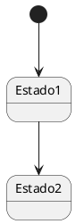
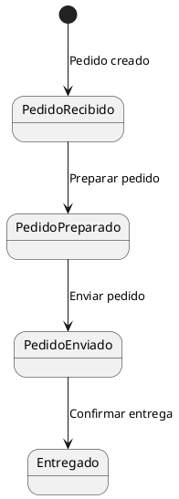
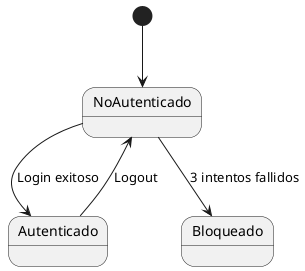
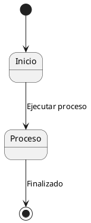
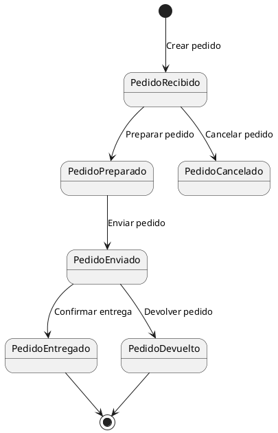
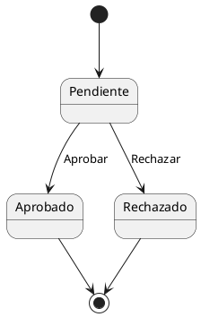
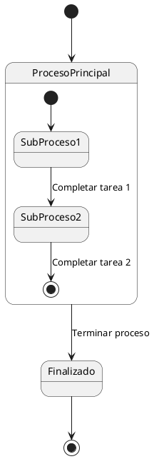

# Diagramas de estados

## Introducción a los Diagramas de Estados

Un diagrama de estados es una representación gráfica del **comportamiento dinámico** de un objeto o sistema, mostrando los **estados** en los que puede encontrarse y las **transiciones** entre ellos debido a eventos.

Un diagrama de estados facilita el modelado de sistemas en los que un objeto cambia de estado a medida que ocurren **eventos**. Por lo tanto, es útil en sistemas secuenciales como **máquinas expendedoras, procesos de pedidos, autenticación de usuarios, etc.**.

Imagina que un semáforo es como un sistema que cambia de estado (verde, amarillo, rojo) en función de eventos (el tiempo transcurrido o la llegada de un coche). Así funcionan las máquinas de estados.

>**Actividad:** Señala tres ejemplos de la vida cotidiana, como el del semáforo, donde se pudiera aplicar un diagrama de estados.

## Partes de un Diagrama de Estados

### Estado

Un **estado** representa una condición en la que se encuentra un objeto.

- El punto negro (*) representa el **estado inicial**.
- `Estado1` y `Estado2` son ejemplos de **estados**.

#### Transición

Una **transición** conecta dos estados y ocurre cuando se dispara un **evento**. Las transiciones tienen un solo sentido.

- **Eventos**: "Pedido creado", "Preparar pedido", "Enviar pedido", etc.
- Cada flecha entre estados representa una **transición**. Una transición cambia desde el estado de donde nace la flecha hasta el estado donde apunta la flecha y ocurre cuando se dispara el evento.

#### Evento

El **evento** es la acción que provoca una transición. Puede escribirse como texto en las flechas.

- Estados: *NoAutenticado*, *Autenticado*, *Bloqueado*.
- Eventos: *Login exitoso*, *3 intentos fallidos*, *Logout*.

#### Estado Inicial y Estado Final

- **Estado inicial**: Punto de partida del sistema (círculo relleno).
- **Estado final**: Punto donde el proceso termina (círculo doble). El proceso puede ser cíclico y no terminar.

## Ejemplo Práctico: Ciclo de Vida de un Pedido

Este ejemplo muestra cómo un pedido pasa por varios estados durante su procesamiento.

En este diagrama podemos observar lo siguiente:

1. **Estados**: PedidoRecibido, PedidoPreparado, PedidoEnviado, PedidoEntregado, PedidoCancelado, PedidoDevuelto.
2. **Transiciones**:
    - *Crear pedido*: De `[ * ]` a `PedidoRecibido`.
    - *Preparar pedido*: De `PedidoRecibido` a `PedidoPreparado`.
    - *Enviar pedido*: De `PedidoPreparado` a `PedidoEnviado`.
    - *Cancelar pedido*: Transición directa a `PedidoCancelado`.

## Máquinas de Estados Simples y Compuestas

### Máquina de estados simple

Una máquina de estados simple representa de forma lineal los estados y las transiciones.

### Máquinas de estados compuestas

Una máquina de estados compuesta representa estados que pueden contener **subestados**.

## Cómo Crear un Diagrama de Estados

A la hora de realizar diagramas de estados debemos seguir los siguientes pasos:

1. Identificar los **estados** del objeto.
2. Determinar los **eventos** que provocan transiciones.
3. Dibujar el **estado inicial** y el **estado final**. En diagramas cíclicos, el estado final puede no ser necesario.
4. Conectar los estados mediante **transiciones** etiquetadas.
5. Revisar la lógica y corregir posibles inconsistencias.

Por supuesto, si queremos que la máquina sea compuesta, por cada estado que deseamos convertir a su vez en una máquina de estados debemos seguir el mismo proceso.

Los errores más comunes a la hora de realizar diagramas de estados son:

- Olvidar el estado inicial o final.
- No etiquetar correctamente las transiciones con eventos, o no etiquetarlas directamente por parecernos triviales.
- Confundir estados con eventos.

