# Diagramas de actividad

## Diagramas actividad

Los diagramas de actividad son representaciones gráficas de algoritmos o procesos, en las que se usan símbolos específicos para mostrar los pasos y decisiones. Son una herramienta esencial en la planificación, análisis y comunicación de sistemas.

Los diagramas de actividad son equivalentes a los diagramas de flujo que se emplean fuera de UML.

### Componentes básicos de un diagrama de actividad

1. **Flechas**: Conectan los diferentes símbolos y muestran el flujo del proceso.

2. **Círculo**: Representa el inicio (simple) o fin del proceso (doble).
```plantuml
@startuml
start
stop
@enduml
```
3. **Rectángulo**: Indica una acción o proceso.
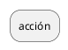
4. **Rombo o hexágono**: Representa una decisión, como una bifurcación. Se usan siempre dos: una para abrir y otra para cerrar.
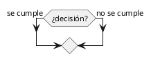
## Estructuras comunes

### Estructuras if-else, if y switch

Estas estructuras se utilizan para representar decisiones lógicas.  
**Ejemplo de if-else:**

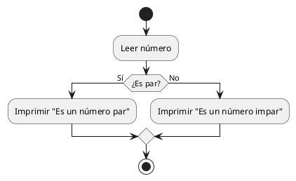

**Ejemplo de if:**

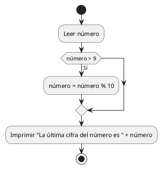

**Ejemplo de Switch-case**

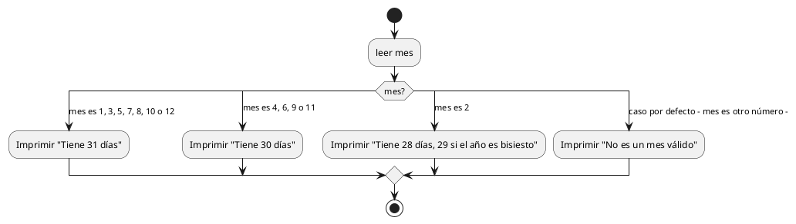

### Estructuras while, do-while y for

Los bucles permiten repetir una acción varias veces.  
>**Ejemplo de bucle while que pide suma números hasta que introduces 0:**

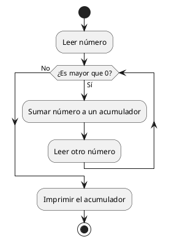

>**Ejemplo de bucle do-while para hacer diagramas:**

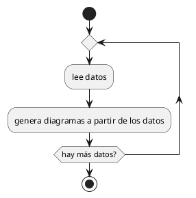

>**Ejemplo de bucle for para separar los números pares e impares desde 0 hasta una entrada dada por el usuario:**

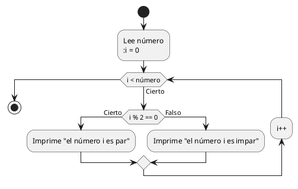

### Programación modular

Dentro del diseño de programas, existe un paradigma que es el de la programación modular. En él, se adopta un enfoque de diseño descendente en el cual un problema grande se divide en subproblemas más pequeños que permiten simplificar el problema general.

Estos subproblemas se conocen como módulos y tienen la ventaja de ser más fáciles de probar, mantener y corregir, además de poder ser reutilizados en diferentes partes del problema principal o incluso en otros problemas distintos. Los módulos se pueden invocar desde cualquier otro módulo. Un módulo tiene un grado de entrada igual al número de veces que es invocado y un grado de salida igual al número de módulos que invoca.

La dependencia entre módulos se llama **acoplamiento**, y puede ser peligrosa si va más allá de que un módulo emplee el resultado de otro. Por ello, es conveniente diseñar los módulos como si fueran **cajas negras**, es decir, de tal forma que solo nos importe los parámetros que le pasamos como entrada y el resultado que nos devuelve.

Podemos representar la invocación a módulos en los diagramas de actividad como una instrucción o condición cualquiera, indicando entre paréntesis los parámetros que le pasamos.

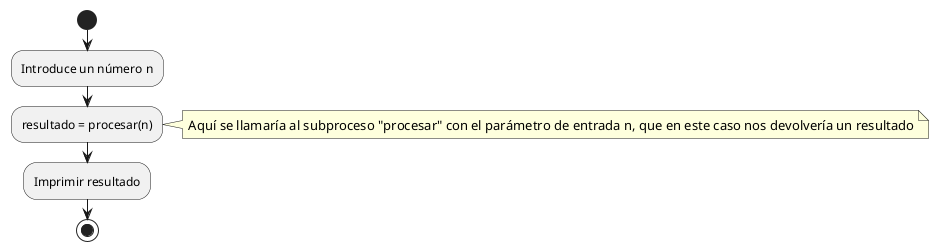

## Concurrencia en diagramas de actividad

Aunque no se trabaja programación concurrente en el primer curso del ciclo, es apropiado conocer cómo representar flujos paralelos (hilos) en un diagrama de actividad. Esta técnica es útil cuando se modelan procesos que pueden ejecutarse simultáneamente, algo común en sistemas donde las operaciones independientes pueden ocurrir al mismo tiempo (como cuando se consulta una base de datos externa o se trabaja con interfaces gráficas).

### Representación de los hilos

En un diagrama de actividad, los hilos (o actividades concurrentes) se representan mediante **ramificaciones paralelas**, utilizando nodos de bifurcación (*fork*) y unión (*join*):

- **Fork (Bifurcación):** Representado por una línea horizontal o vertical gruesa. Indica que el flujo se divide en varios caminos paralelos que se ejecutan simultáneamente.
- **Join (Unión):** También representado por una línea gruesa, marca el punto donde los flujos paralelos se sincronizan para continuar con un único flujo.

Por ejemplo, Supongamos un sistema de cajero automático que debe realizar dos tareas en paralelo:

1. **Actualizar el saldo de la cuenta.**
2. **Registrar la operación en un historial de transacciones.**

Ambas tareas pueden ejecutarse de forma concurrente, ya que no dependen entre sí, pero deben completarse antes de que el sistema pueda finalizar la operación.

**Representación en un diagrama de actividad:**

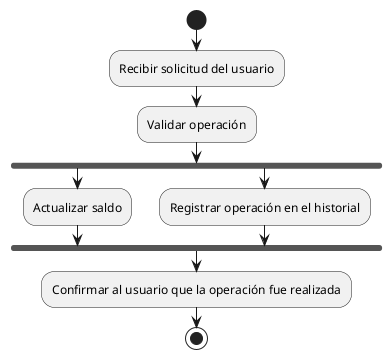

En este caso, se puede observar que el diagrama representa las siguientes acciones:

1. **Inicio del flujo:** El sistema recibe la solicitud del usuario y valida que la operación sea posible.
2. **Bifurcación:** El flujo se divide en dos hilos: uno para actualizar el saldo y otro para registrar la operación en el historial.
3. **Unión:** Ambos hilos se sincronizan para continuar con el flujo principal.
4. **Fin del flujo:** El sistema confirma al usuario que la operación fue realizada.

Es importante no confundir los hilos con las diferentes opciones que nos proporciona un `if-else` o un `switch`. En el caso de los hilos, **todas** las acciones desde el **fork** se llevan a cabo de manera simultánea y el programa espera en el punto de encuentro, el **join**. Como curiosidad, el nombre de **fork** viene de tenedor (**fork** en inglés es tenedor), pues su representación se asemeja a un tenedor (en realidad no, viene de bifurcación, que es el otro significado de fork, pero sirve como regla mnemotécnica).

Aunque no vayamos a hacer programación concurrente este curso, la división en hilos sí que nos permite representar las siguientes cosas:

- Visualizar procesos que pueden ejecutarse en paralelo, optimizando tiempos.
- Detectar posibles dependencias entre actividades que podrían causar errores.
- Representar sistemas más complejos con mayor precisión.
- Planificar los sprints de un equipo de desarrollo.

### Uso de carriles en los diagramas de actividad

Para representar la intervención de varios actores dentro de una misma actividad, se puede dividir el diagrama de actividad en carriles, reservando cada carril para cada actor.

Aunque los carriles son especialmente prácticos para describir las actividades concurrentes, se pueden emplear en cualquier momento. Asimismo, también podemos agrupar diferentes bloques de acciones para facilitar la interpretación del diagrama.

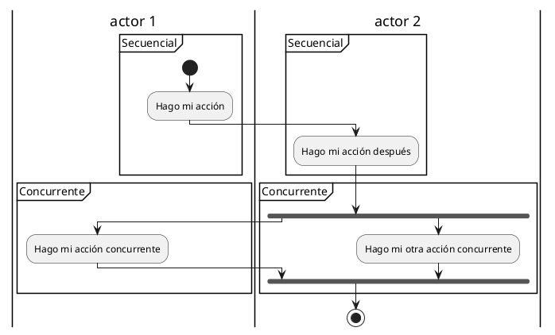

***Nota**: En Plantuml, los carriles dividen las particiones por la mitad. Sin embargo, al diseñarlos con otros editores, como Visual Paradigm o en papel y lápiz, puedes agruparlos como te resulte más conveniente*

