## Diagramas de interacción

Existen varios tipos de diagramas de interacción.
- Diagramas de secuencia
- Diagramas de comunicación
- Diagramas de tiempos
- Diagramas de interacción global

En este apartado, vamos a trabajar los diagramas de secuencia por ser los más relevantes y, al mismo tiempo, los más complejos de entender. Al final, introduciremos los diagramas de comunicación.

## ¿Qué es un diagrama de secuencia y para qué se usa?

Un **diagrama de secuencia** es un tipo de diagrama de comportamiento en UML que modela la interacción entre actores (usuarios u otros sistemas) y los objetos de un sistema en un orden temporal. Su principal objetivo es mostrar el flujo de mensajes o eventos que ocurren entre diferentes participantes a lo largo del tiempo, destacando el **orden cronológico** de las interacciones.

Se utiliza para:

- **Especificar** cómo se desarrolla un proceso dentro del sistema (por ejemplo, cómo se valida un pedido o cómo un usuario realiza una compra).
- **Diseñar o analizar escenarios** concretos de interacción entre componentes del sistema.
- **Comunicar ideas entre desarrolladores**, analistas y diseñadores.

Un ejemplo típico sería la interacción entre un cliente, un cajero automático y un banco para retirar dinero. El cliente introduce su tarjeta, el cajero se conecta al banco para validar los datos, el cliente realiza la operación y finalmente, si todo es correcto, entrega el dinero (En el caso de que la operación fuera sacar el dinero).

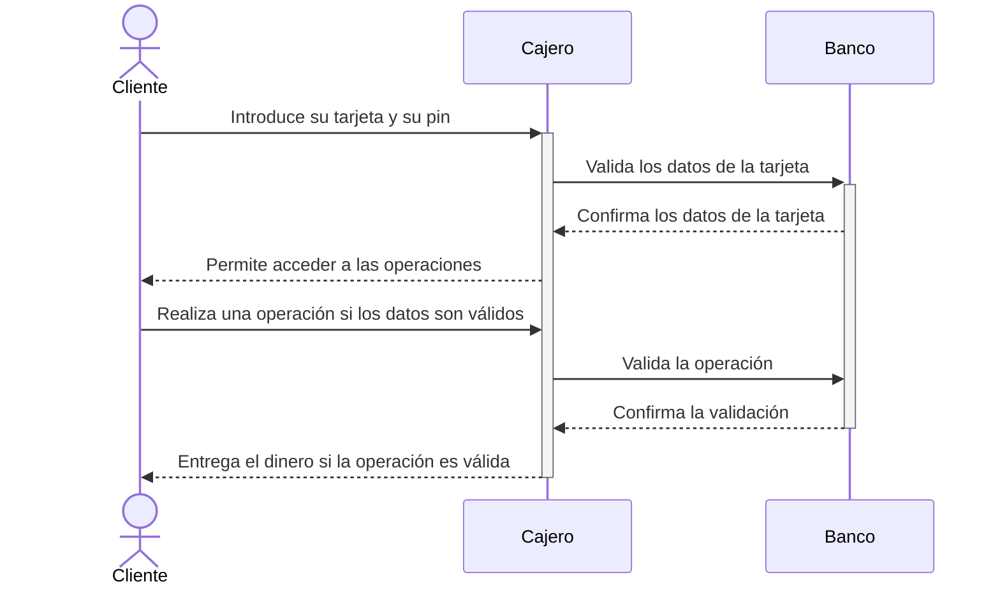

## Componentes básicos de un diagrama de secuencia y cómo construirlo

Un diagrama de secuencia se compone de los siguientes elementos:

### Actores y Objetos

Representan las entidades participantes:

- Los actores suelen ser personas o sistemas externos.
- Los objetos son instancias del sistema que participan en la interacción.

Se representan como una línea y el nombre de la entidad aparece tanto al principio como al final de esta. Es común acompañar los nombres de símbolos representativos:

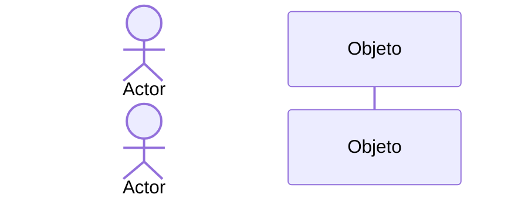

### Líneas de vida

Son líneas verticales asociadas a cada actor/objeto. Representan el tiempo durante el cual estos están activos. Dentro de ellas se puede incluir determinada información:

1. **Bloques de activación**:
   Rectángulos sobre las líneas de vida que indican que el actor/objeto está realizando una tarea. Pueden contener incluso estados como los trabajados en los diagramas de estados.

2. **Fragmentos combinados**:
   Estructuras condicionales o repetitivas que representan lógica compleja (por ejemplo, bucles o decisiones).

A continuación, vamos a profundizar un poco más en las líneas de vida:

#### Líneas de vida y bloques de activación

Las líneas de vida son las líneas verticales asociadas a actores y objetos, y los bloques de activación son los rectángulos sobre estas líneas que indican que un actor/objeto está realizando una tarea específica.

En el siguiente ejemplo se representa una conversación entre un cliente y un sistema, donde se activa un bloque durante la validación de credenciales.

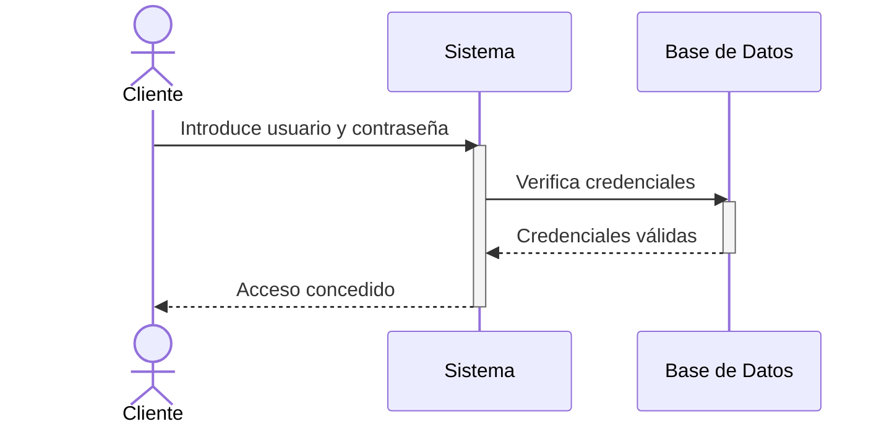

En este caso:

- El **Sistema** está activo mientras procesa la solicitud del cliente.
- La **Base de Datos** está activa mientras verifica las credenciales.

#### Fragmentos combinados: condicionales y bucles

Los fragmentos combinados son estructuras que muestran flujos condicionales (`alt`) o repetitivos (`loop`).

#### Condicional (alt)

El **fragmento condicional** permite modelar flujos donde existen diferentes caminos dependiendo de una condición.

**Ejemplo: Validación de credenciales con diferentes respuestas:**

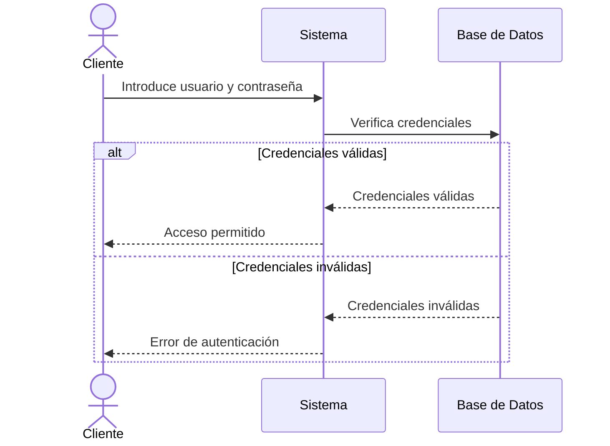

En este caso:

- Si las credenciales son válidas, el cliente recibe acceso.
- Si las credenciales son inválidas, se le notifica un error.

#### Bucle (loop)

El **fragmento de bucle** representa procesos que se repiten hasta cumplir una condición.

**Ejemplo: Reintento de inicio de sesión (máximo 3 intentos):**

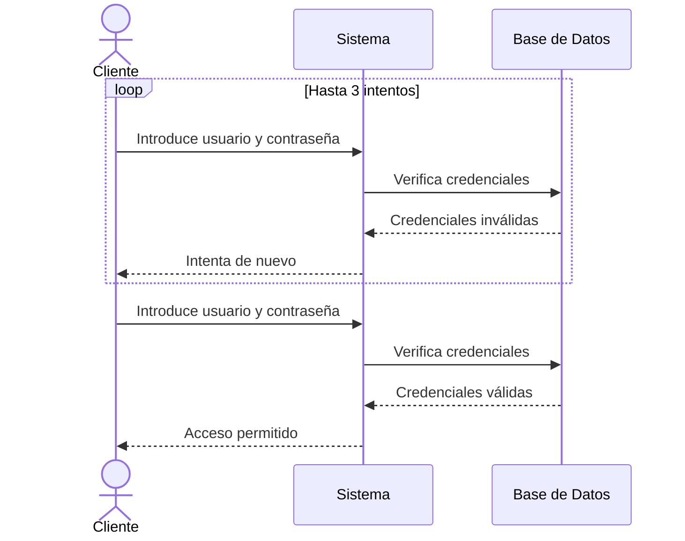

En este caso:

- El cliente puede intentar ingresar sus credenciales hasta tres veces. Si en algún intento las credenciales son válidas, el flujo termina con acceso permitido.

#### Combinación de activación y fragmentos

En muchos escenarios, los **bloques de activación** y los **fragmentos combinados** se combinan para modelar interacciones más complejas. Por ejemplo:

**Ejemplo: Compra en línea con verificación de inventario y pago:**

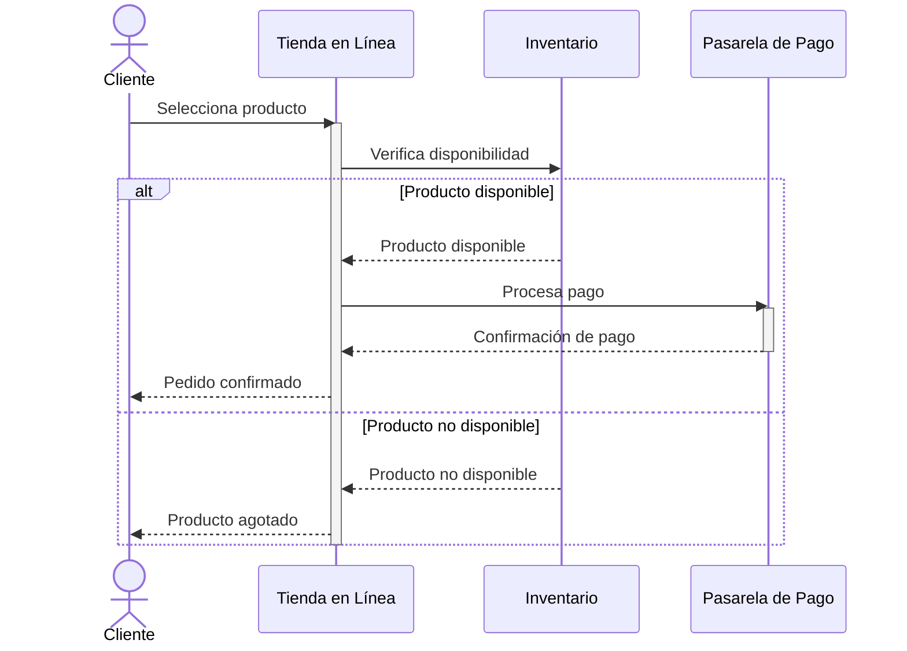

En este ejemplo:

1. **Bloques de activación**:
    - La **Tienda** está activa mientras verifica el inventario y procesa el pago.
    - El **Inventario** y la **Pasarela de Pago** están activos mientras realizan sus tareas específicas.
2. **Fragmento condicional**:
    - Si el producto está disponible, se procesa el pago.
    - Si no está disponible, se informa al cliente.

#### Añadir estados al diagrama de secuencia

Otra práctica que puede ser de utilidad es indicar los cambios de estado que se producen en la línea de vida de un proceso. Estos cambios se pueden indicar dentro de la línea de vida o, como en el siguiente ejemplo, en una nota aparte.

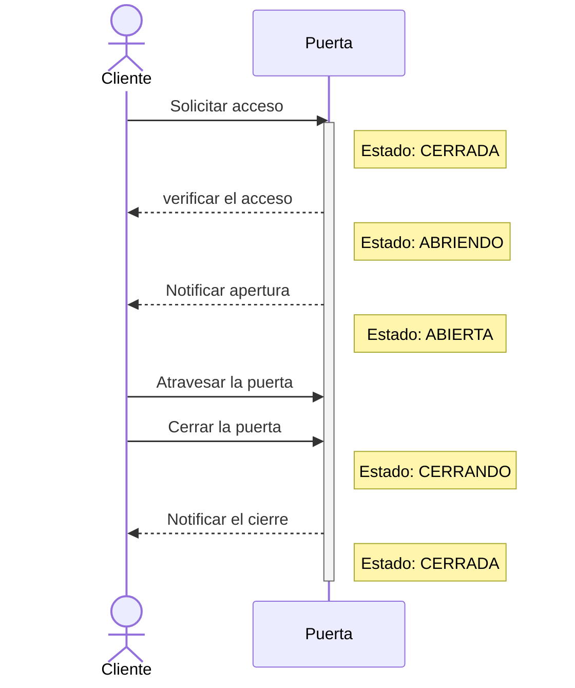

Este sería el diagrama de estados correspondiente de la puerta:

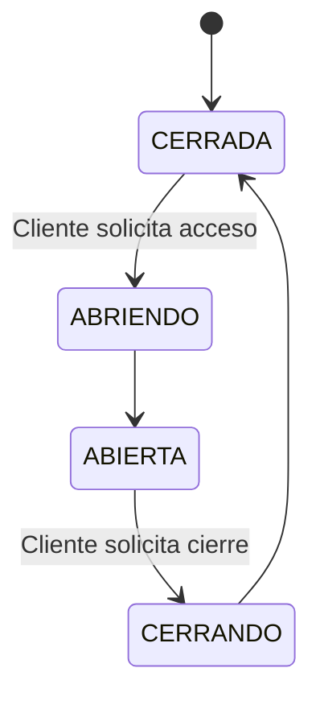

### Mensajes

Las flechas indican la comunicación entre actores/objetos. Los tipos principales son:

- **Mensajes síncronos**: llamadas o peticiones que esperan una respuesta. Se representan con una flecha normal y una línea continua.

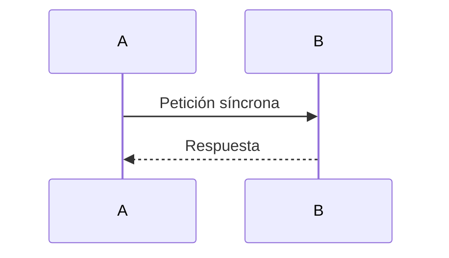

- **Mensajes asíncronos**: peticiones que no esperan una respuesta inmediata. Se representan con una flecha abierta y una línea discontinua.

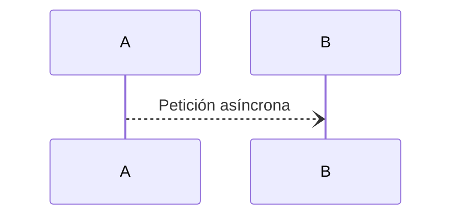

- **Mensajes de retorno**: respuestas enviadas tras una petición. Se representan con una línea discontinua. La flecha será abierta o cerrada dependiendo de si son retornos asíncronos o síncronos respectivamente

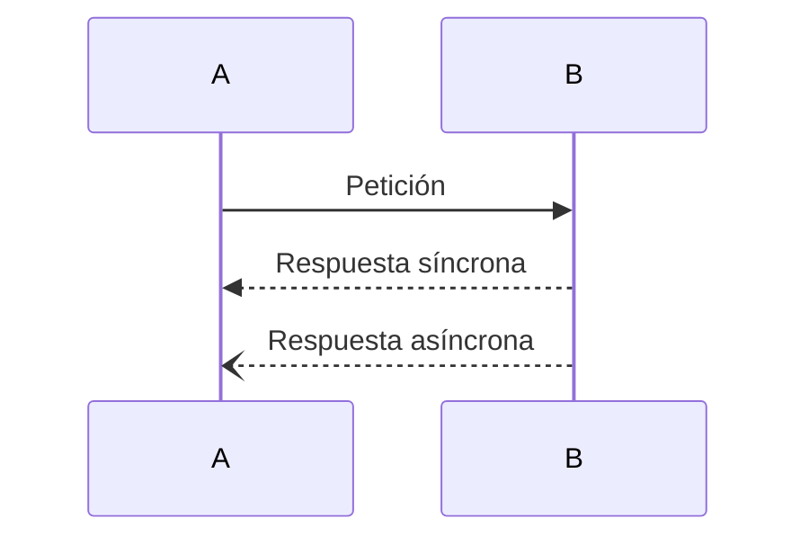

A continuación, un ejemplo con los tres tipos de mensajes:

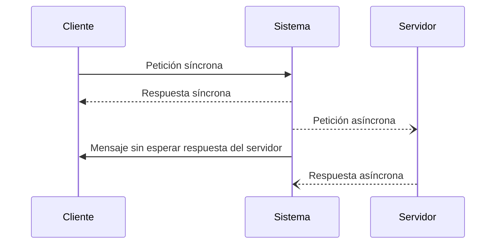

### Construcción de diagramas de secuencia

Para construir un diagrama de secuencia, debemos seguir los siguientes pasos:

1. **Identificar los actores y objetos** que participan en el escenario.
2. **Establecer el flujo de mensajes** entre ellos, respetando el orden cronológico.
3. Agregar activaciones, retornos y fragmentos combinados según sea necesario.

El siguiente ejemplo muestra cómo un cliente interactúa con un sistema de autenticación.

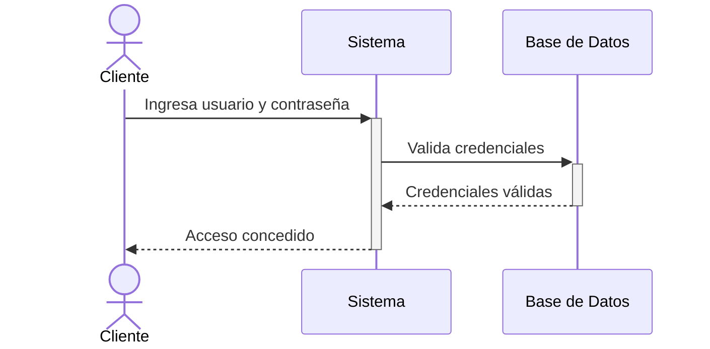

Los diagramas de secuencia son especialmente útiles en casos donde es necesario modelar **escenarios específicos y ordenados de interacción**.

## Diagramas de comunicación

Los diagramas de comunicación modelan las interacciones entre objetos o partes empleando mensajes secuenciados. Representan una combinación de información que puede ser obtenida a través de los diagramas de clase, secuencia y casos de uso, que describen tanto la estructura estática como el comportamiento de un sistema. Asimismo, los diagramas de comunicación son una simplificación del diagrama de colaboración, que era estándar en UML 1.x y fue descartado en UML 2.x.

Los diagramas de comunicación emplean una codificación gráfica similar a la que se usa en los diagramas de objetos. Los elementos se elanzan con líneas y en cada enlace se etiqueta con un número, que representa el orden cronológico del mensaje y el mensaje que se comunica. Los diagramas de comunicación empiezan desde el mensaje 1 y siguen los mensajes de objeto a objeto.

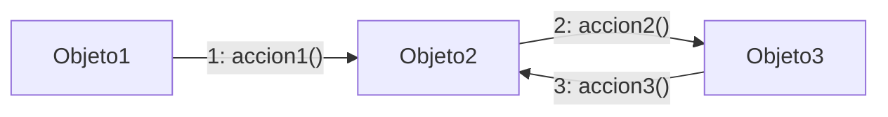

Los mensajes que se producen en la misma llamada tienen el mismo prefijo, pero usan diferentes sufijos según cuando se llaman. Aunque siguen manteniendo el orden, nos permite agrupar mensajes de tal forma que puedan tener más sentido.

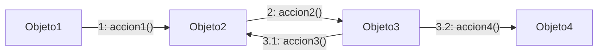
En este ejemplo, los mensajes suceden en orden, pero agrupamos los mensajes `accion3` y `accion4` dentro del mensaje 3. Podemos emplear tantos niveles como queramos para establecer una jerarquía con los mensajes.

Por otro lado, para expresar concurrencia, podemos emplear letras. Si dos mensajes comparten el mismo número, se ejecutarán de forma concurrente o simultánea. Para diferenciarlos, los etiquetaremos con a, b, c, etc.

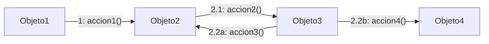
En este ejemplo, hemos agrupado los mensajes `accion2`, `accion3` y `accion4` dentro del mensaje 2. En el mensaje 2, primero ha sucedido `accion2` y después, de forma simultánea, se han lanzado los mensajes `accion3` y `accion4`.

Finalmente, se pueden asociar mensajes a condiciones, expresadas entre corchetes, lo que nos permite representar estructuras de selección y de bucle.

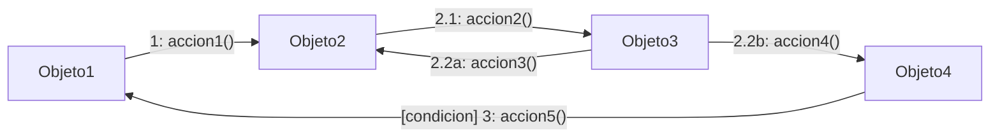
En este ejemplo, el mensaje `accion5` solo se lanzará si se cumple la condición `condicion`.

Los diagramas de comunicación muestran la misma información que los diagramas de secuencia, pero su presentación es totalmente diferente, lo que hace que algunos matices sean más evidentes en uno que en otro.

- En los diagramas de comunicación, se entiende fácilmente qué partes interactúan entre sí.
- En los diagramas de secuencia, se entiende fácilmente el orden de las interacciones.

Este diagrama de comunicación:

Es equivalente a este diagrama de interacción:

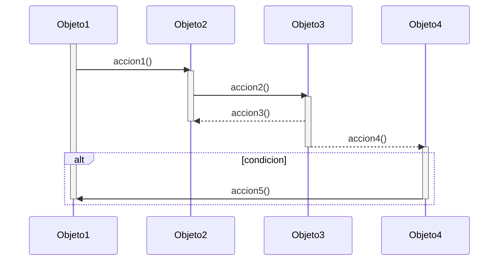

