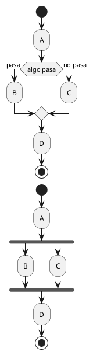
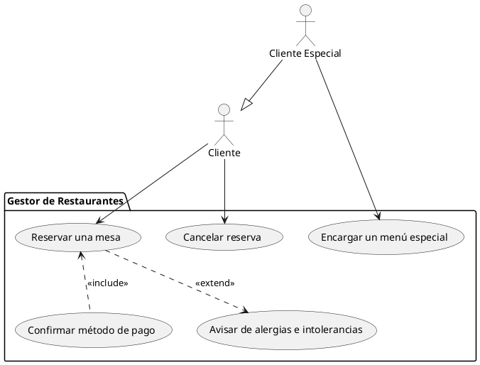

# Examen

## Pregunta práctica

Lee el enunciado de esta problemática y establece, según los criterios del IEEE 830 estudiado en la primera unidad, los requisitos funcionales la aplicación que se te pide desarrollar. A continuación, basándote en dicha información, realiza los siguientes diagramas:

- Diagrama de casos de uso
- Diagrama/s de transición de estados
- Diagrama/s de interacción

>Se requiere diseñar un sistema para gestionar el acceso a las aulas de un instituto. En el instituto interactúan tres tipos de usuarios: Personal docente, personal no docente y alumnado. Todos ellos se identifican por su nombre y su DNI, pero el alumnado además dispone de un NIA y está matriculado en un curso.
>
>Por su parte, las aulas pueden estar abiertas o cerradas y, además, pueden estar ocupadas, reservadas, bloqueadas o libres.
>
>El sistema debe regular el acceso a las aulas bajo las siguientes condiciones:
>
>- Solo se puede entrar en un aula si está abierta y no está ocupada, reservada o bloqueada.
>- El alumnado solo puede entrar en el aula si está ocupada por su profesor correspondiente.
>- Las aulas pueden ser reservadas por el profesorado si no están reservadas.
>- Existen aulas de estudio que sí pueden ser reservadas por el alumnado, pero cuya reserva debe ser confirmada por el personal docente o no docente.
>- El personal no docente puede bloquear las aulas por motivos diversos (limpieza, mantenimiento, etc.). Durante el bloqueo, estas aulas no pueden reservarse ni ocuparse.

## Pregunta de diagramas de actividad

En una fábrica de coches eléctricos, varios trabajadores deben colaborar para ensamblar y entregar los vehículos según los pedidos de los clientes. Cada trabajador tiene una tarea específica, y el coche solo puede ser entregado cuando todos hayan terminado su parte. El flujo de trabajo se divide en las siguientes actividades:

1. **Encargado:** Procesa los pedidos, uno a uno, para poder determinar sus características. Los añade a la lista de pedidos.
2. **Técnico 1:** Ensambla el chasis del coche eléctrico.
3. **Técnico 2:** Prepara el sistema de baterías.
4. **Técnico 3:** Monta el motor eléctrico.
5. **Técnico 4:** Cuando está todo listo, ensambla el motor eléctrico en el chasis, añade el sistema de baterías y lo conecta al motor.
6. **Técnico 5:** Prepara los componentes interiores y el tapizado de los asientos. Debe verificar si el tapizado es de cuero, de lana o sintético, ya que el proceso de preparación es diferente.
7. **Técnico 6:** Cuando el chásis está completamente montado, le instala los componentes interiores preparados por el técnico 5.
8. **Técnico 7:** Realiza las pruebas finales de funcionamiento y seguridad. Si el pedido no pasa las pruebas, debe marcarlo para que se procese de nuevo.
9. **Trabajador de entrega:** Prepara el coche para su entrega al cliente, pero **solo puede hacerlo cuando todos los técnicos hayan terminado sus tareas**. En el caso de que el coche haya sido marcado por el técnico 7, no se entrega sino que se transfiere de nuevo a la lista de pedidos. El coche pasa a ser desmontado por el **Técnico 8**.

El proceso debe repetirse mientras haya pedidos por procesar.

Modela el sistema de montaje de coches eléctricos mediante un **diagrama de actividad**, representando los flujos paralelos de trabajo. Puedes usar carriles y agrupaciones.

## Test

1. ¿Cuáles son los dos tipos de diagramas UML principales?
2. Usando metodologías ágiles, ¿en qué fases del desarrollo de una aplicación son relevantes los diagramas UML?
3. ¿Es el diagrama Entidad Relación un diagrama UML?
4. ¿Cuál es el objetivo de un diagrama de actividad? Elige una opción:
    1. Definir las relaciones entre clases
    2. Definir el comportamiento de un proceso
    3. Definir una actividad en base a la comunicación entre flujos de datos de primer nivel
    4. Definir las cosas que puede hacer un sistema
5. ¿Cuál es el objetivo de un diagrama de casos de uso? Elige una opción:
    1. Definir las relaciones entre clases
    2. Definir el comportamiento de un proceso
    3. Definir una actividad en base a la comunicación entre flujos de datos de primer nivel
    4. Definir las cosas que puede hacer un sistema
6. Define qué es una transición en un diagrama de estados

7. Explica qué diferencia hay entre estos dos diagramas de actividad y qué pasa en cada uno de ellos:

8. ¿Qué es la línea de vida de un diagrama de secuencia? Elige una opción:
    1. Representa el tiempo en el que un actor está activo.
    2. Representa el tiempo en el que una clase está activa.
    3. Representa las diferentes fases por las que pasa un actor durante el tiempo que permanece activo.
    4. Las líneas de vida no pertenecen a los diagramas de secuencia

9.  Explica qué representa el siguiente diagrama de casos de uso:

10. ¿Cuál de estas afirmaciones es falsa?
    a. Los diagramas de actividad pueden usar carriles
    b. El diagrama de casos de uso está estrechamente relacionado con los requisitos funcionales
    c. Los diagramas de estado no pueden anidarse
    d. Los diagramas de secuencia son un tipo de diagrama de interacción
