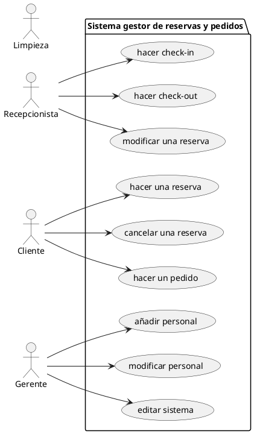

## EXAMEN MODELO – PRUEBAS DE SOFTWARE

### PARTE A: 6 PUNTOS  
**Diseña las siguientes pruebas para una aplicación determinada:**

- **(2 puntos)** Pruebas unitarias: diseña escenarios en los que usarías pruebas tipo JUnit (caja negra, basadas en casos de uso). Es necesario representarlas en forma de tabla:

|ID|Nombre de prueba|método|descripción (precondiciones y pasos)|entrada|salida esperada|salida obtenida|
|--|---------------|--|--|--|--|--|
|1  
|2
|3
|...
- **(1 punto)** Pruebas de integración: diseña escenarios en los que usarías pruebas tipo Mockito y GitHub Actions (simulación de componentes y tareas automatizadas en cada cambio).  
- **(1 punto)** Pruebas de aceptación: diseña escenarios usando pruebas tipo Cucumber, utilizando lenguaje Gherkin para definir los criterios del cliente.  
- **(1 punto)** Pruebas de seguridad: diseña escenarios donde se ponga a prueba la robustez y protección del sistema ante fallos o ataques.  
- **(1 punto)** Justifica cada una de las pruebas indicadas anteriormente.

### APLICACIÓN:

Estamos desarrollando una **plataforma de gestión de reservas y pedidos para un hotel**. Los roles principales son: *Recepcionista, Cliente, Gerente, y Limpieza*.  
Cada usuario accede desde su propio terminal (dispositivo móvil o PC) utilizando credenciales personalizadas.  
La aplicación se conecta con un sistema de reservas externo vía API REST y también accede a una base de datos SQL.  
Las funcionalidades están representadas en el siguiente diagrama de casos de uso:



### PARTE B: 2 PUNTOS  
DADO EL SIGUIENTE CÓDIGO…

```java
public class Refactorizable {
    public static void main(String[] args) {
        int[] h = {101, 203, 105, 304, 401};
        int t = 0;
        for (int i = 0; i < h.length; i++) {
            t += metodo(h[i]); // Colocar breakpoint si el número > 200
        }
        System.out.println("Total: " + t);
        for (int n : h) {
            System.out.println("Número: " + n);
        }
    }
    
    static int metodo(int numero) {
        int r;
        if (numero % 2 == 0) {
            r = numero + 10;
        } else {
            r = numero + 5;
        }
        System.out.println("Habitación: " + numero);
        return r;
    }

}
```

#### PREGUNTA 1 (1 PUNTO):  
Coloca un **punto de ruptura** en la línea indicada con la condición establecida y realiza las siguientes pruebas:

- Al llegar al primer breakpoint, ejecuta un **step over** y continúa hasta el siguiente.
- La segunda vez que se detenga, haz un **step into**, luego tres **step over**, y finalmente un **step out**.

Completa una traza con tabla de seguimiento de variables y llamadas (pila del debugger).

#### PREGUNTA 2 (1 PUNTO):  
Refactoriza el código anterior y justifica los cambios.  
Indica el tipo de refactorización (renombrar variables, extraer método, eliminar código duplicado, etc.).


### PARTE C: TEST DE TESTS – (2 PUNTOS)  
**Marca la respuesta correcta en cada caso.**

1. **Las pruebas de caja negra…** 
a) Prueban la lógica del código fuente  
b) Evalúan entradas y salidas sin conocer el código  
c) Sirven para verificar la conectividad entre módulos  
d) Son pruebas que realiza el desarrollador directamente  

2. **Las pruebas de integración…** 
a) Prueban unidades aisladas de código  
b) Evalúan el sistema completo desde la interfaz  
c) Verifican cómo interactúan entre sí los módulos  
d) Se hacen exclusivamente antes de desplegar en producción  

3. **Las pruebas de sistema…** 
a) Evalúan componentes de forma individual  
b) Evalúan el sistema completo con todas sus funcionalidades  
c) Se enfocan en pruebas de seguridad  
d) Son pruebas no automatizables  

4. **Las pruebas unitarias…** 
a) Se hacen tras completar el sistema  
b) Evalúan unidades de código aisladas  
c) Verifican el diseño gráfico de la app  
d) Solo se hacen manualmente  

5. **El lenguaje Gherkin se utiliza…** 
a) Para implementar lógica de negocio  
b) Para definir requisitos funcionales con lenguaje natural  
c) Para escribir código en Cucumber  
d) Para realizar pruebas unitarias  

6. **Las pruebas de rendimiento…**  
a) Evalúan la experiencia de usuario  
b) Miden la respuesta del sistema ante diferentes cargas  
c) Son útiles solo en producción  
d) No detectan cuellos de botella  

7. **En una pipeline de integración continua (CI/CD)…** 
a) Se compila y despliega el código automáticamente  
b) No es posible integrar pruebas automatizadas  
c) Solo se hacen pruebas de aceptación  
d) Se evalúa solo el rendimiento del sistema  

8. **El principio de bajo acoplamiento…** 
a) Es negativo para la arquitectura  
b) Mejora la mantenibilidad del sistema  
c) Dificulta el testing  
d) Solo aplica a bases de datos  

9. **La refactorización...**
a) Sirve para cambiar completamente la funcionalidad del software  
b) Mejora la calidad del código sin alterar su comportamiento  
c) Se hace una sola vez al finalizar el desarrollo  
d) Se aplica solo si hay errores  

10. **Un test fallido en GitHub Actions…**  
a) Detiene el despliegue automático si está configurado así  
b) No tiene impacto en la rama principal  
c) Nunca ocurre, ya que las pruebas se hacen localmente  
d) Es necesario para confirmar que el código está bien  

11. **Un diagrama de estados…**
a) Nos puede ayudar a planificar pruebas que evalúan el comportamiento del sistema ante cambios de estado
b) Nos puede ayudar a planificar pruebas que evalúan las características de un objeto del sistema y los métodos que realiza
c) Sirve para determinar la complejidad ciclomática óptima que garantice que el acoplamiento sea bajo y el rendimiento no se resienta
d) No tiene relación con las pruebas de software

12. **La documentación de un sistema**
a) Es innecesaria y ha sido eliminada en las metodologías ágiles
b) Sirve para facilitar el uso de la aplicación
c) Es fundamental para que Github actions funcione
d) Se debe hacer exclusivamente con javadoc o doxygen
